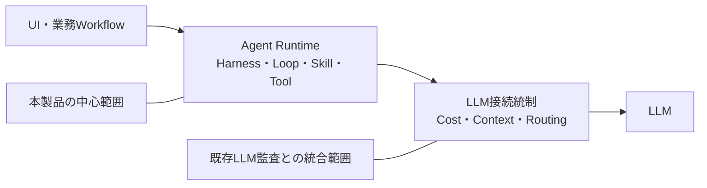
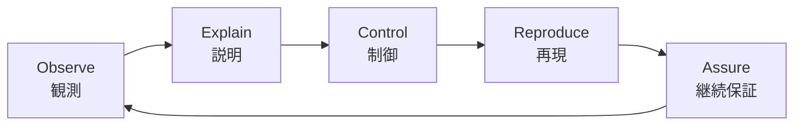
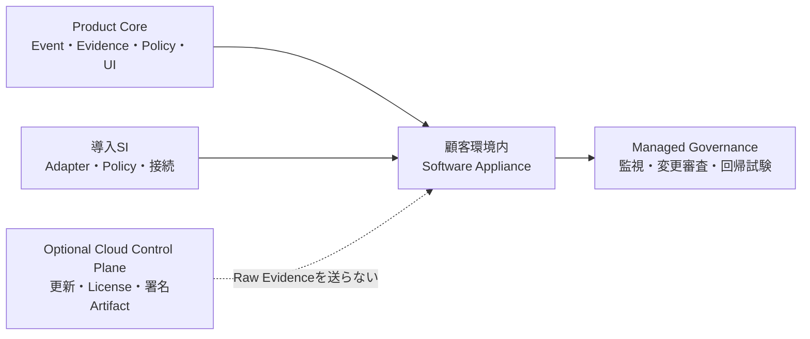
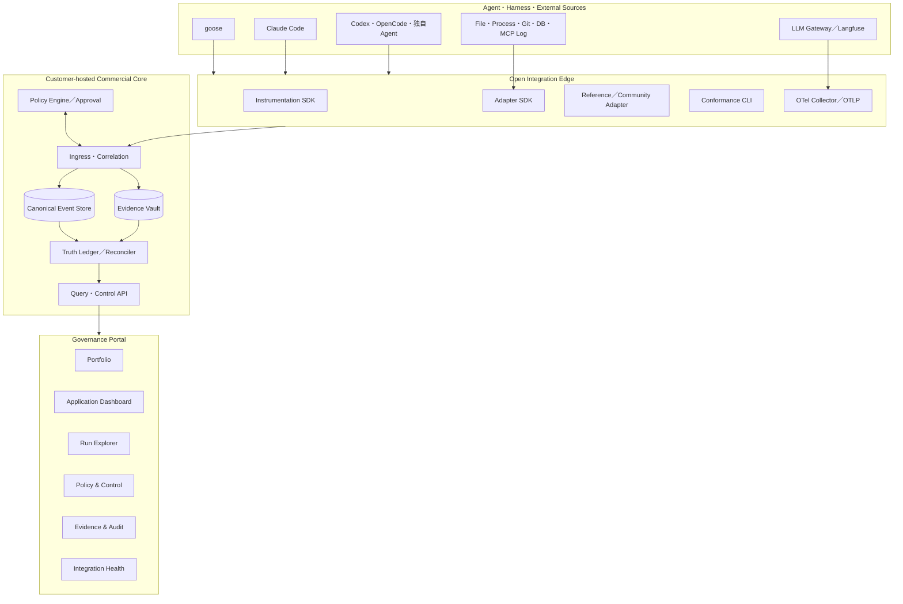
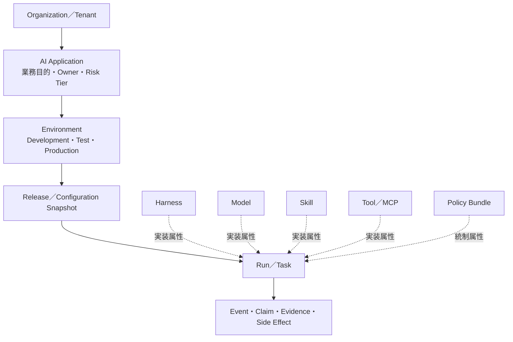
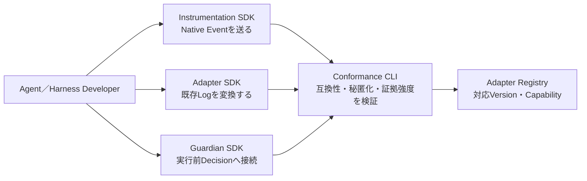
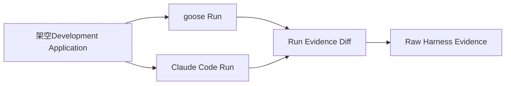
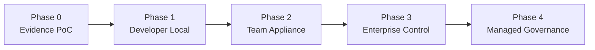

## この記事での願い

- 残念ながら自分の所属する組織ではこういうプロダクトの理解をタイムリーに得ることができない
- 他稿で書いたように「ハーネス」「エージェント」という言葉の意味が理解されず、まるッと「AI」と言う言葉に置き換えられてしまう世界なので。
- なので誰かの目に留まり参考にしていただけることを望みます（PoCでこれが可能であることは確認できています）

## AIエージェント実行ガバナンス基盤 プロダクトコンセプト仕様書

> AIエージェントを、特別扱いされた実験用ツールではなく、説明・制御・検証可能な業務アプリケーションとして運用するための共通基盤

- 文書種別：プロダクトコンセプト仕様書／概要設計書
- 企画名（仮）：AIエージェント実行ガバナンス基盤
- 英語カテゴリ名（仮）：Agent Application Governance Platform / Agent Control Plane
- 文書版：0.1
- 基準日：2026年9月20日
- ステータス：PoC実装前の製品化仮説

---

## 0. エグゼクティブサマリー

本製品は、異なるAIエージェントやハーネスの実行を共通形式で観測し、実行根拠・権限・副作用を説明し、必要な操作を実行前に制御し、変更前後の挙動を再検証するためのガバナンス基盤である。

顧客へは、機密性の高いPrompt、Context、Tool入力、File、Command、承認履歴、外部副作用を顧客環境外へ集約しない**Customer-hosted Software Appliance**として提供する。販売・導入はSI、継続運用はManaged Governanceとして提供する。

画面の主語はHarnessではなく**AI Application**とする。顧客は業務目的を持つAIアプリを管理し、問題発生時にRun、Event、Harness Native Evidenceへ段階的に掘り下げる。LLM監査基盤とは共通IDと共通ポータルで統合するが、LLM利用管理とAgent実行品質管理は責務別の画面に分離する。

初期市場は、現在すでに自律実行・File変更・Shell実行・MCP接続が使われている**開発Agent**とする。開発Agent向けにはTelemetry SDK、Adapter SDK、Schema、Conformance Test、Reference Adapterをオープンに提供し、開発コミュニティ自身が計装・検証・Adapter開発へ参加できる状態を作る。

オープン化の目的は、完成品を無償提供することではない。相互運用に必要な接続面を公開し、対応Harnessと標準Telemetryを増やし、自社製品が接続できる市場そのものを広げることである。商用価値は、証拠相関、実行制御、Evidence Vault、Enterprise運用、認証、監査、Control Pack、導入SI、Managed Governanceに置く。

### 0.1 本書で仮置きする主要判断

| 項目 | 仮置きする判断 |
|---|---|
| 提供形態 | 顧客環境内Software Applianceを中核とする |
| 販売形態 | Product Core + 導入SI + Managed Governance |
| SaaS | 機密証跡を集約するSaaSは主力にしない。更新・ライセンス等の任意Control Planeは将来検討 |
| 物理Appliance | 初期対象外。Docker／VM／Kubernetesを先行し、閉域需要が確認できた場合に検討 |
| 管理単位 | AI Applicationを主語、Runを診断単位、Harnessを技術属性とする |
| LLM監査との関係 | 一つのPortalに統合するが、専門画面とデータ責務を分ける |
| 初期用途 | 開発AgentをBeachhead市場とする |
| 公開戦略 | Schema、SDK、Adapter Contract、Conformance Test、Reference Adapterを公開候補とする |
| 商用価値 | Evidence、Control、Enterprise Operations、Control Pack、SI、Managed Serviceに置く |

---

## 1. 背景と解決する問題

### 1.1 LLMの出口管理だけでは、AIアプリの品質を説明できない

LLM GatewayやLLM Observabilityを導入すると、誰がどのModelへ、どのContextを、いくらで送ったかを管理できる。しかし、AIアプリの結果が変わったとき、次の問いには十分答えられない。

- なぜそのContextになったのか
- どのInstruction、Skill、Memoryが判断時に有効だったのか
- どの条件でAgentic Loopが継続・停止したのか
- なぜそのToolが選択されたのか
- 人間承認を経たのか、自動許可されたのか
- File、DB、SaaS、外部通信へ何を変更したのか
- Model、Harness、Skill、Policyの変更後に、最初にどこが変わったのか

本製品は、LLM呼び出しの前後に存在するAgent Runtimeを管理対象へ加える。



### 1.2 「AIだから仕方ない」を通常のアプリケーション管理へ戻す

本製品が対象とするのはLLMの内部思考ではなく、外部から観測・制御できる実行状態である。

- 実行時に存在したInstructionとContext
- Model CallとTool Call
- 権限、承認、Policy Decision
- File、Command、DB、MCP、SaaSへの副作用
- Context圧縮、Memory更新、Retry、Loop遷移
- Harness、Model、Skill、Policy、ApplicationのVersion
- 外部照合記録とRaw Evidence

確率的な判断をなくすのではなく、確率的な判断を決定的な権限・状態遷移・副作用制御の内側へ置く。

### 1.3 開発Agentは将来用途ではなく、現在の初期市場である

開発Agentは、すでに次の高リスク操作を日常的に実行している。

- Repository全体の読取り
- File作成・変更・削除
- Shell Command実行
- Package追加
- Test、Build、Deploy
- Git操作
- Issue、Pull Request、CI/CDとの連携
- MCP Serverを介した外部サービス操作
- 自動承認モードでの連続実行

開発者は実行内容を技術的に検証でき、OSSやSDKを試す動機も強い。Adapter、Telemetry、Policy、Replayを早く検証するBeachhead市場として適している。

---

## 2. プロダクトコンセプト

### 2.1 一文で表すコンセプト

> どのAIエージェントを使っても、業務アプリ単位で実行の根拠・権限・影響を説明し、必要なときに止め、変更後も同じ統制が維持されていることを検証できる共通ガバナンス基盤

### 2.2 顧客への約束

本製品は、重要な実行について次の質問へ一貫して答えられる状態を提供する。

1. 誰が、どのAI Applicationで、何を目的に実行したか
2. どのHarness、Model、Skill、Tool、Policyの版が使われたか
3. 判断時にどのInstruction、Context、File、Memory、Tool Resultが存在したか
4. Agentは何を実行しようとしたか
5. 誰またはどのPolicyが許可・拒否・変更・承認待ちにしたか
6. 実際に外部環境へ何が変更されたか
7. 前回の正常Runと比べ、最初にどこが変わったか
8. 表示された説明は、どのEvidenceに基づくか
9. 分からない部分は何か
10. 同じ失敗を再現し、変更後に再試験できるか

### 2.3 中核能力



| 能力 | 内容 |
|---|---|
| Observe | 異なるHarnessの実行を共通形式で記録する |
| Explain | 入力、状態、権限、Policy、外部副作用を証拠付きで説明する |
| Control | 高リスク操作を実行前にAllow／Deny／Modify／Approvalへ分岐する |
| Reproduce | Tool応答や状態を固定し、副作用なしで再生・比較する |
| Assure | Model、Harness、Skill、Policy変更後も必須条件を継続検証する |

### 2.4 製品原則

1. **Application-centric**：顧客にはHarnessではなくAI Applicationを見せる
2. **Evidence-aware**：観測、導出、推定、検証不能を混ぜない
3. **Customer-controlled Data**：機密証跡の保存場所を顧客が管理する
4. **Progressive Control**：Read-only観測から実行時制御へ段階導入する
5. **Cross-Harness**：特定Harnessを製品の正本にしない
6. **Open Edge, Commercial Core**：相互運用境界を開き、運用価値を商用化する
7. **Replaceable Stack**：OSSとBackendを交換可能にする
8. **Safe by Default**：本文取得、外部送信、自動制御は明示設定なしに有効化しない
9. **Known Limits First**：取得できない事実を取得できたように見せない
10. **Operations-ready**：可視化だけでなく停止、承認、復旧、監査、変更審査まで扱う

---

## 3. ゴールと非ゴール

### 3.1 ゴール

| ID | ゴール |
|---|---|
| G-01 | 複数Harnessの実行を同一Application／Runの情報モデルで扱える |
| G-02 | 重要な表示からRaw Evidenceと外部照合記録へ遡れる |
| G-03 | Harness固有の取得能力差をCapabilityとCoverageとして表示できる |
| G-04 | Tool、MCP、File、Command、外部通信の高リスク操作を実行前に制御できる |
| G-05 | Model、Harness、Skill、Policy変更前後の最初の差分を特定できる |
| G-06 | LLM監査TraceとAgent Runtime Traceを共通IDで相関できる |
| G-07 | 顧客環境内で閉じた収集・保存・閲覧・制御ができる |
| G-08 | 開発者がSDKを使い、自作Agentや新Harnessを自ら計装できる |
| G-09 | Community Adapterを安全性と証拠強度を明示して利用できる |
| G-10 | OSSやHarnessが方向転換・終了してもCanonical Evidenceを保持できる |

### 3.2 非ゴール

- AIアプリのエンドユーザー向けChat UIを提供すること
- Dify、n8n、LangGraph、goose、Claude Code等を置き換えること
- LLMの非公開Chain of Thoughtを取得すること
- 同じ入力に対して同じ文章を必ず返すこと
- すべてのHarnessに同一の観測・制御能力を保証すること
- Langfuse、Phoenix、SIEM、APMを全面的に再実装すること
- 顧客の生PromptやSource Codeを自社SaaSへ集約すること
- 初期段階から物理Applianceを製造・保守すること

---

## 4. ターゲットと利用者

### 4.1 初期ターゲット

#### Beachhead：開発Agentを組織利用する企業・開発チーム

- コーディングAgentを複数製品で利用している
- 自動承認やYOLO Modeの利用範囲を広げたい
- AgentによるFile変更やCommand実行を監査したい
- ModelやHarness更新後のRegressionを検知したい
- 開発者個人の設定ではなく、組織Policyを適用したい
- Agent実行ログをCI、SIEM、ITSMへ連携したい

#### 次段階：統制要件の高い組織

- 中央省庁、自治体、独立行政法人
- 金融、保険、医療、製造、重要インフラ
- 大規模企業のAI CoE、情報システム、セキュリティ、内部監査
- 顧客向けAI Applicationを提供するSaaS／SI事業者

### 4.2 購買者と利用者を分ける

| 役割 | 主な関心 | 主画面 |
|---|---|---|
| AI CoE・情報システム | 全AI Applicationの統制状態 | Portfolio |
| 業務責任者・Application Owner | 自分のApplicationの品質と自律範囲 | Application Overview |
| 開発者・QA | 失敗原因、差分、Replay | Run Explorer / Comparison |
| 運用担当 | 実行中の異常、承認、停止 | Live Operations |
| セキュリティ | 権限、Tool、外部通信、Policy違反 | Policy & Control |
| 内部監査 | 証跡、承認、構成、完全性 | Evidence Package |
| Platform Engineer | Harness、Adapter、Collectorの状態 | Integration Health |
| Community Developer | 自作Adapterの互換性 | SDK / Conformance CLI |

---

## 5. 用途別Control Pack

Control Packは、共通Product Coreへ用途固有のPolicy、Scenario、Dashboard Template、Evidence Reportを追加する商用・運用単位である。

| Control Pack | 主な対象 | 代表的な管理項目 |
|---|---|---|
| Development Agent | コーディングAgent、CI Agent、Review Agent | Repository Scope、File変更、Shell、Package、Git、Secret、Deploy |
| Public Sector | 自治体・行政AI | 個人情報、外部送信、記録保持、承認、説明資料 |
| Financial Agent | 金融・保険業務Agent | 職務分離、取引上限、顧客情報、Model Risk、長期証跡 |
| Data & Analytics Agent | SQL、Notebook、BI、データ処理Agent | Data Access、Query、Export、Notebook状態、機密列 |
| IT Operations Agent | Infrastructure、SRE、Support Agent | Command、Cloud変更、Credential、Change Window、Rollback |

### 5.1 Development Agent Control Pack

初期Control Packには次を含める。

- Repository／Directory単位のAllowlist
- `.env`、Credential、秘密鍵、設定Fileの保護
- Shell Command Risk分類
- Package追加・更新の記録
- Network Access先の制限
- Git Commit／Push／Force Pushの制御
- Issue／PR／CI／Deploy操作の承認
- Worktree／Branch／Sandboxの分離
- AGENTS.md／CLAUDE.md／Rule／SkillのVersion記録
- Context圧縮前後の重要制約の生存確認
- Model／Harness更新前後のGolden Scenario
- Source Code本文を保存しないHash／Diff中心のEvidence Mode

---

## 6. 提供モデル

### 6.1 推奨モデル

> Customer-hosted Software Appliance + SI + Managed Governance



### 6.2 SIは妥協策ではなくGo-to-Marketである

SIだけで顧客ごとの専用品を作ることは避ける。一方、共通Product Coreを顧客の権限、業務、監査、既存Systemへ適合させるSIは製品価値の一部である。

**共通製品に固定するもの**

- Canonical Event Model
- Evidence Model
- Adapter Contract
- Capability Manifest
- Policy Decision API
- Query API
- UI情報構造
- Conformance Test
- Upgrade／Migration方式

**顧客別に設計するもの**

- Application Inventory
- Identity／権限との接続
- Tool／MCP／Network境界
- Policy Bundle
- Approval Workflow
- Retention／Legal Hold
- SIEM／ITSM／SOC連携
- Control Packの適用範囲

### 6.3 SaaSの位置付け

機密Evidenceを保持するマルチテナントSaaSを初期主力にしない。

将来の任意Cloud Control Planeは、次の非機密情報に限定する。

- License状態
- 製品Version
- 署名済みAdapter／Policy Packの配布
- Compatibility情報
- Vulnerability Advisory
- Opt-inの匿名化Health情報
- Support Bundleの明示的送信

Cloud Control Planeが停止しても、顧客内のObserve、Explain、Control、Evidence参照は継続しなければならない。

### 6.4 Deployment Profile

| Profile | 配置 | 対象 |
|---|---|---|
| Developer Local | Docker Compose、localhost | SDK利用者、個人開発、PoC |
| Team Appliance | 単一VM／OVA | 開発部門、少人数運用 |
| Enterprise | Kubernetes／OpenShift | 複数Application、HA、SSO |
| Air-gapped | Offline Bundle、署名Artifact | 公共、重要インフラ、閉域 |
| Physical Appliance | Hardware + Support | 市場要求が確認された場合だけ検討 |

---

## 7. 論理アーキテクチャ

### 7.1 全体構造



### 7.2 設計上の正本

| 情報 | 正本 |
|---|---|
| Application定義 | Product CoreのApplication Registry |
| Canonical Event | Canonical Event Store |
| Raw Evidence | Evidence Vault |
| Harness固有Session | Harness側。自社Run IDと別に保持 |
| LLM Trace | LLM監査Backend。自社Run IDと相関 |
| Policy | Version管理されたPolicy Bundle |
| Approval | Durable Approval Record |
| Truth Ledger | Reconcilerが生成する検証結果 |

Langfuse、Harness DB、OTel Backendのいずれか一つを製品全体の正本にしない。

---

## 8. 情報モデル

### 8.1 管理階層



### 8.2 必須識別子

| ID | 意味 |
|---|---|
| `organization_id` | 組織またはTenant |
| `application_id` | Harnessから独立したAI Application |
| `environment_id` | Development／Test／Production等 |
| `release_id` | Model、Prompt、Skill、Policy、Codeの構成Snapshot |
| `run_id` | End-to-endの業務Task／実験Run |
| `trace_id` | 分散Trace相関用ID |
| `session_id` | Harness固有Session ID |
| `harness_id` | Harness製品とInstance |
| `adapter_id` | Adapter名とVersion |
| `policy_bundle_id` | Policy BundleのVersion／Hash |
| `evidence_id` | Raw Evidence参照 |

### 8.3 Canonical Eventの最小Envelope

```yaml
schema_version: agp.event.v0.1
event_id: immutable-event-id
organization_id: org-example
application_id: app-code-assistant
environment_id: dev
release_id: release-hash
run_id: run-id
trace_id: trace-id
session_id: harness-native-session-id
timestamp: synchronized-time
event_type: tool.proposed
actor: user-or-agent-or-system
source:
  harness: claude-code
  harness_version: version
  adapter: agp-adapter-claude
  adapter_version: version
evidence:
  level: observed
  verification: single_source
  raw_ref: content-addressed-reference
  integrity_hash: hash
payload:
  metadata_only: true
```

### 8.4 Evidence Level

| Level | 意味 |
|---|---|
| Observed | Hook、OTel、Native Log、OS、Gateway等から直接取得 |
| Derived | 観測事実へVersion固定Ruleを適用した結果 |
| Inferred | 不完全な証拠から導いた仮説 |
| Not Observable | 現在の取得経路では確認不能 |

### 8.5 Verification Status

| Status | 意味 |
|---|---|
| Externally Verified | Harness外部の照合記録と一致 |
| Cross-source Corroborated | 独立した複数Sourceが一致 |
| Single Source | 一つのSourceだけが報告 |
| Conflict | Source間で内容が矛盾 |
| Not Verifiable | 外部確認手段がない |

---

## 9. ユーザー体験と画面構造

### 9.1 基本方針

> 顧客の主語はApplication、原因調査の単位はRun、実装差を調べるときだけHarnessへ降りる。

### 9.2 Portal構造

```text
AI Governance Portal
├── Portfolio
│   └── 全ApplicationのCost・Risk・Coverage・Policy状態
├── Application
│   └── Application単位の稼働・Release・品質・自律度
├── LLM Usage
│   └── Model・Token・Cost・Cache・送信Context
├── Agent Runtime
│   └── Loop・Tool・Approval・Side Effect・Compaction
├── Policy & Control
│   └── Allow・Deny・Modify・Approval・Exception
├── Evidence
│   └── Truth Ledger・Raw Evidence・監査Package
└── Integrations
    └── Harness・Adapter・Collector・GatewayのHealth
```

### 9.3 統合Dashboardの考え方

LLM監査とAgent Runtimeを一画面へ詰め込まない。一つのPortal Shellと共通Filterを持ち、専門画面を分ける。

共通Filter：

- Organization
- Application
- Environment
- Release
- Run
- User／Service Account
- Time Range

共通相関：

- `application_id`
- `run_id`
- `trace_id`
- `release_id`

### 9.4 Harness Dashboardの位置付け

Harness別画面は顧客の主画面ではなく、計測品質を管理するIntegration Health画面とする。

- Harness Version
- Adapter Version
- Supported Event
- Unsupported／Not Observable Event
- Hook／OTel／Parser Health
- Schema Drift
- Parse Error
- Event Drop
- Coverage Gap
- Upgrade Compatibility

---

## 10. 機能概要

### 10.1 Inventory

| ID | 要求 |
|---|---|
| FR-INV-01 | Application、Owner、Risk Tier、Environmentを登録できる |
| FR-INV-02 | Harness、Model、Skill、Tool、MCP Server、PolicyのVersionをRunへ関連付ける |
| FR-INV-03 | ApplicationとLLM Gateway／Langfuse Traceの接続関係を管理する |
| FR-INV-04 | AdapterのCapabilityとCompatibilityを表示する |

### 10.2 Observe

| ID | 要求 |
|---|---|
| FR-OBS-01 | Session、Turn、Loop、Model、Tool、Context、Approvalを共通Eventへ変換する |
| FR-OBS-02 | Live IngressとRead-only Importの両方を提供する |
| FR-OBS-03 | Raw Evidenceを変更せず、Hash付きで参照できる |
| FR-OBS-04 | Event Drop、Parse Error、Source欠落をCoverage Gapとして記録する |

### 10.3 Explain

| ID | 要求 |
|---|---|
| FR-EXP-01 | Baseline Runと比較RunのFirst Divergenceを表示する |
| FR-EXP-02 | Instruction、Context、Memory、Skillの追加・削除・圧縮差分を表示する |
| FR-EXP-03 | Tool ProposalからSide Effectまでを同一Laneで表示する |
| FR-EXP-04 | すべてのClaimへEvidence LevelとVerification Statusを付与する |
| FR-EXP-05 | 表示からRaw Evidenceと外部照合記録へ遡れる |

### 10.4 Control

| ID | 要求 |
|---|---|
| FR-CTL-01 | Tool／MCP／File／Command／Network操作を実行前に評価する |
| FR-CTL-02 | Allow／Deny／Modify／Approval Requiredを返す |
| FR-CTL-03 | Policy Version、Input Hash、Decision、Rule、Latencyを記録する |
| FR-CTL-04 | Observeは原則fail-open、重要ControlはRule別にfail-open／closedを選択できる |
| FR-CTL-05 | Kill Switch、Budget、Loop、Time、Tool回数の上限を提供する |

### 10.5 Reproduce and Assure

| ID | 要求 |
|---|---|
| FR-RPA-01 | 記録済みTool応答またはMockを使ってDry Runできる |
| FR-RPA-02 | Model、Harness、Prompt、Skill、PolicyのA/B比較ができる |
| FR-RPA-03 | Golden Scenarioと必須InvariantをVersion管理する |
| FR-RPA-04 | 本番反映前にRegression結果をGateへ返せる |
| FR-RPA-05 | 再生できない要素を明示する |

### 10.6 Evidence and Audit

| ID | 要求 |
|---|---|
| FR-EVD-01 | Scenario Contract、Canonical Event、外部照合記録をTruth Ledgerで照合する |
| FR-EVD-02 | Missed、False Positive、Conflict、Not Verifiableを表示する |
| FR-EVD-03 | Application、Run、Policy、Approval、Side Effect、Integrity情報をEvidence Packageとして出力する |
| FR-EVD-04 | Retention、Legal Hold、Access Auditを提供する |

### 10.7 Integrate

| ID | 要求 |
|---|---|
| FR-INT-01 | OTLPによるTrace、Metric、Logの入出力を提供する |
| FR-INT-02 | Langfuse、Phoenix、SIEM、ITSMへ交換可能なExporterを提供する |
| FR-INT-03 | LLM TraceとRuntime Runを共通IDで相関する |
| FR-INT-04 | MCP、ACS、Harness Hook、Session ParserをAdapter境界で取り込む |

---

## 11. 開発Agent向けOpen SDK戦略

### 11.1 SDKを公開する目的

SDK公開の目的は、無償ユーザー数だけを増やすことではない。

1. Harness／Agent開発者が自ら標準Telemetryを実装できる
2. Communityが新Harness向けAdapterを作れる
3. Canonical Event Modelを実ログで鍛えられる
4. 対応Harnessが増え、自社SIの接続コストが下がる
5. 標準に沿ったAgentが増え、本製品の接続可能市場が広がる
6. PoCや研究の結果が公開Fixtureとして蓄積される
7. 自社が相互運用性の中心として認知される

### 11.2 SDKの構成



#### Instrumentation SDK

AgentやHarness自身が構造化Eventを送信するためのSDK。

- Run開始／終了
- Model Request／Response Metadata
- Tool Proposal／Start／Result
- Instruction Load
- Context Item追加／削除
- Compaction
- Skill Activation
- Approval Request／Resolution
- Policy Decision
- Side Effect Observation
- Checkpoint

#### Adapter SDK

既存HarnessのHook、OTel、JSON、JSONL、SQLite等をCanonical Eventへ変換するSDK。

- Source Reader
- Version Detector
- Native Event Parser
- Canonical Mapper
- Evidence Linker
- Capability Manifest
- Redaction Hook
- Contract Test Harness

#### Guardian SDK

Tool実行前のControl境界へ接続するSDK。初期版ではACS互換ShimとHarness固有Hookを対象とする。

- Decision Request
- Allow／Deny／Modify／Approval
- Timeout
- Fail-open／Fail-closed
- Policy Bundle ID
- Input／Output Hash
- Decision Evidence

### 11.3 言語とProtocol

Protocolを特定言語へ固定しない。

| 段階 | 提供物 |
|---|---|
| PoC | JSON Schema、OTLP Mapping、Go Reference Adapter、Conformance Test |
| Early Access | TypeScript／Python Instrumentation SDK |
| Expansion | Go SDK正式化、需要に応じRust／Java Binding |

Node.js／TypeScriptとPythonを優先する理由は、開発Agent、MCP Server、Agent Frameworkの利用者が多く、Community検証へ参加しやすいためである。GoはCustomer-hosted Core、Collector、CLI、Hook ShimのReference実装に使用する。

### 11.4 Capability Manifest

Adapterは「対応している」とだけ表明してはならない。何を、どのSourceから、どのEvidence Levelで取得できるかを機械可読に宣言する。

```yaml
adapter: community-goose-adapter
version: 0.1.0
harness:
  name: goose
  versions: ">=x.y,<z"
capabilities:
  session_lifecycle:
    observe: true
    source: native_otel
  tool_proposal:
    observe: true
    control: partial
    source: hook
  context_compaction:
    observe: partial
    verification: single_source
  file_side_effect:
    observe: derived
    external_oracle_required: true
limitations:
  - complete_model_context_not_available
```

### 11.5 Conformance Level

| Level | 意味 |
|---|---|
| Experimental | Schema検証だけを通過した試作 |
| Community | 公開Fixtureと基本Contract Testを通過 |
| Verified | 対象Harnessの複数Versionで自動試験済み |
| Certified | 自社がSecurity、Evidence、Compatibilityを検証し署名 |

Community AdapterをCertifiedと同じ信頼度で表示しない。利用者はAdapterの作成者、Version、Test結果、Known Limitを確認できるようにする。

### 11.6 SDKのPrivacy Default

- Prompt／Response／Source Code本文は既定で送信しない
- Metadata、Hash、Size、Type、Timingを基本とする
- Content Captureは明示的Opt-inとする
- Secret Detection前に外部Exportしない
- Unknown Fieldを自動送信しない
- Local BufferとOffline Modeを提供する
- Observe SDK障害でAgent実行を停止しない
- Control SDKはPolicyごとにFailure Postureを指定する

### 11.7 Community運営

公開Repositoryには次を用意する。

- `CONTRIBUTING.md`
- Code of Conduct
- Security Policy
- Versioning Policy
- Adapter RFC Template
- Capability Manifest Schema
- Golden Fixture Format
- Conformance Test
- Compatibility Matrix
- Release／Deprecation Policy
- DCOまたは同等のContribution合意
- MaintainerとDecision Process

単にGitHubへ置くだけではCommunityは育たない。Issueへの応答、Release、互換性情報、ContributorのCreditまでを製品運営に含める。

---

## 12. Open Coreと商用境界

### 12.1 公開候補

| 公開候補 | 公開する理由 |
|---|---|
| Canonical Event Schema | Harness側に共通出力を実装してもらうため |
| Capability Manifest Schema | 対応範囲を誠実に比較するため |
| Instrumentation SDK | 自作Agentへ標準Telemetryを組み込むため |
| Adapter SDK | Communityが新Harnessへ対応するため |
| Conformance CLI | Coreへ接続する前に互換性を確認するため |
| Sanitized Golden Fixture | AdapterのRegressionを共同で検証するため |
| Reference Adapter | 実装例と初期普及のため |
| OTel Mapping | Backend交換性を確保するため |
| Local Developer Viewer | 開発者が価値を即時確認するため |
| Basic Development Policy | 安全な開発Agent利用の共通基盤を作るため |

### 12.2 商用領域

| 商用領域 | 顧客が対価を払う価値 |
|---|---|
| Enterprise Correlation | 大量Eventの相関、First Divergence、Truth Ledger |
| Evidence Vault | 暗号化、完全性、Retention、Legal Hold、Access Audit |
| Runtime Control | Policy配布、Approval、Kill Switch、例外管理 |
| Enterprise Portal | Portfolio、RBAC、SSO、Multi-tenant、監査UI |
| Certified Adapter | Version追随、署名、SLA、Security Review |
| Control Pack | 公共・金融・開発Agent等のPolicyとScenario |
| Enterprise Connector | Identity、SIEM、ITSM、SOC、Workflow連携 |
| Managed Governance | 監視、月次報告、変更審査、回帰試験、Incident支援 |
| 導入SI | 顧客固有System、権限、Policy、運用への適合 |

### 12.3 公開しても失わない差別化

SchemaやSDKは、読めばすぐ模倣できる部分であり、閉じても強い参入障壁になりにくい。一方、次は運用蓄積を必要とするため、公開だけでは再現しにくい。

- 複数Harnessの実ログFixture
- Adapter Version追随能力
- Evidence相関とTruth Ledger
- False Positive／Missedを減らす診断Rule
- 業種別Policyと例外設計
- Customer-hosted環境の導入・Upgrade・障害対応
- 監査・Incident Responseの運用手順
- Compatibility RegistryとCertified Adapter
- 顧客で蓄積した非公開の運用知見

製品のMoatはSchemaの秘密性ではなく、**対応範囲、証拠品質、運用品質、変更追随速度、顧客信頼**に置く。

### 12.4 License方針（仮）

- Schema、SDK、Reference Adapter：Apache License 2.0候補
- Documentation：CC BY 4.0等を別途検討
- Commercial Core：商用License
- Trademark、Certified Mark、署名鍵：自社管理
- Community Adapter：同一または互換性の高いPermissive Licenseを推奨

Apache License 2.0は商用製品へ組み込みやすくPatent Grantも含むため、Harness Vendorや企業開発者の採用障壁を下げやすい。ただし、最終的なLicense、商標、特許、Contributor合意は法務確認を経て決定する。

---

## 13. なぜ技術公開が社内で理解されにくいのか

### 13.1 誤解が生まれる構造

日本企業に限らないが、受託・SI中心の組織では技術を次のように評価しやすい。

- 所有しているCodeを資産とみなし、利用される接続面を資産とみなしにくい
- 公開を「無料配布」、非公開を「差別化」と単純化する
- Ecosystemによる将来利益より、当期の個別案件売上を評価する
- Community運営、Developer Relations、標準化活動をCost Centerとして扱う
- 外部Contributorの成果を自社売上へ結び付ける指標を持たない
- 他社に利用されることを損失と考え、市場全体が広がる効果を評価しない
- 情報漏えい対策と公開戦略を同じ議論にしてしまう
- Open／Closedの境界を設計せず、「全部公開」か「全部秘密」の二択になる

中間管理職が公開へ慎重になること自体は不合理ではない。公開範囲、収益化点、責任、License、競合利用への備えが説明されていなければ、止める判断は自然である。

問題は、公開しないことを無条件に差別化と呼ぶことである。誰にも採用されない独自仕様は、差別化ではなく孤立になり得る。

### 13.2 社内で説明すべき論点

| よくある反応 | 仕様上の回答 |
|---|---|
| 公開すると競合に使われる | 競合も含め対応Harnessが増えることで、自社Coreの接続市場が広がる |
| Schemaこそ差別化ではないか | Schemaは普及しなければ価値がない。差別化はEvidence、Control、運用に置く |
| 無料利用されて売上にならない | SDK利用をAdapter、Certified版、Control Pack、SI、Managed Serviceへの導線にする |
| 自社だけで囲い込みたい | 自社だけで全Harnessの更新へ追随する方が継続Costと失敗Riskが高い |
| 品質を保証できない | Experimental／Community／Verified／Certifiedを分ける |
| 情報漏えいが心配 | 公開するのはSchemaとCode。顧客Data、Policy、運用知見は公開しない |
| 他社に主導権を奪われる | Maintainer、Registry、Conformance、Certified Mark、Release Processを自社が運営する |

### 13.3 公開戦略の評価指標

公開活動をStar数だけで評価しない。

| 指標 | 意味 |
|---|---|
| Supported Harness Count | 接続可能なHarness数 |
| External Adapter Count | 外部ContributorによるAdapter数 |
| Conformance Pass Count | 標準互換実装数 |
| Adapter Maintenance Share | 自社外で保守されるAdapter割合 |
| Time to Support New Version | Harness更新への追随時間 |
| SDK-to-Commercial Conversion | SDK利用組織が商用評価へ進んだ割合 |
| Certified Adapter Revenue | 認証・保守へ転換した売上 |
| SI Integration Effort | 一接続あたりのSI工数 |
| Community-originated Findings | 外部検証で発見された欠陥・仕様改善数 |

### 13.4 社内向けの短い説明

> 公開するのは売り物そのものではなく、売り物へ接続する共通規格と開発道具である。接続規格を普及させることで対応製品を増やし、当社は証拠相関、実行制御、業種別Policy、導入、運用を販売する。独自規格を秘密にして自社だけで全製品へ追随するより、市場とCommunityに接続面を広げてもらう方が、普及速度と継続性で有利になる。

---

## 14. セキュリティとデータ保護

### 14.1 基本方針

- Customer-hostedを既定とする
- Prompt／Response／Tool Input本文の取得を既定OFFとする
- Metadata、Hash、Referenceを優先する
- CollectorでRedactionしてから外部Backendへ送る
- Evidence VaultとCanonical Storeを分離する
- Encryption at Rest／in Transitを必須とする
- RBAC、SSO、Access AuditをEnterprise要件とする
- RetentionとLegal HoldをPolicy化する
- Support Bundleは顧客が内容を確認して明示送信する
- Source Logを変更しない
- AdapterとPolicy Bundleを署名・検証する

### 14.2 Data Classification

| Class | 例 | 既定処理 |
|---|---|---|
| Public | 合成Fixture、公開Repository | 保存可能 |
| Internal Metadata | Tool名、Version、所要時間 | Canonical Storeへ保存 |
| Sensitive | Path、Command、MCP引数、User ID | Mask／Hash／Allowlist |
| Restricted | Source Code、Prompt、業務Data | 明示Opt-in、暗号化、厳格RBAC |
| Secret | API Key、Token、秘密鍵 | 保存禁止、検出時破棄 |

---

## 15. 非機能要件

| 分類 | 要求 |
|---|---|
| Availability | Cloud Control Plane停止中も顧客内Coreを継続する |
| Performance | Observeは非同期を基本とし、Agent実行への影響を測定する |
| Control Latency | 同期Decisionのp95をPoCで実測し、許容値を決定する |
| Scalability | Application、Run、Event、Evidenceを独立してScaleできる |
| Integrity | Raw Evidence、Policy、Release、AdapterへHash／署名を付与する |
| Portability | Docker、VM、Kubernetes、Offline Bundleを段階対応する |
| Interoperability | OTLP、JSON Schema、MCP、ACS等をAdapter境界で扱う |
| Upgradeability | Schema MigrationとBackward Compatibilityを定義する |
| Degraded Operation | Backend停止時も収集・Buffer・後送または欠落表示を行う |
| Explainability | ClaimからEvidence、Rule、Known Limitへ遡れる |
| Accessibility | 色だけに依存せず、状態をTextとIconでも表す |
| Localization | 日本語を初期対応し、Event Schema自体は言語非依存とする |

---

## 16. 標準・OSSとの関係

### 16.1 OpenTelemetry

OpenTelemetryはTrace、Metric、Logの搬送とSemantic Conventionの基礎に使用する。OpenTelemetryは共通命名により、異なる言語・基盤のTelemetryを横断分析できる設計である。一方、GenAI関連Conventionは発展中であり、本製品のEvidence、Approval、Context Lifecycleをすべて表現できる前提には置かない。

本製品は、OTelをTransport／Interoperability層として利用し、Canonical Event Modelを独立して維持する。

### 16.2 Claude Code

Claude Codeは公式にOTelによるMetric、Event、任意Trace出力を提供し、HookではSession、Tool、Permission、Instruction Load、Compaction等のLifecycle EventとDecision Controlを公開している。このため、商用HarnessにおけるOpen Telemetry／Hook統合の主要検証対象とする。

### 16.3 goose

gooseはOSSであり、MCP、ACP、Extensionを含むOpen Standard志向のAgentである。Sourceを確認でき、Community AdapterやSDKの検証対象として適している。

### 16.4 Agent Control Standard

Agent Control Standardは、外部GuardianがAgentの実行要求を検査し、Permit／Deny／Modifyを返すWire Contractを目指している。公開直後でReference ImplementationにもKnown Gapがあるため、直接依存せず、Guardian AdapterとしてVersion分離して取り込む。

### 16.5 交換可能性

| 層 | Primary | Alternative | 最小縮退 |
|---|---|---|---|
| Telemetry Transport | OTLP | HTTP／File Import | JSONL Import |
| Policy | OPA／Rego | Cedar／CEL | JSON Rule |
| LLM Observability | Langfuse | Phoenix | OTel Backend |
| Event Store | PostgreSQL／ClickHouse等 | 別DB | SQLite／JSONL |
| Object Evidence | S3互換 | MinIO／別Storage | 暗号化File |
| Harness Control | ACS／Native Hook | MCP Proxy | Wrapper／Sandbox |
| UI Graph | React Flow等 | Cytoscape／D3 | Timeline／Table |

---

## 17. PoCへの反映

### 17.1 既存PoC設計で維持するもの

- 対象Harness：goose、Claude Code
- Scenario Contract
- 外部照合記録（Independent Oracle）
- Canonical Event
- Truth Ledger
- Coverage Matrix
- Claim Inspector
- Control Verification
- Evidence Level／Verification Status
- 能力別Go／Conditional Go／No-Go

### 17.2 製品化仮説として追加する項目

| ID | 仮説 | PoCでの確認方法 |
|---|---|---|
| P-01 | Applicationを主語にして複数Harnessを比較できる | 一つの架空Applicationでgoose／Claude Code Runを比較 |
| P-02 | 利用者はHarnessを知らなくても原因を理解できる | Application Owner向け診断Task |
| P-03 | 技術者はCanonical表示からNative Evidenceへ降りられる | Claim InspectorからRaw Linkを確認 |
| P-04 | Adapter ContractをCoreから分離できる | 両Adapterを同一Conformance Testで検証 |
| P-05 | Customer-hosted／Offlineでも中核機能が成立する | 外部Serviceを停止したCore Profile試験 |
| P-06 | LLM監査とRuntimeを共通IDで相関できる | 任意Langfuse Profileで`application_id`／`run_id`を照合 |
| P-07 | SDK化可能な最小Event Contractを定義できる | Go Reference AdapterからSchema／Interfaceを抽出 |
| P-08 | 本文を保存せずに価値ある診断ができる | Metadata／Hash ModeとContent Modeを比較 |

### 17.3 PoC Scopeを増やしすぎないための制約

- Multi-tenantを実装しない
- 本番SSOを実装しない
- 商用License機構を実装しない
- SaaS Control Planeを実装しない
- 物理／OVA Imageを作成しない
- Community Portalを作成しない
- TypeScript／Python SDKを完成させない
- 一つのApplicationと二つのHarnessで情報構造だけ検証する
- SDKはSchema、Adapter Contract、Conformance TestのDraftまでとする

### 17.4 PoC時の管理階層



### 17.5 PoC Exit Criteriaへの追加

- `application_id`を基準に両HarnessのRunを一覧・比較できる
- Harness名を隠した状態でも評価者が失敗原因を説明できる
- 必要な場合だけHarness固有Evidenceへ遡れる
- AdapterをCore変更なしに交換できる
- Langfuse停止中もCanonical Event、Truth Ledger、UIが継続する
- 外部NetworkなしのCore Profileで実証結果を再閲覧できる
- Open SDK候補のSchemaとConformance Testが両Adapterへ適用できる

---

## 18. 開発・提供ロードマップ



### Phase 0：Evidence PoC

- goose／Claude Code Adapter
- Scenario Contract／Oracle／Truth Ledger
- Application-centric比較
- Adapter Contract Draft
- Conformance Test Draft

### Phase 1：Developer Local

- Docker Compose
- Local Viewer
- Development Agent Control Pack Basic
- Schema／SDK／Reference Adapter公開
- Community Feedback

### Phase 2：Team Appliance

- VM Image／OVA候補
- Team RBAC
- Application Registry
- Certified Adapter
- Central Policy
- LLM監査連携

### Phase 3：Enterprise Control

- Kubernetes／OpenShift
- SSO／Enterprise RBAC
- Evidence Vault
- Approval Workflow
- SIEM／ITSM
- Public／Financial Control Pack

### Phase 4：Managed Governance

- 月次運用Report
- Model／Harness変更審査
- Regression Service
- Incident Response
- Signed Update／Compatibility Registry
- 任意Cloud Control Plane

---

## 19. 主要リスクと対応

| リスク | 対応 |
|---|---|
| Harness更新でAdapterが壊れる | Fixture、Conformance Test、Compatibility Matrix、Certified Adapter |
| Community Adapterの品質差 | Trust Level、署名、Capability Manifest、Known Limit |
| Open Coreが商用機能を侵食する | 公開境界と商用境界をRequirement単位で管理する |
| 競合がSDKを利用する | 利用を許容し、市場拡大とCompatibility主導権を取る |
| 自社だけがCommunity運営Costを負う | KPI、Maintainer制度、Partner Program、Contribution Credit |
| Schemaが早期固定される | Experimental Namespace、Versioning、Migration Tool |
| 機密情報がTelemetryへ混入する | Metadata Default、Allowlist、Redaction、Secret Drop |
| SaaSなしでは販売しにくい | Appliance LicenseとManaged Serviceを標準Offerにする |
| Appliance運用が重い | Compose→VM→Kubernetesの段階提供、Support Matrix |
| LLM監査との統合で画面が複雑化する | Portal Shellを統合し、専門画面を分ける |
| 「決定論」を過大表現する | 決定的な統制境界と再現可能なEvidenceに限定する |
| 公開が防衛公開として不十分 | 公開日、Version、Commit、Release Noteを残し、法務戦略と分けて扱う |

---

## 20. 未決事項

### PoC開始前に決める

- Product／OSS Repositoryの仮名称
- Canonical Event Namespace
- Application IDの採番主体
- Open SDK候補のLicense方針
- Community AdapterのTrust Level
- Content Captureの既定値
- SDK公開前に必要なSecurity Review
- 開発Agent Control Packの最初のGolden Scenario

### PoC結果後に決める

- 商用CoreとOpen Coreの最終境界
- TypeScript／Python SDKの正式提供順
- VM Image／OVAのSupport範囲
- Pricing単位：Application、Node、User、Run、Managed Service
- 物理Applianceの必要性
- Optional Cloud Control Planeの実装可否
- Langfuse統合を標準同梱するか任意Profileに留めるか
- Certified Adapter Programの料金と責任範囲

---

## 21. 現時点の推奨判断

1. 既存PoCを技術実証の中核として維持する
2. `application_id`を最上位の製品管理単位としてPoCへ追加する
3. goose／Claude Code AdapterからAdapter ContractとConformance Testを抽出する
4. Development Agent Control Packを最初の用途別Packageとする
5. SDK／Schema／Reference AdapterのOpen Source化を製品戦略として扱う
6. Customer-hosted Software Applianceを商用製品の中核とする
7. SIを個別開発ではなく、Application登録、Policy、Integration、Operationsの提供手段とする
8. LLM監査とは共通Portal／共通IDで統合し、専門画面は分ける

本書の判断は、PoC実装を大規模化するためのものではない。PoCで得られるEvidenceを、製品、SDK、SI、Managed Governanceのどこへ接続するかを先に固定し、実証成功後に設計をやり直さないための仮説である。

---

## 22. 参考資料

### プロジェクト内資料

- `AIエージェント実行ガバナンス基盤_企画構想.md`
- `AIエージェント実行ガバナンス基盤_PoC実証設計.md`
- `AIエージェント実行ガバナンス基盤_PoC基本設計_goose_ClaudeCode.md`
- `AIのコストを管理した次に_結果が変わった理由を管理する.md`

### 公式仕様・製品資料

- [OpenTelemetry Semantic Conventions](https://opentelemetry.io/docs/concepts/semantic-conventions/)
- [OpenTelemetry: How to write semantic conventions](https://opentelemetry.io/docs/specs/semconv/how-to-write-conventions/)
- [Claude Code Monitoring / OpenTelemetry](https://code.claude.com/docs/en/monitoring-usage)
- [Claude Code Hooks Reference](https://code.claude.com/docs/en/hooks)
- [Claude Agent SDK Hooks](https://code.claude.com/docs/en/agent-sdk/hooks)
- [goose Official Documentation](https://block.github.io/goose/)
- [OWASP GenAI Security Project: Agent Control Standard](https://github.com/GenAI-Security-Project/agent-control-standard)

### 注記

外部標準、Harness、Hook、Telemetry Eventは更新が速い。実装開始時にVersionまたはCommit SHAを固定し、本書の記述との差分をCapability Matrixへ反映する。
