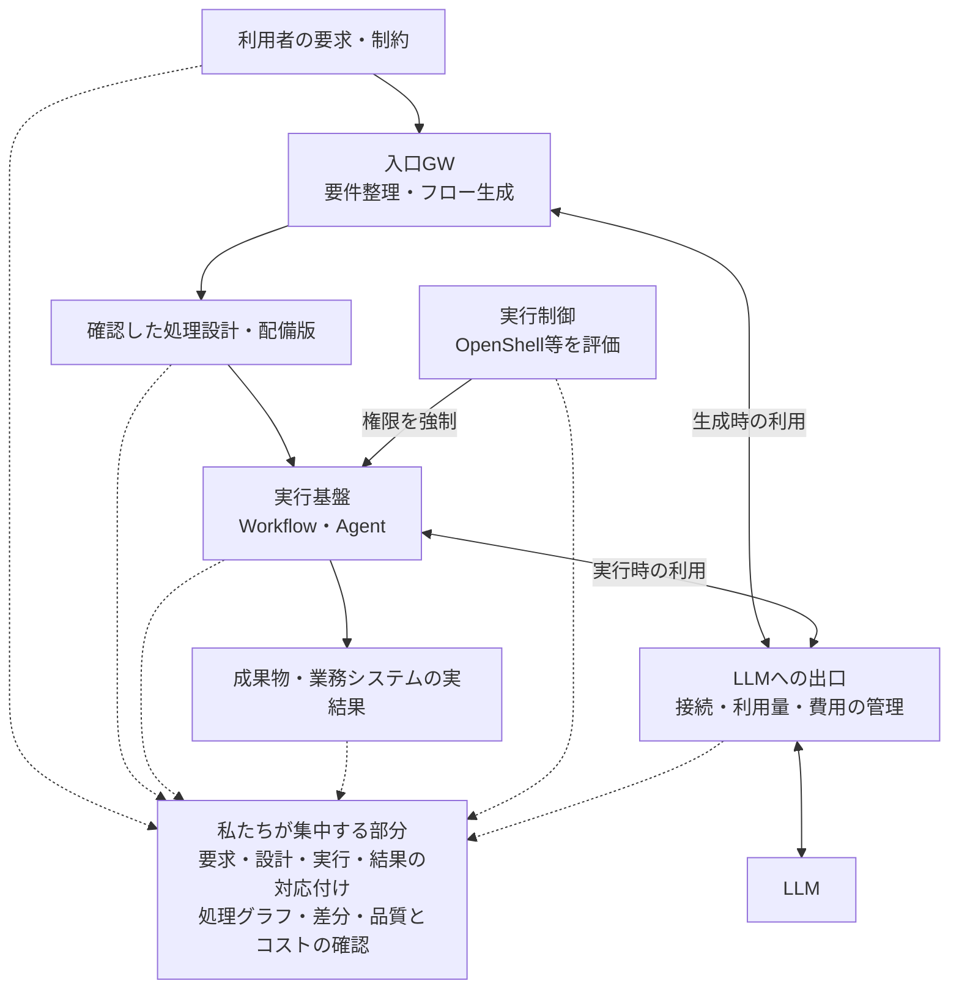
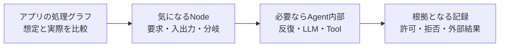

> 2026年9月29日時点の公開情報と、私たちの開発・検証状況に基づく方針です。外部製品の機能、私たちが動作確認した範囲、これから検証する構想を区別して記載します。

AIアプリを「作れる」ことから、「業務で使い続けられる」ことへ。次の競争が、かなり具体的になってきました。

2026年9月28日、NVIDIAはOpen Agent Safety Platformを発表しました。OpenShellによる実行制御と、Sentryによる独立した監視・制御を組み合わせる構想です。Anthropicも参加しており、発表ではClaude Managed Agentsとの連携が説明されています。NVIDIAとAnthropicだけの取り組みではなく、複数企業が関わる基盤です。[NVIDIA公式発表](https://nvidianews.nvidia.com/news/open-agent-safety-platform)

私たちは、それ以前から「AIアプリケーションの実行を見える化し、管理する基盤」を検討してきました。そこで今回の発表を受けて考えたのは、使える部品が増えた今、限られた開発資源をどこへ振り向けるか、ということです。

方針は、**実行制御やLLM管理の共通部品を取り込み、業務の要求・処理・結果を結び付ける製品と運用に集中する**ことです。

## 1. 「許可された処理」と「求められた仕事」は別々に確認する

たとえば、請求書から支払予定表を作るAIアプリを考えます。

許可されたファイルだけを読み、許可されたAPIだけに接続し、保護されたDBを書き換えなかった。この確認は必要です。それでも、請求金額を一桁間違えて抽出すれば、業務上は失敗です。

逆に、金額が正しくても、依頼は「予定表を作る」までだったのに、支払処理まで実行したら問題です。ワークフローの生成段階で、依頼を取り違えていた可能性もあります。

確認したいのは、次の四つです。

| 観点 | 業務で答えたい問い |
|---|---|
| フロー | 依頼した内容を正しく処理に落とし込み、必要な経路・承認を通ったか |
| 結果 | 求めた成果物や更新が、実際に得られたか |
| 品質 | 正確さ、抜け漏れ、応答時間が用途に合っているか |
| コスト | その成果を得るための費用と、人間の手直しが見合っているか |

実行権限の管理は、この四つを支える重要な基礎です。その上で、業務の目的に照らした確認を組み合わせます。

## 2. OpenShellは、実行制御の有力な部品になる

OpenShellは、Agentを隔離環境で実行し、ファイル・プロセス・ネットワークへのアクセスをポリシーで制御するランタイムです。権限の強制をAgentの外側に置く点が重要です。[OpenShell公式ドキュメント](https://docs.nvidia.com/openshell/about/overview)

また、機械処理用の監査記録をOCSF形式のJSONLとして出力できます。これは、セキュリティイベントを共通の構造で扱うための形式です。公式仕様では、イベントの識別子とSandboxの識別子も区別されています。[OCSF JSON Export](https://docs.nvidia.com/openshell/observability/ocsf-json-export)

私たちにとっては、この記録を「どのアプリの、どの実行の、どの処理で起きた判断か」に結び付ける接続点になります。ただし、Sandboxが識別できるだけで、業務上のNodeまで自動的に特定できるわけではありません。そこは連携の検証対象です。

Sentryは、BlueFieldを利用してホストから独立した監視・制御を追加する層です。一方、OpenShell自体にBlueFieldは必須ではありません。最初はソフトウェア側の連携を評価し、ハードウェアによる追加の分離は顧客要件に応じて検討します。[プラットフォーム公式説明・FAQ](https://www.nvidia.com/en-us/solutions/ai/agent-safety/)

ここは冷静に見る必要もあります。実行監視、権限管理、監査画面は、私たちの構想と重なる領域です。既存製品が追い付かないことを前提にした差別化はできません。

私たちが検証したい価値は、複数の実行基盤と業務システムをつなぎ、利用者が自分の仕事の言葉で挙動を確認できることです。これも他社に実現できないと断言できるものではありません。接続の確かさ、業務への適合、変更への追随、運用品質で価値を積み重ねます。

## 3. 入口をつなぐと、生成された処理の根拠まで遡れる

並行して、私たちのチームでは、既存のチャットから自然言語の要件を受け取り、ワークフローを生成するGWを開発しています。内部ではCatalog.pyと呼んでおり、現在はn8n連携のPoCが動作しています。

DifyやLangChainを使ったアプリへの対応は、今後の検証対象です。各製品がJSONやYAML、コードで処理を表現できても、分岐、状態、再試行、権限の意味まで同じになるとは限りません。変換後も要求を満たすかを確認します。

この入口で残したいのは、生成したワークフローだけではありません。

- 利用者が何を依頼したか
- 追加質問を経て、どの条件を確認したか
- 生成側がどんな前提を補ったか
- どの設計を確認し、どの版を配備したか

ここが残れば、「実装されたとおり動いたが、要求とは違った」という問題を扱えます。生成時点の設計と、配備後に直接編集された設計の差も追跡対象になります。

全体として、次のつながりを作ります。

実線は処理・通信・制御の関係、点線は可視化へ結び付ける記録です。目標構成を表しており、全接続が実装済みという意味ではありません。出口GWはLLMへの接続口です。ファイルやDB、業務APIへの操作は、実行側と接続先側の記録を別途つなぎます。

アプリの生成・変更と、日々の実行も別の段階です。毎回生成し直す必要はなく、確認したアプリへ新しい入力を渡して使います。入口GWを経由せずに作られた既存アプリも、取得できる設計・実行情報から取り込みます。

## 4. 最初に見せる画面は、業務の処理グラフ

ユーザーは、まず「請求書処理」「問い合わせ対応」「開発支援」といったアプリを開きます。そこで設計した処理と、今回実際に通った経路を確認します。

Agentが四回やり直していたら、そのNodeを展開する。予定外の更新が拒否されていたら、要求した引数と適用したルールを見る。出力金額が変わったら、入力資料、抽出結果、設計やモデルの変更を比較する。

これが、私たちが目指すドリルダウンです。記録の詳細度は、この操作をどこまで根拠付きで支えられるかに効きます。

固定ワークフローでは設計図を比較の基準にできます。ただし、設計自体が要求を満たすかは別に確認します。自律型Agentでは、要求・禁止事項・必要な承認などを基準に、観測された実行を組み立てます。

時間が前後しているだけのイベントを、因果関係があるようには描きません。直接確認できた関係、推定した関係、記録が不足している箇所を区別します。ログを読めたことだけから「すべての指示に従った」「判断理由が完全に分かった」とも結論しません。

## 5. 開発資源を集中する四つの場所

最初から対応製品や画面を増やすと、どれも浅くなります。今の段階では、次の順序で投資します。

| 優先 | 集中する仕事 | 最初に得たい成果 |
|---|---|---|
| 1 | 要求・設計・実行・外部結果の対応付け | 一つの業務を、入力から実結果まで途切れずに辿れる |
| 2 | グラフ中心の画面と実行比較 | 現場と開発者が、調べるべき箇所を同じ画面で見つけられる |
| 3 | 既存の実行制御・LLM管理との接続 | 許可・拒否・LLM利用の記録を処理の中に表示できる |
| 4 | 業務別の評価条件と変更前後の検証 | モデルやワークフローを変えたとき、継続利用の判断材料を出せる |

1と2を最初の実証の中心に置き、3はそのシナリオに必要な範囲から接続します。4は評価条件を先に用意し、運用結果で改善します。根拠のない工数比率を置くより、各段階で何を示せれば次へ進むかを決めます。

LLM接続にはLiteLLM、呼び出しの観測・評価にはLangfuseなどを活用する方針です。LangfuseはすでにLLM呼び出しだけでなく、Toolや検索を含むアプリケーショントレースと評価を扱っています。既存機能を確認した上で、不足する接続と業務上の表示を補います。[LiteLLM公式ドキュメント](https://docs.litellm.ai/docs/proxy/quick_start)、[Langfuse Observability](https://langfuse.com/docs/observability/overview)

独自の基盤モデル、汎用チャット画面、ワークフローエディタ、Sandboxを一式作ることへの投資は抑えます。Catalog.pyも、要件と生成物を結ぶ入口として育てます。各製品のエディタを置き換えるところまで初期範囲を広げません。

ただし「つなぐだけなら簡単」とは考えていません。並列実行、再試行、子Agent、ログ欠落、秘匿化、バージョン差によって、同じ操作の記録を正しく対応付けることは難しくなります。ここを正確に扱えることが、製品の土台です。

## 6. 売りは、調査・更新・運用を業務単位で引き受けること

顧客への説明は、次の一文に置きます。

> **AIアプリが意図どおりに作られ、動き、役に立っているかを、処理の流れと根拠から確認できるようにする。**

「ガバナンス」という言葉だけでは、導入費用の理由になりにくい。顧客が困っている場面へ落とし込む必要があります。

| 顧客の困りごと | 提供する価値 | 効果の測り方 |
|---|---|---|
| 昨日と結果が違い、調査に時間が掛かる | 入力・設計・実行の差を辿り、原因候補を絞る | 問題箇所を根拠付きで説明するまでの時間 |
| モデルやアプリを更新するのが怖い | 合意した業務シナリオで変更前後を比較する | 受入条件の達成率、手直し時間 |
| 自動実行が何を変えたか分からない | 許可・実行・外部結果を結び付ける | 対象操作の照合率、未確認事項の件数 |
| 安いモデルにしたのに人手が増えた | 利用料金と品質・再実行・人間の作業を合わせて評価する | 受入可能な成果一件あたりの総費用 |
| 各部門で異なる製品が使われている | 共通の確認手順と記録で運用する | 新規接続や製品更新に掛かる作業時間 |

いずれも、これから実証する指標です。導入前後で対象業務と条件を揃え、削減率を測ります。現時点で効果の数値は置いていません。

提供形態の第一候補は、顧客環境内で動かすソフトウェアアプライアンスと、導入SI、継続的な運用支援の組み合わせです。初期はVMやコンテナで導入・更新しやすい形を目指し、物理機器は要件に応じて検討します。

導入時には業務、権限、合格条件、記録の保持範囲を整理する。運用中はバージョン追随、変更前後の検証、問題調査、品質・コストの見直しを行う。この継続作業まで含めて価値を提供します。

現場に合うアプリを作るSIは引き続き重要です。Difyやn8nを使った開発と、組織全体の管理は両立します。他のベンダーが作ったアプリにも接続できることを、製品の前提にします。

## 7. オープンにする部分も、事業のために選ぶ

複数のAgentやワークフローに対応する仕事を、私たちだけで抱えるには限界があります。そこで、接続仕様と小さな開発者向けツールを公開する方針です。

| 公開を目指すもの | 普及によって期待する効果 |
|---|---|
| 共通イベントの最小仕様と既存標準への対応表 | 接続先ごとに同じ意味を説明し直す負担を減らす |
| SDKと参照アダプタ | 開発者自身が記録を出し、動作を確認できる |
| 接続テストと機密情報を除いたサンプル記録 | 対応範囲やバージョン更新時の不具合を共同で検証できる |
| 最小のローカル表示ツール | 自作Agentの処理を、導入契約なしで試せる |

OpenTelemetryやOCSFなど既存の形式を尊重し、要求・設計・業務結果との対応に必要な情報を補います。独自形式へ変換するときも、元記録と出所を保持します。

商用価値は、企業環境への適合、複数アプリの横断管理、対応バージョンの検証、運用支援、業務別の評価条件に置きます。公開で接続可能な環境が増えれば、顧客にも私たちにも導入しやすくなる、という仮説です。

ただし、公開すれば自動的にコミュニティが育つわけではありません。説明、サンプル、問い合わせ対応、互換性維持にも資源を割きます。最初の対象は、いま困りごとを持ち、自分でも検証できる開発Agentの利用者です。

## 8. 若い基盤への依存は、交換時に失うものから考える

OpenShellを有力候補にしても、製品全体をその内部形式へ固定しません。各部品が変わったときに、業務の要求、実行履歴、外部結果との関係を残せるようにします。

| 領域 | 第一候補・方針 | 代替時の考え方 |
|---|---|---|
| 実行制御 | OpenShellを評価 | 実行基盤の権限制御や外部API側の制御へ接続する。保護範囲の違いを明示する |
| LLM接続 | LiteLLMを想定 | 顧客指定GWにも対応できる接続契約を定める |
| 観測・評価 | Langfuseなどを活用 | 元記録と評価条件を保持し、表示・分析先を変更できるようにする |
| 実行記録の取得 | 公式API・Hook・出力機能を優先 | 履歴読取りやTool境界の記録で補い、取得できない項目を示す |

代替部品の名前が並ぶだけでは、交換可能とは言えません。同じシナリオを走らせ、見える情報、止められる操作、運用負担の差を確認します。たとえばToolのHookとOS側の隔離では強制できる範囲が違い、同じ保護を提供するとは限りません。

## 9. 次のPoCでは、一本の業務をつなぐ

現在地は、次のように整理しています。

| 項目 | 現状 |
|---|---|
| 自然言語の要件からn8nのワークフローを生成する入口GW | チーム内でPoC動作 |
| Goose／Claude Codeを対象とする観測・照合 | PoC設計段階。実証結果はこれから |
| Dify／LangChainへの入口GW対応 | 拡張候補。意味を保った変換を未検証 |
| OpenShellによる実行制御と記録連携 | 公開仕様を確認し、採用を評価する段階 |
| 要求から実結果までの統合画面・商品提供 | 構想・設計段階 |

次は、動いているn8n側の生成PoCを起点に、一つの短い業務で要求・生成物・実行・結果を結び付けます。それと別に、Claude Codeなど一つのAgentでOpenShellの許可・拒否を検証します。両者の記録を共通の考え方で表示できるかを確認してから、対象を増やします。

合格条件は「接続できた」だけでは足りません。

1. 要求と異なるフローを用意したとき、設計段階の相違として示せる。
2. 正常終了でも成果物が誤っていれば、合意した評価条件で区別できる。
3. 禁止した更新が拒否され、対象の外部記録でも更新がないことを照合できる。
4. 意図的に一箇所変えた実行を比較し、最初に観測された差と後続の違いを示せる。
5. 記録を欠落させたとき、正常と決め付けず「未確認」と表示できる。
6. 利用者がグラフから問題箇所へ辿る時間を、従来の調査と比較できる。

差が最初に見つかった場所は、根本原因と同じとは限りません。PoCでは変更箇所を把握した実験で確かめ、本番では原因候補と確認済みの事実を分けます。品質の評価も、業務ルール、既知の正解、人間の確認を使い分けます。

## 10. 目指すのは、部品の進化を顧客の改善につなげること

NVIDIAや各Agentベンダーが、実行を守る基盤を整える。LLM管理・観測製品が、呼び出しや品質の評価を充実させる。私たちはその進化を取り込み、顧客の要求と実際の仕事をつなぐ部分へ開発資源を使います。

利用者が処理グラフを見て「ここまでは想定どおり、ここから確認したい」と分かること。変更前後の違いを、開発者と運用担当者が同じ根拠で話せること。必要な制御を適用し、得られた成果に費用が見合うかを判断できること。

その状態を、異なる製品が混在する現場で作り、維持する。私たちは、そこを事業として育てたいと考えています。
