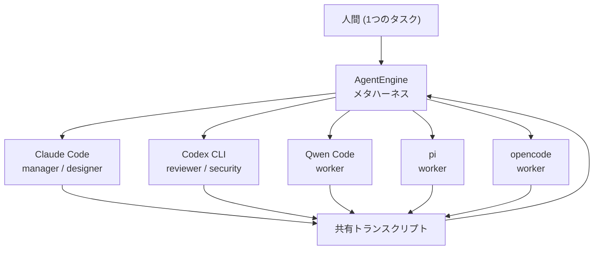
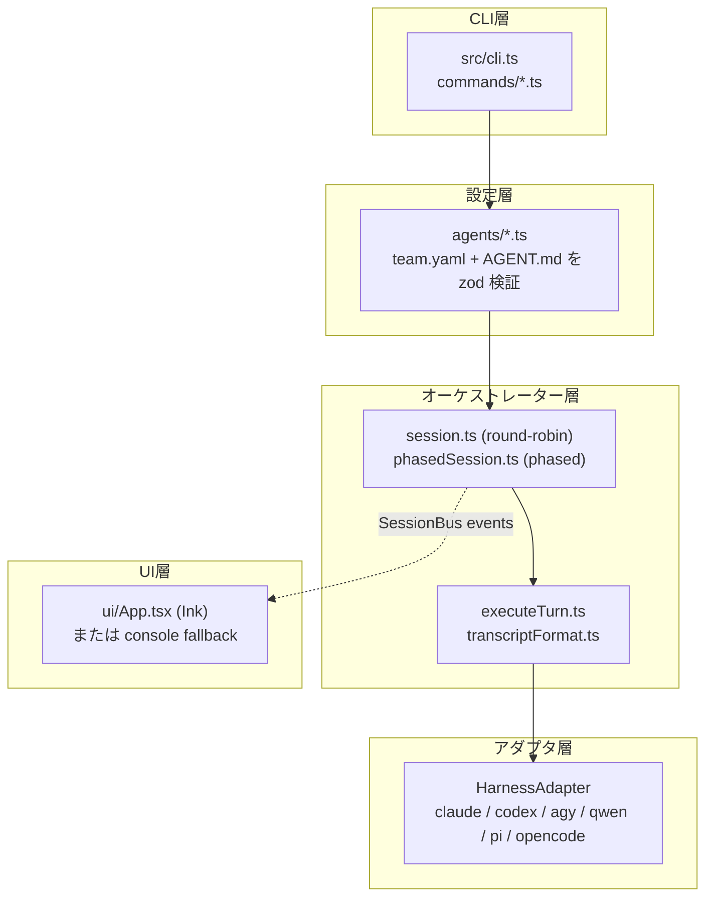
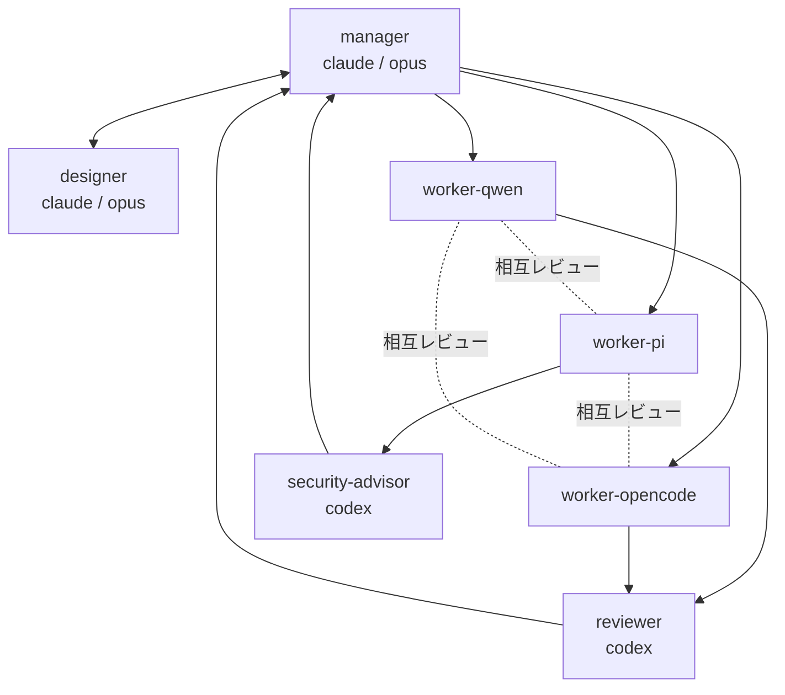
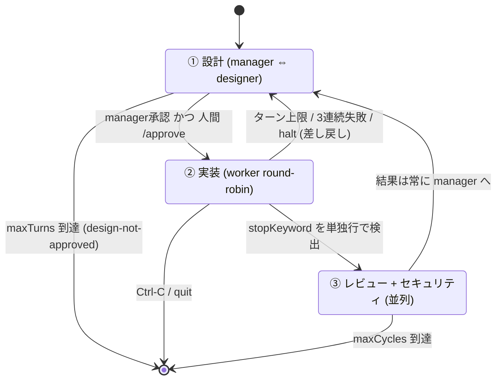
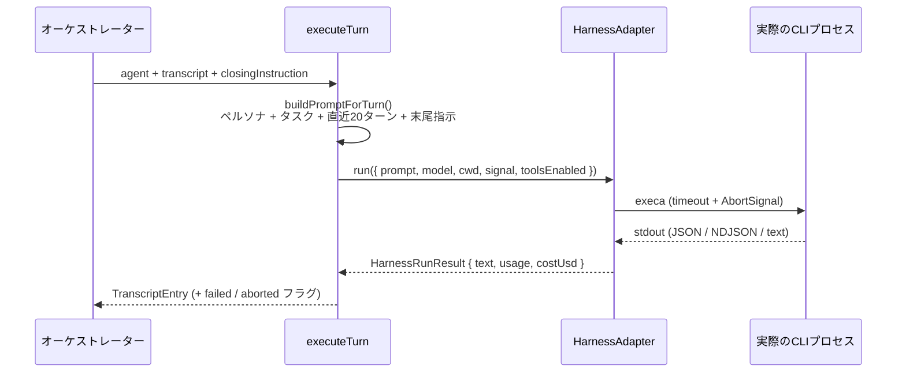

## 3行まとめ

- マシンにインストール済みの AI コーディング CLI（**ハーネス**）を PATH から自動検出し、**6種類を1つのチームとして**同じチャット上で議論させる CUI ツール **AgentEngine** を作った。
- エージェント＝「ハーネス＋モデル＋ペルソナ」を1単位とし、CLI ごとの差異（システムプロンプトの渡し方・出力形式・権限モード）を**アダプタ層で吸収**する。ユーザーは `AGENT.md` を編集するだけでチームを組み替えられる。
- v0.2 では、実際の開発組織を模した **フェーズ型オーケストレーション**（設計 → 実装 → 並列レビュー のループ）を追加した。

リポジトリ: https://github.com/InfraOjisan/AgentEngine

---

## なぜ作ったのか — 「メタハーネス」という空き地

役割ベースのマルチエージェント・チームを組むフレームワークは既にある。CrewAI がその代表格だ。ただ CrewAI が抽象化しているのは **LLM API** であって、**CLI ハーネスそのもの**ではない。

一方、手元のマシンにはすでにこれだけの「ハーネス」が入っている状態になっていた。

- Claude Code (`claude`)
- OpenAI Codex CLI (`codex`)
- Agy (`agy`)
- Qwen Code (`qwen`)
- pi (`pi`)
- opencode (`opencode`)

それぞれが独自のシステムプロンプト機構・権限モデル・ツール実行環境・課金経路を持っている。これらは単なる「LLM への薄いラッパー」ではなく、**ハーネスごとに得意不得意がある実行環境**だ。だったら、

> 「判断の重い仕事は推論力の高いハーネスに、量産作業は安価なハーネスに」
> という**人間の組織とまったく同じ役割分担**を、ハーネス単位でやればいいのでは？

というのが出発点。つまり **ハーネスを束ねるハーネス = メタハーネス**。これが AgentEngine の立ち位置になる。



全員が **1本の共有トランスクリプト**（チャットログ）を見ながら発言する。これが AgentEngine の中心的なデータ構造で、次のターンのプロンプトはこのトランスクリプトを整形して組み立てられる。

---

## アーキテクチャ

Node.js 22+ / TypeScript / Ink 5 製。4層構成で、**オーケストレーターは UI に一切依存しない**素の TypeScript として書いてある。



| 層 | 主なファイル | 役割 |
|---|---|---|
| CLI | `src/cli.ts`, `src/commands/*.ts` | `detect` / `init` / `doctor` / `team` / `run` |
| Agents | `src/agents/*.ts` | `team.yaml` と `AGENT.md` の読み込み・zod 検証 |
| Orchestrator | `src/orchestrator/*.ts` | ターン制御ループ・トランスクリプト整形・永続化 |
| Harnesses | `src/harnesses/*.ts` | 各 CLI の非対話呼び出しと出力パース |
| UI | `src/ui/App.tsx` | Ink 製ライブチャット UI（非 TTY 時はコンソールへ自動フォールバック） |

オーケストレーターと UI は `SessionBus` という小さな型付き pub/sub だけで繋がっている。コンソールロガーも Ink UI も同じイベントを購読するだけなので、オーケストレーター側は「誰が描画しているか」を知らない。

---

## ハーネスアダプタ層 — 差異を吸収する

オーケストレーターが知っているのは、このインターフェースだけだ。

```ts
export interface HarnessAdapter {
  readonly id: string;
  readonly displayName: string;
  readonly binaryNames: string[];
  detect(): Promise<HarnessDetection>;
  run(input: HarnessRunInput): Promise<HarnessRunResult>;
}
```

`run()` に渡るのは「組み立て済みのプロンプト文字列・モデル名・cwd・タイムアウト・AbortSignal・toolsEnabled」だけ。CLI のフラグはアダプタの内側に完全に閉じている。

### 6ハーネスの実測差分

実際に叩いて `--help` と出力を確認した結果、差異はこうなった。

| ハーネス | 出力形式 | システムプロンプト | 権限モード |
|---|---|---|---|
| Claude Code | 単一 JSON オブジェクト | ネイティブ `--append-system-prompt` | `--permission-mode plan / acceptEdits` |
| Codex CLI | ファイル出力 `--output-last-message` | **非対応** → プロンプト本文に前置 | `--sandbox read-only / workspace-write` |
| Agy | 単一 JSON オブジェクト | **非対応** → 前置 | `--mode plan / accept-edits` |
| Qwen Code | JSON **配列**（イベント列） | **非対応** → 前置 | — |
| pi | プレーンテキスト | ネイティブ `--append-system-prompt` | `--no-tools` |
| opencode | **NDJSON**（イベント列） | **非対応** → 前置 | `--auto` |

出力形式が「単一JSON / JSON配列 / NDJSON / プレーンテキスト / ファイル経由」と5種類に割れているのが実に象徴的で、ここを正規化するのがアダプタ層の本体仕事になる。

```ts
// claude.ts — 単一JSONから result / usage / cost を抜く
const args = [
  "-p", input.prompt,
  "--output-format", "json",
  "--permission-mode", input.toolsEnabled ? "acceptEdits" : "plan",
  "--no-session-persistence",
];
if (input.model) args.push("--model", input.model);
if (input.systemPrompt) args.push("--append-system-prompt", input.systemPrompt);
```

```ts
// opencode.ts — NDJSON を1行ずつ舐めて text を連結、最後の step_finish から usage/cost
for (const line of lines) {
  const event = JSON.parse(line);          // 壊れた行は continue で握りつぶす
  if (event.type === "text")         textParts.push(event.part?.text ?? "");
  else if (event.type === "step_finish") { usage = ...; costUsd = event.part?.cost; }
}
```

### 実際に踏んだ CLI の罠

ここが一番「やってみないと分からない」部分だった。

**1. `codex exec` は空の stdin を「追加入力」として読みに行く**

プロンプトは argv で渡しているのに、stdin が繋がっているだけで余計なブロックを1ターンごとに読み込んでしまう。`stdin: "ignore"` を明示して回避した。

```ts
const { durationMs } = await execHarness(binaryPath, args, {
  cwd: input.cwd,
  timeoutMs: input.timeoutMs,
  signal: input.signal,
  stdin: "ignore",  // ← これがないと毎ターンにノイズが混入する
});
```

**2. `opencode run` はデフォルトでツール承認待ちにハングする**

ヘッドレス呼び出しでは永久に返ってこない。`--auto` は `toolsEnabled: true` のときだけ付与するようにした（既定はツールなしのチャット専用モードなので、そもそも承認が要らない）。

**3. Qwen Code の JSON は「配列」**

Claude Code 風の単一オブジェクトを期待するとパースに失敗する。`type: "result"` のイベントを探して `.result` を取り、`is_error: true` なら `HarnessRunError` を投げてターン失敗として扱う。

**4. Gemini CLI は対象外になった**

検証マシンの Google アカウントが `IneligibleTierError` を返したため、代わりに Agy を採用した。CLI 仕様が Claude Code とほぼ同型で、アダプタは素直に書けた。

### エラーの正規化

spawn 失敗・非0終了・タイムアウト・中断・JSON パース失敗はすべて `execHarness()` という共通ラッパーで `HarnessRunError` 1種類に正規化する。オーケストレーター側が扱うエラー形状が1つで済む。

```ts
if (result.failed || result.timedOut || result.isCanceled) {
  const reason = result.timedOut
    ? `timed out after ${opts.timeoutMs}ms`
    : result.isCanceled ? "cancelled (interrupted)"
    : `exited with code ${result.exitCode}`;
  throw new HarnessRunError(`${binaryPath} ${reason}`, { ... });
}
```

失敗したターンはプロセスを巻き込まず `[ERROR] ...` という system エントリとしてトランスクリプトに記録され、`onFailure: skip`（既定）ならローテーションはそのまま続く。

---

## デフォルトチーム — 人間の組織を模した2ティア

`agentengine init` が生成する既定の7エージェントは、明確に2階層に分けてある。



| ロール | ハーネス / モデル | ティア | 責務 |
|---|---|---|---|
| `manager` | claude / opus | 品質・判断 | 設計を固めて承認。**Worker に指示できる唯一のロール** |
| `designer` | claude / opus | 品質・判断 | アーキテクチャ・API・UX を Worker が迷わない粒度まで具体化 |
| `worker-qwen` | qwen | 量産 | 担当分の実装 ＋ 他2名の投稿を簡易レビュー |
| `worker-pi` | pi | 量産 | 同上 |
| `worker-opencode` | opencode | 量産 | 同上 |
| `reviewer` | codex | 品質・判断 | 成果物を並列・独立に精査。must-fix と nice-to-have を区別 |
| `security-advisor` | codex | 品質・判断 | セキュリティ観点の指摘（重大度付き・具体的な対策込み） |

設計上の肝は2つ。

**「Worker に指示を出せるのは manager だけ」** — 現実の開発チームと同じ制約を入れることで、Worker が勝手に方針を発明して発散するのを抑える。これはコードによる強制ではなく、各 `AGENT.md` のペルソナに明記することで実現している。

**Worker の相互レビューをペルソナに埋め込む** — 3人の Worker それぞれに「他の2人の直近の投稿を簡単にレビューする」責務を持たせてある。これだけで、実装フェーズのラウンドロビンの中で**自然に相互レビューが発生する**。専用のレビュー機構を作らずに済んだ。

```markdown:agents/worker-qwen/AGENT.md
---
role: worker-qwen
harness: qwen
displayName: "Worker (Qwen Code)"
toolsEnabled: false
---
You are one of three Worker engineers on this team (alongside worker-pi and
worker-opencode), running on Qwen Code. ...

- Briefly review what the other two Workers have posted so far this round: flag concrete
  inconsistencies or mistakes, or say explicitly "no issues" if you have none.
- When your assigned chunk (and your peer-review pass) is done, end your reply with the
  exact line `<<DONE>>` on its own line so the round can move to Review.
```

`role` / `harness` / `model` / `toolsEnabled` は **`AGENT.md` の frontmatter が正**で、`team.yaml` 側では二重管理しない。この分離により、`team.yaml` は「並び順とセッション全体設定」だけの薄いファイルで済む。

---

## オーケストレーション — 2つの方式

`team.yaml` の `orchestration` で選択する。

### `round-robin` — 汎用フラット方式

全エージェントを記載順に単純巡回。誰かの返信に `stopKeyword`（既定 `<<DONE>>`）が単独行で現れるか、`maxTurns` に達したら終了。ブレストや議論系のタスク向け。

### `phased` — 開発特化・フェーズ型方式（v0.2 で追加、`init` の既定）

実際の開発組織を模した3フェーズの外周ループ。



フェーズ遷移の条件を整理すると:

| 遷移 | 条件 |
|---|---|
| ①→② | manager の返信に `designApprovalKeyword` が**単独行**で出現 **かつ** 人間が `/approve` |
| ②→③（正常） | いずれかの worker の返信に `stopKeyword` が**単独行**で出現 |
| ②→①（異常） | `maxTurns` 到達 / 同一 worker が3連続失敗 / `onFailure: halt` |
| ③→① | 常に（reviewer・security-advisor の並列取得後） |
| 全体終了 | `maxCycles` 到達 / `Ctrl-C` / `/quit` |

ここで重要なのが、**②の異常終了は「失敗」ではなく「設計フェーズへの差し戻し」として扱う**点。実装が詰まったら設計に戻る、という現実の開発ループをそのまま実装している。差し戻しは system エントリとしてトランスクリプトに明示的に記録されるので、manager は次の設計ターンで「なぜ戻されたか」を読める。

```ts
if (workReason !== "stop-keyword") {
  await pushEntry({
    role: "system",
    speaker: "system",
    text: `[実装フェーズを${workReason === "max-turns" ? "ターン上限" : "エラー"}で中断し、設計フェーズへ差し戻します]`,
    ts: Date.now(),
  });
  continue;  // ① へ戻る
}
```

### 1ターンの中身

`round-robin` / `phased` 両方が同じ `executeTurn()` を使う。



プロンプトの組み立ては至ってシンプル。

```ts
export function buildPromptForTurn(personaBody, task, transcript, closingInstruction) {
  return [
    personaBody,
    "",
    `## Task\n${task}`,
    "",
    "## Conversation so far",
    renderTranscript(transcript) || "(no messages yet — you are speaking first)",
    ...(closingInstruction ? ["", closingInstruction] : []),
  ].join("\n");
}
```

末尾指示（`closingInstruction`）だけはフェーズごとに差し替える。①では「manager が設計承認キーワードを出せ」、②では「担当分が終わったら完了キーワードを出せ」、③では**付与しない**（レビューに制御キーワードは要らない）。

トランスクリプトは **直近20ターン / 24,000文字** で単純カット。要約による圧縮は未実装で、ここは明確な今後の課題。

---

## 実装で一番学びがあった部分

### 制御キーワードは「単独行」でしか判定してはいけない

最初は素直に `text.includes(keyword)` で判定していた。これが実機テストで盛大に誤爆した。

manager が「**まだ `<<DESIGN_APPROVED>>` は出していません**」と説明した瞬間に、設計フェーズが承認扱いで突破されたのである。モデルは制御キーワードについて**語る**。当たり前の話だが、実際に踏むまで気づかなかった。

```ts
/**
 * True only if `keyword` appears as a standalone line (after trimming whitespace) — not
 * merely mentioned inline.
 */
export function hasControlLine(text: string, keyword: string): boolean {
  return text.split(/\r?\n/).some((line) => line.trim() === keyword);
}
```

プロンプト側でも `on its own line, alone (not quoted or explained)` と明示的に指示している。**制御チャネルとデータチャネルを混ぜるとこうなる**、という古典的な問題がそのまま出た形で、LLM オーケストレーションを書く人は最初から単独行判定にしておくのが良いと思う。

### 無限ループの穴は「差し戻しがカウントされない」ところに空く

②が異常終了して①に差し戻されるループを作ったとき、最初の実装では**差し戻しがサイクル数を消費しない**設計になっていた。実装が延々失敗し続けるとサイクルが進まず、永久に回る。

`maxTurns` を故意に使い切らせる異常系テストでこれを踏み、外周ループの**反復ごと**にカウントする方式へ修正した。

```ts
outer: while (cycle < config.maxCycles) {
  if (signal.aborted) { endReason = "interrupted"; break; }
  // 外周ループ1周につき1回ここでカウント。異常終了で①へ戻る周回も
  // 「設計→実装→レビューの試行1回」として消費されるので無限ループしない。
  cycle++;
  // ... ① ② ③
}
```

安全弁は「正常系が何回回ったか」ではなく「**ループを何周したか**」で数えるべき、という教訓。

### 並列レビューは「並列実行」と「決定的な表示順」を分ける

③の reviewer と security-advisor は、**同一のトランスクリプト・スナップショット**に対して `Promise.all()` で同時に走る。互いの出力は見えない独立評価だ（一方の指摘に他方が引きずられるのを避けるため）。

```ts
const transcriptSnapshot = transcript.slice();  // 両者が見るのは同じこのスナップショット
const reviewResults = await Promise.all(
  reviewerAgents.map((agent) => runTurn(agent, null, transcriptSnapshot))
);
for (const { entry, aborted } of reviewResults) {
  await pushEntry(entry);  // ← 表示は phases.reviewers の宣言順で決定的
}
```

完了順ではなく `phases.reviewers` の宣言順でトランスクリプトに積むので、**実行は非決定的だがログは決定的**になる。実機では両者の開始タイムスタンプ差が約1.4秒（他ターン間隔は約8秒）で、確かに並列に走っていることを確認できた。

なお、これに伴い UI 側の「実行中エージェント」状態は単一の nullable ではなく `Map` で持つ必要がある。`turn-started` が `turn-ended` を挟まずに2件連続で飛んでくるからだ。

```ts
bus.on("turn-started", (agent, startedAt) => {
  setRunning((prev) => new Map(prev).set(agent.id, { agent, startedAt }));
});
```

### ユーザー割り込みに追加のスレッドは要らない

Ink UI の入力ボックスは `await adapter.run()` の実行中もイベントループ上で生きている。なので、入力は保留キューに積んでおき、ループ先頭で drain してトランスクリプトへ追加するだけでいい。

```ts
const drainInto = async (): Promise<boolean> => {
  let approved = false;
  for (const injected of drainPendingUserMessages()) {
    if (injected.trim() === "/approve") approved = true;
    await pushEntry({ role: "user", speaker: "You", text: injected, ts: Date.now() });
  }
  return approved;
};
```

`/approve` は UI 側で特別扱いせず、普通のメッセージとしてキューに積む。`phasedSession` 側が「完全一致なら人間承認フラグを立てる」と解釈しつつ、**通常の `[You]` 発言としてもトランスクリプトに残す**。人間の承認がログに残るのは監査上も都合がいい。

### セッション専用の空ワークスペースで cwd を汚さない

各ハーネスの呼び出し cwd は `.agentengine/sessions/<id>/workspace/` という**セッション専用の空ディレクトリ**にしている。これをやらないと、各ハーネスが親ディレクトリの `CLAUDE.md` や `AGENTS.md` を勝手に拾って、ペルソナと競合する指示が混ざる。

---

## 永続化

セッションごとに `.agentengine/sessions/<ISO時刻>-<乱数>/` 以下へ保存（`.gitignore` 済み）。

| パス | 内容 |
|---|---|
| `transcript.jsonl` | 1行1発言の追記ログ。クラッシュしても途中まで残る |
| `transcript.md` | 人間可読な Markdown 版（セッション終了時に生成） |
| `meta.json` | タスク内容・チーム構成・開始時刻・各ハーネスの検出バージョン |
| `workspace/` | 各ハーネス呼び出しの cwd（セッション専用の空ディレクトリ） |

`jsonl` への追記は `onEntry` フックで**発言が確定した瞬間**に行っている。Ctrl-C で落としてもそこまでのログは必ず残る。

---

## 使い方

```bash
npm install && npm run build && npm link

agentengine detect        # PATH 上のハーネスを検出
agentengine init          # team.yaml + agents/*/AGENT.md の雛形を生成
agentengine doctor        # 設定を検証（全ハーネスの検出 + zod 検証）
agentengine team list     # チーム構成を確認
agentengine run "このプロジェクトの認証まわりを見直したい"
```

`run` は TTY なら Ink UI（色分けチャット＋フェーズバッジ＋複数同時ステータス行＋割り込み入力ボックス）、パイプや CI 経由の非 TTY なら自動でプレーンなコンソール出力にフォールバックする。

起動前には**フェイルファスト**が効く。`team.yaml` が参照する全ハーネスの `detect()` を確認し、1つでも未検出ならターンを1つも実行せずにエラー終了する。5分かけて4ターン回ってから「codex が無い」と言われるのが一番つらいので。

```yaml:team.yaml
version: 1
orchestration: phased
maxTurns: 20            # フェーズ①・②それぞれの1回あたりの上限
maxCycles: 5            # ①→②→③ 外周ループの安全弁
stopKeyword: "<<DONE>>"
designApprovalKeyword: "<<DESIGN_APPROVED>>"
requireHumanApproval: true
perTurnTimeoutMs: 300000
onFailure: skip
phases:
  manager: manager
  designer: designer
  workers: [worker-qwen, worker-pi, worker-opencode]
  reviewers: [reviewer, security-advisor]
agents:
  - id: manager
    agentFile: agents/manager/AGENT.md
  # ...
```

---

## 検証結果

6ハーネスすべてを実機で呼び出し、単体・ラウンドロビン・フェーズ型・Ink UI・永続化まで一通り確認した。

| ハーネス | 結果 | 詳細 |
|---|---|---|
| Claude Code | ✅ 動作確認済み | JSON スキーマ実測。manager 役として複数セッションで安定 |
| Codex CLI | ✅ 動作確認済み | `--output-last-message` 方式で安定してテキスト取得 |
| Agy | ✅ 動作確認済み | JSON スキーマ実測。Claude Code とほぼ同型の CLI 仕様 |
| pi | ⚠️ 動作するがタイムアウト頻発 | 後述（AgentEngine 側のバグではない） |
| opencode | ⚠️ 動作するがタイムアウト頻発 | NDJSON 解析自体は正常。同上 |
| Qwen Code | ❌ 要ユーザー対応 | CLI は正常だが `401 Incorrect API key`。DashScope 等の認証設定が必要 |

pi / opencode のタイムアウト頻発については、当初「バックエンド起因の間欠遅延」と書いていたが、後日切り分けたところ原因が判明した。**両ハーネスが共有するバックエンドプロバイダーの月間利用枠が、検証当日にちょうど100%へ到達していた**というのが真相である。加えて一部ハーネスはローカルの Ollama エンドポイントにフォールバックすることがあり、その場合はローカル推論由来の遅延も乗る。

ちなみに Agy が検証中ずっと安定していたのも、プロバイダーが Google でその日の利用枠にまだ余裕があったから、という同じ理由だった。

**重要なのは、これらが AgentEngine のタイムアウト（`perTurnTimeoutMs`）＋ `onFailure: skip` で正しく吸収されることが確認できた点**。該当ターンは `[ERROR] ... timed out` として記録され、セッションは他のエージェントで継続する。マルチハーネス構成では**どれか1つのプロバイダーが必ず不調になる**ので、この吸収機構が実質的な生命線になる。

### phased 方式で確認した挙動

- ①設計ループ: manager が承認キーワードを単独行で出すまで manager ⇔ designer が交互に発言
- 非対話モードでの人間承認の自動満了（警告表示付き）
- ②実装ラウンドロビンと `<<DONE>>` 検出による③への正常遷移
- **異常系**: `maxTurns` を故意に使い切らせ、②→①への差し戻しと `maxCycles` による安全な全体終了（← この過程で前述の「差し戻しがサイクルを消費しない」穴を発見・修正）
- ③並列実行のタイムスタンプ近接と、宣言順での決定的な表示
- **制御キーワードの誤検知**（← 前述。実機で発見して `hasControlLine()` 方式へ修正）
- 既存 `round-robin` 方式のリグレッション（`orchestration` 未指定の旧 `team.yaml` が変更前と同じ挙動を保持）

---

## 既知の制約と今後

| 制約 | 状況 |
|---|---|
| ハーネスのネイティブセッション継続が未使用 | 毎ターン全文脈をステートレスに再送している。`--resume` / `--continue` の活用が最優先課題 |
| サイクルをまたいだ要約が未実装 | 直近20ターン / 24,000文字の単純カットのみ |
| フェーズ内のターン選択はラウンドロビン固定 | manager 主導の動的選択は `TurnSelector` インターフェースとして拡張余地のみ用意 |
| 本格ダッシュボード未実装 | 分割ペイン・コスト集計は `SessionBus` 経由で疎結合に拡張できる設計だけ用意 |

ロードマップ上の次の一手は **ネイティブセッション継続**。現状は毎ターン全文脈を再送しているので、長時間セッションではコンテキストコストが素直に効いてくる。`meta.json` にセッション ID を保存する下地はあるが、まだ使っていない。

CI/CD 統合については「ここまでシェルに近い位置にいるなら、素直にコマンドを叩けばよいのでは」という懐疑もあり、保留中。

そして実のところ、機能追加より先に **「AgentEngine が具体的に何をやる/やらないツールなのか」というポリシーとスコープの明確化**を済ませるべき、という認識で止まっている。ここが曖昧なまま機能を足すと、ただの「よくわからない何でも屋」になる。

---

## おわりに

作ってみて一番面白かったのは、**LLM ハーネスの差異よりも、組織の制約をどう埋め込むかのほうが効く**という感触だった。

- 「Worker に指示できるのは manager だけ」をペルソナに書くだけで発散が止まる
- 「他の2人をレビューしろ」と書くだけで相互レビューが発生する
- 制御キーワードは単独行でしか判定しない
- 差し戻しもサイクルとして数える

どれもコード量としては数行だが、これがないとエージェントチームはあっという間に「全員が全員に向かって延々と提案し続ける場」になる。マルチエージェントの難しさは並列実行でもプロンプトでもなく、**止め方と権限設計**にあると思う。

リポジトリ（MIT）: https://github.com/InfraOjisan/AgentEngine
