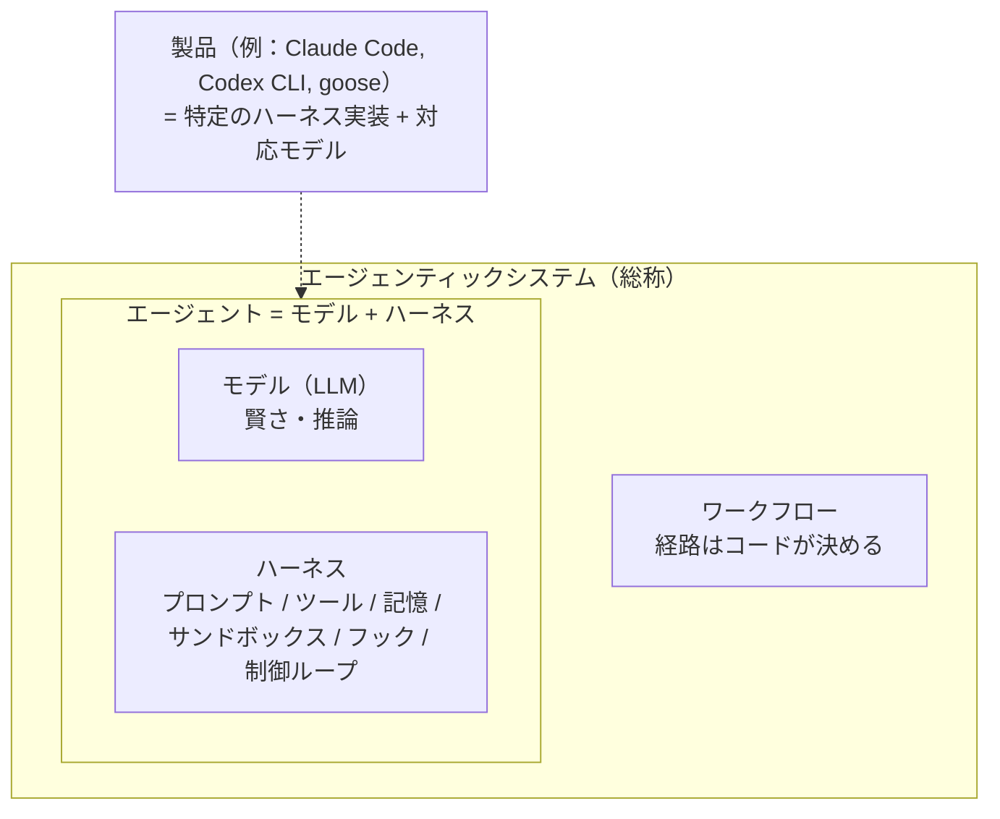
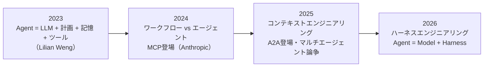
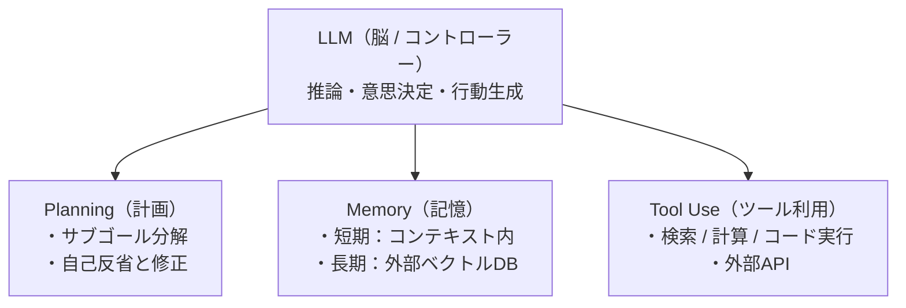
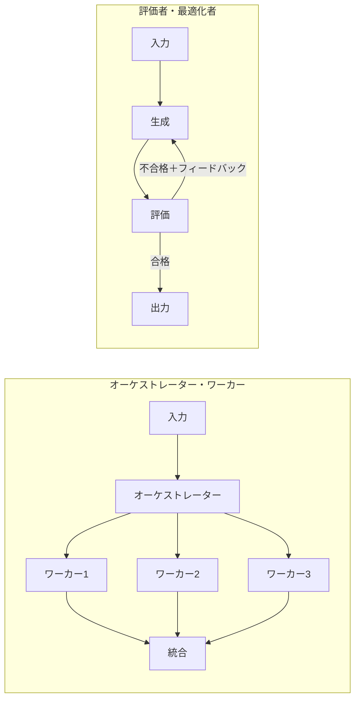
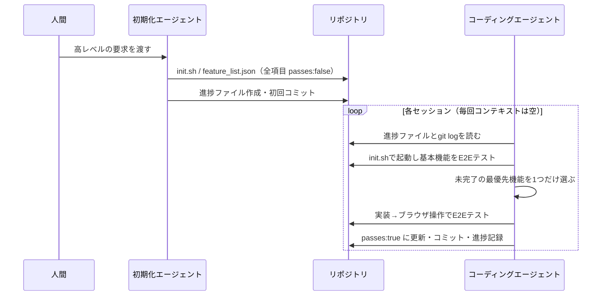
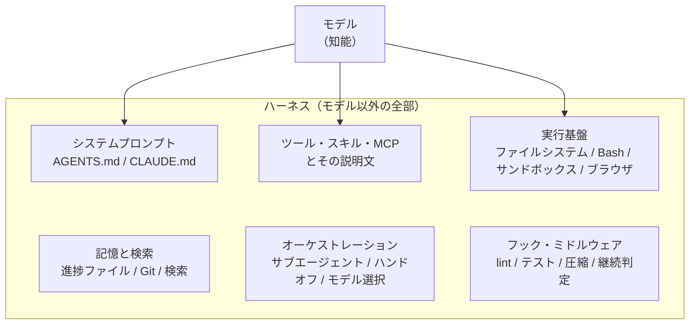
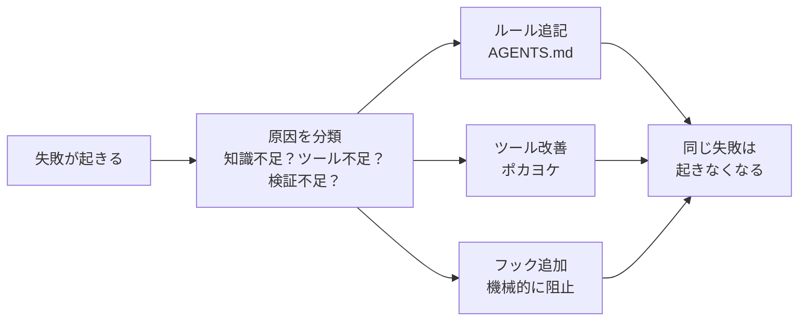
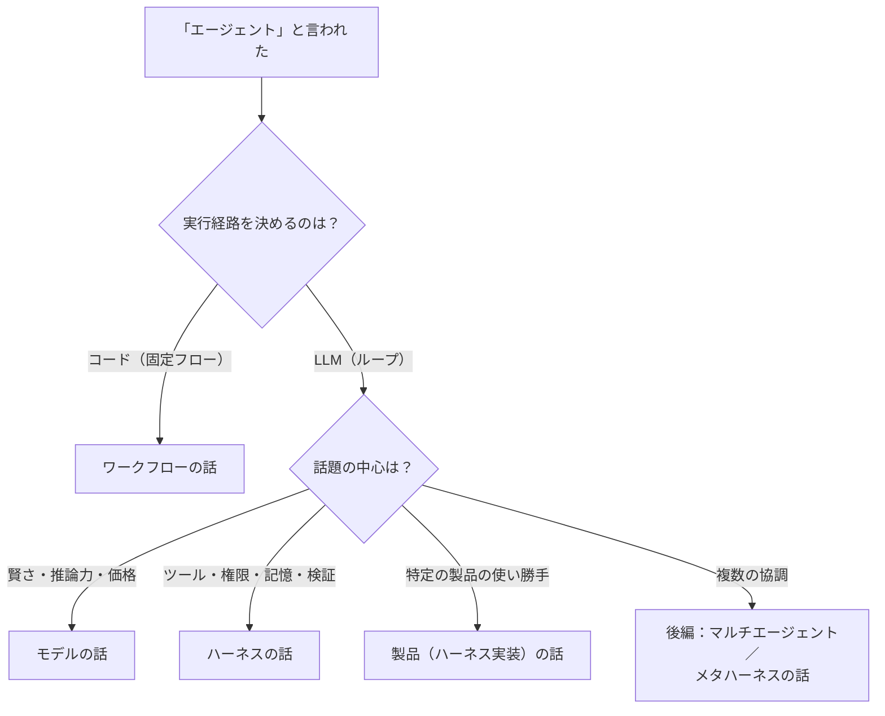

## この記事の結論

- **エージェント ＝ モデル ＋ ハーネス**。モデル（LLM）は「賢さ」、ハーネスは「それ以外の全部」（プロンプト、ツール、記憶、サンドボックス、フック、制御ループ）です
- 日本語圏の議論が噛み合わないのは、**「エージェント」という1語に、モデル・ワークフロー・ハーネス・製品の4つが混ざって使われている**からです
- この用語は、2023年のLilian Weng氏の整理 → 2024年のAnthropicによる「ワークフローとエージェントの区別」 → 2025年のコンテキストエンジニアリング → 2026年のハーネスエンジニアリング、という**地層のように積み重なって**できています。どの層の言葉で話しているかを揃えるだけで、会話はかなり噛み合うようになります

本記事は前後編の前編です。前編では「定義」と「一次情報」を、後編では「協調動作（MCP×A2A）」「マルチエージェントとメタハーネス」を扱います。

:::message
**後編**：[万能神エージェントは来ない【後編】MCP×A2A協調とマルチエージェント、メタハーネス](https://zenn.dev/infra_ojisan/articles/ai-agent-orchestration-mcp-a2a-metaharness)
:::

## はじめに：なぜ「AIエージェント」の話は噛み合わないのか

2026年現在、日本国内で「AIエージェント」という言葉を聞かない日はありません。ところが、実際に話してみるとこんなすれ違いがよく起きます。

| Aさんの言う「エージェント」 | Bさんの言う「エージェント」 | 何が起きているか |
|---|---|---|
| Difyやn8nで組んだ問い合わせ対応フロー | Claude Codeのように自分で考えてコマンドを打つもの | **ワークフロー**と**エージェント**の混同 |
| 「Claude Codeってモデルの名前でしょ？」 | Claude Opus（モデル）を載せて動く道具 | **モデル**と**ハーネス（製品）**の混同 |
| ペルソナ別プロンプトを切り替える仕組み | 別プロセスで独立に動く複数のエージェント | **マルチエージェント**の粒度の違い（後編で扱います） |
| 「RPAの進化版」 | 「汎用問題解決器」 | そもそも想定しているレイヤーが違う |

識者同士でも前提の層がズレたまま話が進み、初めて触れる人は置いてきぼりになります。そこへ海外記事の翻訳が「エージェント」「エージェンティック」「ハーネス」を訳し分けないまま流れてくるので、混乱はさらに深まります。

そこでこの記事では、**議論の土台になっている一次情報に立ち返り**、それぞれが「いつ・誰が・どんな状況で・何を定義したのか」を整理します。

扱う一次情報は次の4本です。

| # | 文書 | 公開 | 著者 | この記事での役割 |
|---|---|---|---|---|
| 1 | [LLM Powered Autonomous Agents](https://lilianweng.github.io/posts/2023-06-23-agent/) | 2023-06-23 | Lilian Weng（当時OpenAI） | エージェントの**構成要素**の定義 |
| 2 | [Building effective agents](https://www.anthropic.com/engineering/building-effective-agents) | 2024-12-19 | Erik Schluntz, Barry Zhang（Anthropic） | **ワークフローとエージェント**の区別 |
| 3 | [Effective harnesses for long-running agents](https://www.anthropic.com/engineering/effective-harnesses-for-long-running-agents) | 2025-11-26 | Justin Young（Anthropic） | **ハーネス**の具体像 |
| 4 | [Agent Harness Engineering](https://addyosmani.com/blog/agent-harness-engineering/) | 2026-04-19 | Addy Osmani（当時Google Cloud AI） | **ハーネスエンジニアリング**の体系化 |

## 先に結論：用語早見表

後の章を読む前に、この記事で使う用語の定義を先に置いておきます。迷ったらここに戻ってきてください。

| 用語 | この記事での定義 | 出どころ | よくある誤用 |
|---|---|---|---|
| モデル（LLM） | 次のトークンを予測する学習済みの重み。単体ではファイルも読めずコマンドも打てない | — | 「Claude Codeはモデル」 |
| 拡張LLM（Augmented LLM） | 検索・ツール・記憶を呼べるようにしたLLM呼び出し。すべての部品の最小単位 | Anthropic 2024 | — |
| ワークフロー | LLMとツールの実行経路を**コードが事前に決めている**システム | Anthropic 2024 | 「エージェントを作った（中身は固定フロー）」 |
| エージェント | 実行経路を**LLM自身が動的に決める**システム。実体は「モデル＋ハーネス」 | Anthropic 2024 / LangChain 2026 | 「チャットボット＝エージェント」 |
| エージェンティックシステム | ワークフローとエージェントの総称 | Anthropic 2024 | 「エージェンティック＝エージェント」 |
| ハーネス | **モデル以外の全部**。システムプロンプト、ツール、記憶、サンドボックス、フック、制御ループなど | LangChain / Osmani 2026 | 「ハーネス＝安全装置だけ」 |
| スキャフォールド | 研究・ベンチマーク文脈でのハーネスとほぼ同義 | SWE-bench系論文など | — |
| コンテキストエンジニアリング | 「その瞬間にモデルへ何を見せるか」の設計 | 2025年に普及 | 「長いプロンプトを書くこと」 |
| ハーネスエンジニアリング | 「モデルが確実に仕事を完遂できる環境・制約・フィードバックループ」の設計 | 2026年に普及 | 「プロンプトの言い換え」 |
| サブエージェント／マルチエージェント／メタハーネス | 後編で詳しく扱います | — | 全部同じ意味で使われがち |

包含関係を図にするとこうなります。



:::message
**馬と馬具のたとえ**
「ハーネス（harness）」はもともと**馬具**のことです。馬（モデル）がどれほど力強くても、馬具（ハーネス）をつけなければ荷車は引けませんし、暴れ馬を御すこともできません。「エージェント」とは、馬具をつけて**仕事ができる状態になった馬**のことだ、と考えると素人の方にも伝わりやすくなります。ソフトウェア業界では昔から「テストハーネス」という言葉もあり、「対象を包んで動かし、観測するための枠組み」という意味でも使われてきました。
:::

## 用語の地層：2023年から2026年まで

用語は一度に生まれたわけではありません。時代ごとの課題に対して新しい言葉が足され、古い言葉の意味も少しずつ変わってきました。



| 時期 | 主な出来事 | 課題意識 |
|---|---|---|
| 2023年3〜4月 | GPT-4公開、AutoGPT・BabyAGIが話題に | 「LLMに自律的にタスクをやらせたい」 |
| 2023年6月 | OpenAIがFunction Callingを公開（6/13）、Weng氏の記事（6/23） | 「エージェントとは何か」を体系化 |
| 2024年11月 | Anthropicが**MCP**（Model Context Protocol）を公開 | ツール接続を標準化したい |
| 2024年12月 | Anthropic「Building effective agents」 | フレームワーク過多、複雑にしすぎ問題 |
| 2025年4月 | Googleが**A2A**（Agent2Agent）を公開 | エージェント同士をつなぎたい |
| 2025年6月 | Anthropicのマルチエージェント研究システム解説、Cognition「Don't Build Multi-Agents」 | マルチエージェントは有効か？論争 |
| 2025年9月 | Claude Code SDKが**Claude Agent SDK**に改名、Anthropic「Effective context engineering」 | 「コーディング用ハーネスは汎用ハーネスだった」 |
| 2025年11月 | Anthropic「Effective harnesses for long-running agents」 | コンテキスト窓を超える長時間タスク |
| 2026年2月 | Mitchell Hashimoto氏のブログ、OpenAI「Harness engineering」 | 「人間は舵を取り、エージェントが実行する」 |
| 2026年3〜4月 | LangChain「The Anatomy of an Agent Harness」、Osmani氏「Agent Harness Engineering」 | ハーネスの体系化 |

ここからは、4本の一次情報を順番に、**書かれた背景**とあわせて読んでいきます。

## 第1章　2023年：Lilian Weng「LLM Powered Autonomous Agents」

### 書かれた背景

2023年3月にGPT-4が公開されると、直後に**AutoGPT**や**BabyAGI**が爆発的に話題になりました。「LLMに目標だけ与えれば、自分でタスクリストを作って実行し、再計画してくれる」というデモは衝撃的でしたが、実際には無限ループやコンテキスト破綻で、まともに完走することはほとんどありませんでした。

そんな熱狂と混乱のさなかの2023年6月23日、**Lilian Weng氏**が個人ブログ「Lil'Log」で公開したのがこの記事です。同氏は2018年にOpenAIに入社し、ロボティクス、Applied AI Researchを経て2023年からSafety Systems部門を率いていました（2024年8月にVP of Research & Safety、2024年11月に退社。その後Thinking Machines Labの共同創業者に。2026年7月健康上の理由から同社を退職しOpenAIに復帰しました。）。
ちなみに記事公開のわずか10日前（6月13日）に、OpenAIがAPIへFunction Calling（ツール呼び出し）を追加しています。「LLMがツールを呼べる」ことが公式機能になった直後に、研究の全体像を1本にまとめた記事だったわけです。Weng氏自身はX（旧Twitter）でこう要約しました。

> Agent = LLM + memory + planning skills + tool use
> This is probably just a start of a new era :)

### 要約：3つの構成要素

LLMを「脳（コントローラー）」とし、3つの要素を組み合わせることで自律エージェントが成り立つ、という整理です。



| 構成要素 | 役割 | 代表的な手法 |
|---|---|---|
| **Planning（計画）** | 大きなタスクをサブゴールに分解し、過去の行動を自己評価して改善する | CoT、Tree of Thoughts、LLM+P、ReAct、Reflexion、Chain of Hindsight |
| **Memory（記憶）** | 短期記憶（コンテキストウィンドウ）と長期記憶（外部ベクトルストア）を組み合わせる | MIPS／近似最近傍探索（LSH、ANNOY、HNSW、FAISS、ScaNN） |
| **Tool Use（ツール利用）** | モデルの重みにない最新情報・計算・コード実行・外部APIを使う | MRKL、TALM、Toolformer、HuggingGPT、API-Bank |

特に押さえておきたいのは次の3点です。

- **ReAct**：「思考（Thought）→行動（Action）→観察（Observation）」のループ。**現在のほぼすべてのエージェントの制御ループの原型**です
- **Reflexion**：失敗したら反省文を記憶に書き込み、次の試行に活かす。後の「失敗をハーネスに刻む（ラチェット）」考え方の源流と言えます
- **人間の記憶との対応**：感覚記憶＝埋め込み、短期記憶＝コンテキスト、長期記憶＝外部DB、手続き記憶＝モデルの重み、という対応づけ

記事の後半では、化学合成エージェント**ChemCrow**、25人の住人が暮らす仮想の街**Generative Agents**、そしてAutoGPT、GPT-Engineerといった事例が紹介され、最後に3つの課題が挙げられています。

| 課題 | 内容 |
|---|---|
| 1. 有限のコンテキスト長 | 行動履歴、APIドキュメント、外部知識を全部は入れられない |
| 2. 長期計画とタスク分解の難しさ | 予期せぬエラーから立ち直れず、試行錯誤が人間ほど上手くない |
| 3. 自然言語インターフェースの信頼性 | LLMの出力（JSONなど）のフォーマット崩れや、指示に従わない問題 |

### 2026年から読み直すと

この記事は今でも「エージェントの教科書」ですが、3年経って**変わった部分**と**変わらない部分**がはっきりしてきました。

| Weng氏の整理 | 2026年の実態 |
|---|---|
| 長期記憶＝ベクトルDB | コーディングエージェントでは**ファイルシステム＋grep＋Git**が主役に。ベクトル検索は選択肢の1つに後退 |
| 計画＝CoT/ToTをプロンプトで誘導 | 推論モデル（reasoning models）が**モデル内部に取り込んだ**。ハーネス側は「計画ファイル」「TODOリスト」として外に書き出させる方向へ |
| ツール利用＝モデルごとの独自実装 | **MCP**で標準化（後編で詳しく扱います） |
| 3つの課題 | **今もまったく同じ課題がハーネス設計の中心テーマ**。コンテキスト長はコンテキストエンジニアリングに、長期計画は長時間稼働ハーネスに、信頼性はフックと検証ループに引き継がれた |

つまりWeng氏の記事は「エージェントの**部品表**」を定義しました。ただしこの時点では、部品を**どう組み上げ、どう御するか**（＝ハーネス）という視点はまだ前面に出ていません。

## 第2章　2024年：Anthropic「Building effective agents」

### 書かれた背景

2024年は「エージェントフレームワーク」の年でした。LangChain／LangGraph、AutoGen、CrewAIなどが次々に登場し、「とりあえずフレームワークで複雑なマルチエージェントを組む」ことが流行します。一方で現場からは「動かない」「デバッグできない」「何が起きているかわからない」という声が上がっていました。

同じ年の10月には、Claude 3.5 Sonnet（新版）がSWE-bench Verifiedで49%を記録してコーディングエージェントの実用性が見え始め、11月25日にはAnthropicがツール接続の標準規格として**MCP**を公開しています。

こうした状況を受けて2024年12月19日、AnthropicのErik Schluntz氏とBarry Zhang氏が、**数十の顧客チームとの協業から得た知見**としてまとめたのがこの記事です。論調は一貫して「**複雑にするな、シンプルに組め**」でした。

### 要約：ワークフローとエージェントを分ける

この記事の最大の功績は、曖昧に使われていた「エージェント」を2つに切り分けたことです。

| タイプ | 定義（原文の趣旨） | 向いているケース |
|---|---|---|
| **ワークフロー（Workflows）** | LLMとツールが**事前に定義されたコード経路**に沿って動くシステム | タスクが明確で、予測可能性や一貫性が大事な場合 |
| **エージェント（Agents）** | **LLM自身がプロセスとツールの使い方を動的に決める**システム | 手順を事前に決められない、オープンエンドな問題 |

そして両方をまとめて「**エージェンティックシステム（agentic systems）**」と呼びました。冒頭の表にあった「Difyで組んだフロー」と「Claude Code」がすれ違うのは、まさにこの区別がされていないからです。どちらが偉いという話ではなく、**別物**なのです。

土台になるのは「**拡張LLM（Augmented LLM）**」、つまり検索・ツール・記憶を扱えるLLM呼び出しです。記事の中でも、その実装手段の1つとして公開直後のMCPが紹介されています。これを部品にして、次の5つのワークフローパターンを組み合わせます。

| パターン | 仕組み | 例 |
|---|---|---|
| プロンプトチェーン | タスクを直列のステップに分け、前の出力を次の入力にする。途中にプログラムのチェック（ゲート）を挟める | 文章作成→翻訳 |
| ルーティング | 入力を分類し、専用の後続処理に振り分ける | 問い合わせ種別ごとの分岐、簡単な質問は小型モデルへ |
| 並列化 | 同時に複数のLLMを動かして集約する。「セクショニング（分割）」と「ボーティング（多数決）」 | ガードレールと本処理の並走、脆弱性レビューの多重化 |
| オーケストレーター・ワーカー | 中央のLLMがタスクを**動的に**分解してワーカーに委譲し、統合する | 複数ファイルにまたがるコード変更 |
| 評価者・最適化者 | 1つのLLMが生成し、別のLLMが評価してフィードバックするループ | 文学翻訳、多段の調査 |

このうち**オーケストレーター・ワーカー**と**評価者・最適化者**は、後編で扱う協調動作の直接の祖先です。



### 補強：見落とされがちな3つのポイント

**1. 「まずLLM APIを直接叩け」**
記事は、フレームワークは抽象化の層が増えて**プロンプトと応答が見えなくなり、デバッグを難しくする**と警告し、「多くのパターンは数行のコードで書ける」としています。「フレームワークを使うな」ではなく「**中で何が起きているか理解してから使え**」という主張です。

**2. エージェントは「ループの中でツールを使うLLM」にすぎない**
記事はエージェントを、環境からのフィードバック（ツール実行結果など）をもとにループするLLMとして説明しています。構造は単純ですが、そのぶん**コストが上がりやすく、エラーが連鎖しやすい**。だからサンドボックスでのテストとガードレールが必須だ、と念を押しています。

**3. ACI（Agent-Computer Interface）とポカヨケ**
付録で強調されているのが「**人間向けのUI（HCI）と同じくらい、エージェント向けのツール定義（ACI）に手間をかけよ**」という点です。SWE-benchのエージェントを作った際、モデルが相対パスを間違える問題に対して、ツールが**絶対パスしか受け付けないように変えたら、そのミスが完全になくなった**というエピソードが紹介されています。製造業の「ポカヨケ」の考え方で、これは2026年の「ハーネスエンジニアリング」そのものです。

結論として挙げられた3原則は次の通りです。

1. **シンプルさ**：シンプルに始め、効果が測定できるときだけ複雑にする
2. **透明性**：エージェントの計画ステップを明示的に見せる
3. **ACIの作り込み**：ツールのドキュメントとテストに投資する

## 第3章　2025年：コンテキストエンジニアリングと「汎用ハーネス」の発見

2025年の流れ（まだこの頃は半年くらいのサイクルでした）。ここから2026年に「ハーネス」が主役に躍り出る芽生えが始まります。

### コンテキストエンジニアリング

2025年の半ば頃から「**プロンプトエンジニアリング**」に代わって「**コンテキストエンジニアリング**」という言葉が広まりました。エージェントはループの中で何十回もモデルを呼ぶため、「最初のプロンプトの書き方」よりも「**その瞬間ごとにコンテキストへ何を入れ、何を捨てるか**」のほうが成否を左右するようになったからです。Anthropicも2025年9月に「[Effective context engineering for AI agents](https://www.anthropic.com/engineering/effective-context-engineering-for-ai-agents)」を公開しています。

### マルチエージェント論争（後編の伏線）

2025年6月には、正反対に見える2本の記事がほぼ同時に出ました。

| 記事 | 主張 |
|---|---|
| Anthropic「[How we built our multi-agent research system](https://www.anthropic.com/engineering/multi-agent-research-system)」 | 調査タスクで、マルチエージェント構成が単一のClaude Opus 4より**90.2%高い性能**。ただしトークン消費はチャットの約15倍 |
| Cognition「[Don't Build Multi-Agents](https://cognition.com/blog/dont-build-multi-agents)」 | コンテキストを共有しない並列エージェントは矛盾した判断をする。**単一スレッドの線形エージェント**を基本にせよ |

この論争が2026年にどう「収束」したかは後編で扱います。

### Claude Agent SDK：コーディングツールは汎用ハーネスだった

2025年9月、Anthropicは「Claude Code SDK」を「**Claude Agent SDK**」に改名しました。Claude Codeの中身（ツール実行、コンテキスト圧縮、サブエージェント、権限管理など）が、コーディング以外のエージェントにもそのまま使える**汎用ハーネス**だと認めた形です。「Claude Code＝コーディング支援ツール」という理解だけでは、もう実態を捉えきれなくなりました。

## 第4章　2025年11月：Anthropic「Effective harnesses for long-running agents」

### 書かれた背景

2025年11月24日にClaude Opus 4.5が公開され、その2日後の11月26日にAnthropicのJustin Young氏が公開したのがこの記事です。題材は「Claude Agent SDKの上で、Opus 4.5に**数時間〜数日かかる本格的なWebアプリ**（claude.aiのクローン）を作らせる」というもの。

Agent SDKにはコンテキスト圧縮（compaction）が備わっていますが、それだけでは本番品質のアプリを作り切れませんでした。**モデルもハーネスの基本機能もそろっているのに、長時間になると破綻する**。この壁をどう越えるかが記事のテーマです。

### 要約：シフト勤務のエンジニアたち

記事の問題設定は、この1文に集約されています。

> 想像してほしい。シフト制で働くエンジニアたちのソフトウェアプロジェクトで、新しく来たエンジニアは**前のシフトで何があったかをまったく覚えていない**。
（原文："Imagine a software project staffed by engineers working in shifts, where each new engineer arrives with no memory of what happened on the previous shift."）

コンテキストウィンドウは有限なので、長いタスクは複数のセッションにまたがります。そのとき単一エージェントは、2つの典型的な失敗をします。

| 失敗パターン | 何が起きるか |
|---|---|
| **やりすぎ（一気に作ろうとする）** | 1セッションで全部作ろうとしてコンテキストを使い切り、中途半端で記録もないコードを次のセッションに残す |
| **早すぎる完了宣言** | 後のセッションが、ある程度できているコードを見て「もう完成している」と誤認する |

解決策は、**役割の違う2つのプロンプト（エージェント）**と、**ファイルとGitによる状態の引き継ぎ**です。



初期化エージェントが作る機能要件リストは、実際には**200項目以上**に及び、次のようなJSONで書かれます（記事中の例を簡略化）。

```json
{
  "category": "functional",
  "description": "New chat button creates a fresh conversation",
  "steps": [
    "Navigate to main interface",
    "Click the 'New Chat' button",
    "Verify a new conversation is created"
  ],
  "passes": false
}
```

コーディングエージェントに許されるのは、基本的に `passes` フィールドの書き換えだけです。記事では「テストを削除・編集することは許されない。機能の欠落やバグにつながるからだ」という**強い言葉**でプロンプトに書いたと紹介されています。

### 補強：この記事の本当の教訓

**1. 「賢いプロンプト」ではなく「状態管理とCI」**
解決策の中身は、人間のチーム開発でおなじみのものばかりです。機能リスト（バックログ）、進捗ファイル（引き継ぎ書）、Gitコミット（変更履歴）、起動スクリプト、E2Eテスト。**エージェントを「記憶を持たない優秀な新人」として扱い、人間のエンジニアリング慣行で包む**。これがハーネス設計の本質です。

**2. 「コードを読んで完成と判断する」を物理的に防ぐ**
エージェントはユニットテストやcurlだけで「動いた」と判断しがちです。そこでPuppeteer MCPでブラウザを操作させ、**人間と同じようにUIをクリックして確かめる**ことを義務づけました。「完了」の判定をモデルの自己申告に任せず、**環境からのフィードバック**で決める設計です。

**3. 残された問い：マルチエージェントのほうが良いのでは？**
記事は「今後の課題」として、「単一の汎用コーディングエージェントが最適なのか、それとも**テスト担当、QA担当、コード整理担当といった専門エージェントに分けたほうが良いのか**」を挙げています。この問いへの答えが、後編のテーマです。

## 第5章　2026年：ハーネスエンジニアリングの成立

### 言葉が生まれた経緯

「ハーネス」という言葉自体は以前から使われていましたが、「**ハーネスエンジニアリング**」という分野名として一気に広まったのは2026年の2〜4月です。

| 日付 | 出来事 |
|---|---|
| 2026年2月 | HashiCorp創業者Mitchell Hashimoto氏が、自身のAI導入体験を綴ったブログで「ハーネスを作り込む」ことを実践の段階として語る |
| 2026-02-11 | OpenAIのRyan Lopopolo氏が「[Harness engineering: leveraging Codex in an agent-first world](https://openai.com/index/harness-engineering/)」を公開。**手書きコードゼロ**で約100万行のプロダクトを約5か月で構築。キャッチフレーズは「**Humans steer. Agents execute.**（人間は舵を取り、エージェントが実行する）」 |
| 2026-02-17 | ThoughtworksのBirgitta Böckeler氏がmartinfowler.comで「[Harness Engineering - first thoughts](https://www.martinfowler.com/articles/exploring-gen-ai/harness-engineering-memo.html)」。用語の出どころとしてHashimoto氏とOpenAIを挙げる |
| 2026-03-10 | LangChainのVivek Trivedy氏が「[The Anatomy of an Agent Harness](https://www.langchain.com/blog/the-anatomy-of-an-agent-harness)」。「**Agent = Model + Harness**」と定式化 |
| 2026-03-24 | Anthropic「[Harness design for long-running application development](https://www.anthropic.com/engineering/harness-design-long-running-apps)」。計画・生成・評価の3エージェント構成 |
| 2026-04-19 | Addy Osmani氏「Agent Harness Engineering」。ここまでの議論を実務者向けに体系化 |

### Addy Osmani「Agent Harness Engineering」の位置づけ

**Google Cloud AIのディレクター（当時）だったAddy Osmani氏の個人ブログ**の記事で、O'Reilly Radarにも転載されています。Google公式の見解ではありません。Osmani氏はChrome DevToolsやLighthouseの開発を率いたことで知られ、Google在籍14年を経て2026年に同社を離れています。

LangChainのTrivedy氏の定義を引用しつつ、記事の核心はこうです。

> Agent = Model + Harness. If you're not the model, you're the harness.
> （エージェント＝モデル＋ハーネス。モデルでないものは、すべてハーネスだ）



### 要約：3つの中心概念

**1. 「スキル不足」の再定義**
エージェントが失敗したとき「モデルが賢くないから」で片づけず、**ハーネスの設定不足（skill issue）**として扱います。LangChainは、**モデルを一切変えずにハーネスだけを変えて**、自社のコーディングエージェントをTerminal Bench 2.0で上位30位圏から上位5位圏まで引き上げたと報告しています。同じモデルでも、載せるハーネスによってスコアが変わるのです。

**2. ラチェット（歯止め）思考**
エージェントが間違えたら、**その失敗が二度と起きない仕組みをハーネスに刻む**。設定ファイルの1行1行が、実際に起きた失敗に紐づいているべきだ、という考え方です。



たとえば「テストファイルを消してしまった」なら、プロンプトに「テストを消すな」と書くだけでなく、**実行前に機械的に止めるフック**を入れます。Claude Codeのフックなら、終了コード2で操作をブロックし、標準エラーの内容をエージェントにフィードバックできます。

```bash
#!/usr/bin/env bash
# .claude/hooks/block-test-deletion.sh
# PreToolUse フック：Bashでテストファイルを消そうとしたら止める
cmd=$(jq -r '.tool_input.command // ""')
if echo "$cmd" | grep -Eq '(^|[;&| ])(rm|git rm)\b.*(test|spec)'; then
  echo "テストファイルの削除は禁止です。失敗しているテストは実装側を直してください。" >&2
  exit 2  # ブロックして理由をエージェントに返す
fi
exit 0   # 成功時は何も言わない
```

```json
{
  "hooks": {
    "PreToolUse": [
      {
        "matcher": "Bash",
        "hooks": [
          { "type": "command", "command": ".claude/hooks/block-test-deletion.sh" }
        ]
      }
    ]
  }
}
```

ポイントは「**成功時は沈黙、失敗時だけ饒舌に**」です。通ったときに余計な出力を返すと、それだけでコンテキストを汚してしまいます。

**3. 長時間稼働を支える設計**

| 論点 | 対策 |
|---|---|
| コンテキストの腐敗（context rot） | 長いログは直接読ませずファイルに逃がす、ツールは段階的に開示する、ときにはセッションを捨てて引き継ぎ資料だけで再起動する |
| 揮発する記憶 | 中間成果物と状態を**ファイルシステムとGit**に保存させる。ロールバックも可能になる |
| 危険なコマンド実行 | 使い捨ての**サンドボックス**と、安全なデフォルトツールを用意する |
| 指示ファイルの肥大化 | AGENTS.mdは百科事典ではなく**目次**にする（OpenAIは約100行に抑え、詳細は `docs/` に置いた） |

### 補強：ハーネスは「モデルの弱点の写し絵」

ここで、ハーネスエンジニアリングを語るうえで最も重要なのに、翻訳記事ではほとんど触れられない論点を補足します。

Anthropicの「Harness design for long-running application development」（2026年3月）は、計画・生成・評価の3エージェント構成で、単独エージェント（20分・9ドル）では「動いているように見えて操作に反応しない」ゲーム制作ツールしか作れなかったのに対し、3エージェント構成（6時間・200ドル）では実際に遊べるものを完成させたと報告しています。

ところが同じ記事で、**Claude Opus 4.6が出たあとにハーネスの部品を1つずつ外していったら、以前は必須だった仕組み（スプリント分割）が不要になった**とも書いています。そしてこう結論づけます。

> ハーネスのすべての部品は、「モデルが単独ではできないこと」についての仮定を埋め込んでいる。
（原文："Every component in a harness encodes an assumption about what the model can't do on its own"）

2026年4月の「[Scaling Managed Agents](https://www.anthropic.com/engineering/managed-agents)」でも、「**ハーネスが埋め込んだ仮定は、モデルが進化すると古くなる**」と明言されています。

つまりハーネスには2種類の部品があります。

| 種類 | 例 | モデルが賢くなると |
|---|---|---|
| **弱点の補修** | コンテキストリセット、スプリント分割、段取りの細かい指示 | **痩せていく**（外すべき負債になる） |
| **境界と責任** | 権限、サンドボックス、検証、監査ログ、人間の承認 | **むしろ厚くなる**（任せる範囲が広がるほど必要） |

「モデルが賢くなればハーネスは要らなくなる」も「ハーネスこそすべて」も、どちらも半分しか正しくありません。**補修は痩せ、境界は太る**。これが2026年時点の実態です。

## 第6章　まとめ：噛み合わない会話をほどく

### 定義の最終版

| 問い | 答え |
|---|---|
| エージェントとは？ | **経路をLLMが決めるシステム**。実体は「モデル＋ハーネス」 |
| Claude Codeは何？ | **ハーネス（を中核とした製品）**。中で動くモデルはClaude Opus／Sonnetなど |
| GPT-5やClaude Opusはエージェント？ | いいえ、**モデル**。エージェント向けに訓練されてはいるが、ハーネスなしでは行動できない |
| Difyやn8nで作ったものは？ | 多くは**ワークフロー**。LLMに経路を委ねるノードを含めば部分的にエージェント |
| ハーネスエンジニアリングとは？ | モデルが仕事を**確実に完遂できる環境・制約・フィードバックループ**を設計すること |
| プロンプト／コンテキスト／ハーネスエンジニアリングの関係は？ | **対象範囲の入れ子**。1回の指示文 ⊂ その瞬間の情報 ⊂ 実行環境全体 |

### 会話がズレたときの診断フロー



「今どの層の話をしていますか？」と一言確認するだけで、識者同士のすれ違いも、初めての人の置いてきぼりも、かなり減らせるはずです。

### 後編へ

前編では、エージェントを「モデル＋ハーネス」として定義し直しました。すると次の疑問が自然に浮かびます。

- 1つのハーネスにすべてを詰め込んだ「**万能神エージェント**」を作ればいいのでは？
- 「とりあえず**Claude Codeだけ**使っておけばいい」のでは？
- 逆に、Claude Codeのような重厚なハーネスを**サブエージェント**として大量に動かすのはアリなのか？

答えは、どれも「No」です。後編では、エージェント同士をつなぐ**A2A**、ツールをつなぐ**MCP**、そして混同されがちな**マルチエージェント**と**メタハーネス**を整理しながら、「異なる特性を持つAIを協調させ、人間がオーケストレーションする」未来像を描きます。

:::message
**後編**：[万能神エージェントは来ない【後編】MCP×A2A協調とマルチエージェント、メタハーネス](https://zenn.dev/infra_ojisan/articles/ai-agent-orchestration-mcp-a2a-metaharness)
:::

:::message
 **余談**：本稿の「用語早見表」と「診断フロー」は、社内でAI導入を議論する前に配る**用語統一ガイド**としてそのまま使えそうです。日本企業のAI導入でつまずく最初の壁は、技術より「経営層・情シス・現場で『エージェント』の意味が違う」ことだったりします。業界別に「うちの業務のこれはワークフロー、これはエージェント」と仕分ける**棚卸しワークショップ**は、コンサルティング商材として十分に成立しそうです。
:::

## 参考リンク

### 一次情報（本記事で要約したもの）

- [LLM Powered Autonomous Agents | Lil'Log](https://lilianweng.github.io/posts/2023-06-23-agent/)（Lilian Weng, 2023-06-23）
- [Building effective agents | Anthropic](https://www.anthropic.com/engineering/building-effective-agents)（2024-12-19）
- [Effective harnesses for long-running agents | Anthropic](https://www.anthropic.com/engineering/effective-harnesses-for-long-running-agents)（2025-11-26）
- [Agent Harness Engineering | AddyOsmani.com](https://addyosmani.com/blog/agent-harness-engineering/)（2026-04-19） / [O'Reilly Radar転載版](https://www.oreilly.com/radar/agent-harness-engineering/)

### 背景・補強に使った資料

- [How we built our multi-agent research system | Anthropic](https://www.anthropic.com/engineering/multi-agent-research-system)（2025-06）
- [Don't Build Multi-Agents | Cognition](https://cognition.com/blog/dont-build-multi-agents)（2025-06-12）
- [Effective context engineering for AI agents | Anthropic](https://www.anthropic.com/engineering/effective-context-engineering-for-ai-agents)（2025-09）
- [Harness engineering: leveraging Codex in an agent-first world | OpenAI](https://openai.com/index/harness-engineering/)（2026-02-11）
- [Harness Engineering - first thoughts | martinfowler.com](https://www.martinfowler.com/articles/exploring-gen-ai/harness-engineering-memo.html)（2026-02-17）
- [The Anatomy of an Agent Harness | LangChain](https://www.langchain.com/blog/the-anatomy-of-an-agent-harness)（2026-03-10）
- [Harness design for long-running application development | Anthropic](https://www.anthropic.com/engineering/harness-design-long-running-apps)（2026-03-24）
- [Scaling Managed Agents: Decoupling the brain from the hands | Anthropic](https://www.anthropic.com/engineering/managed-agents)（2026-04-08）
- [OpenAI loses another lead safety researcher, Lilian Weng | TechCrunch](https://techcrunch.com/2024/11/08/openai-loses-another-lead-safety-researcher-lilian-weng)（2024-11-08）
- [Addy Osmani — Biography](https://addyosmani.com/bio/)
- [Hooks reference | Claude Code Docs](https://code.claude.com/docs/en/hooks)
