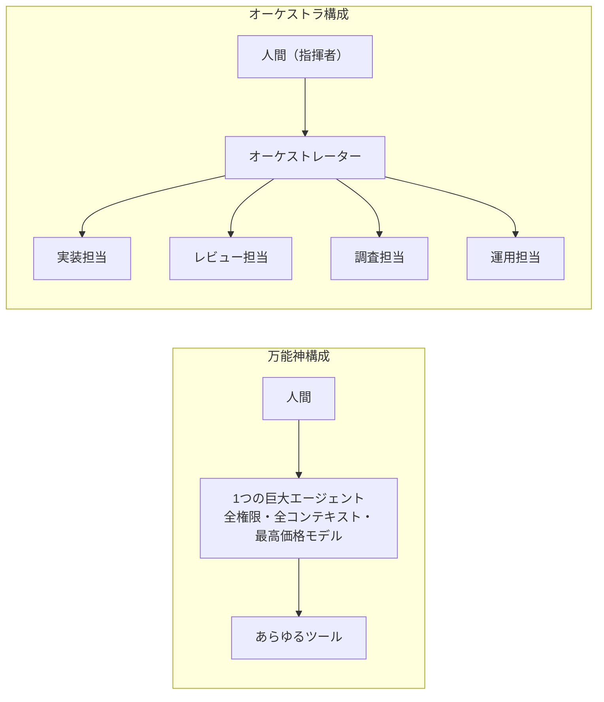
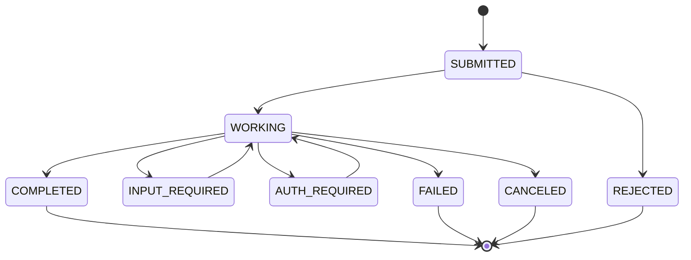
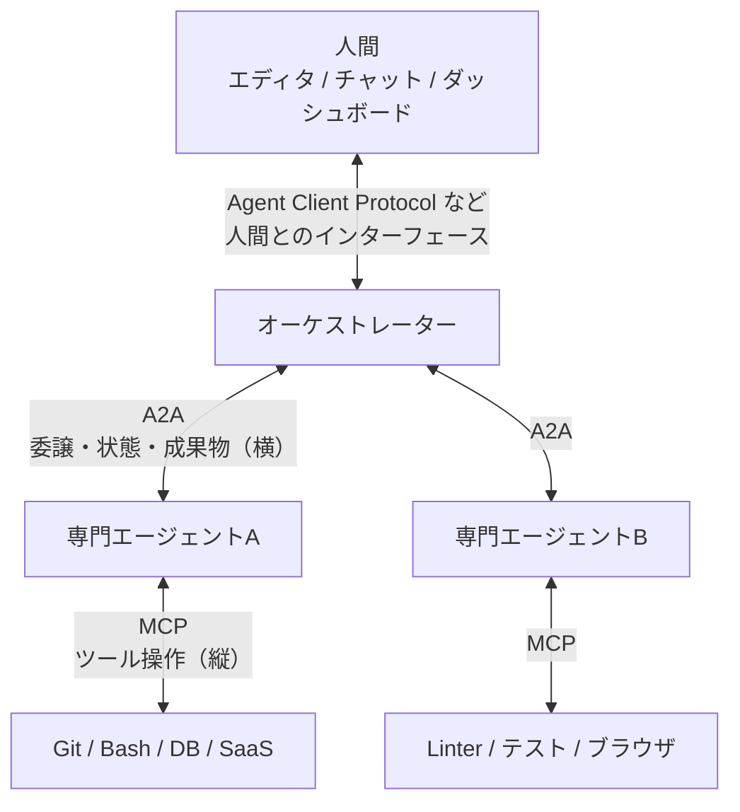
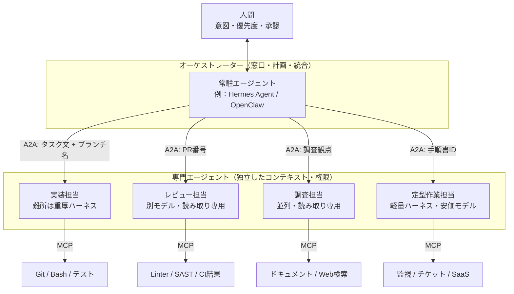
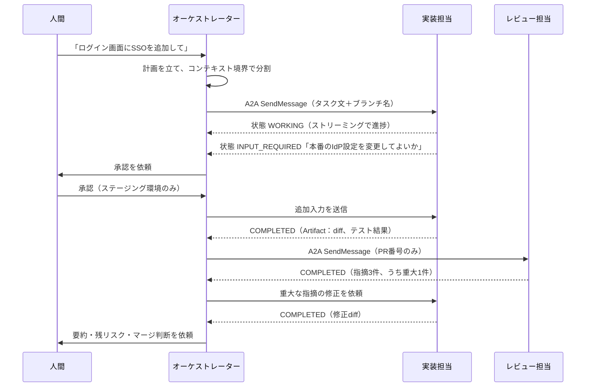
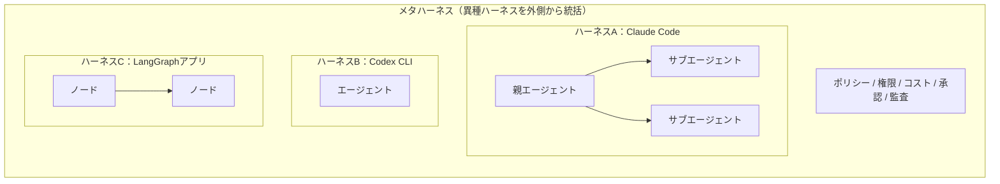
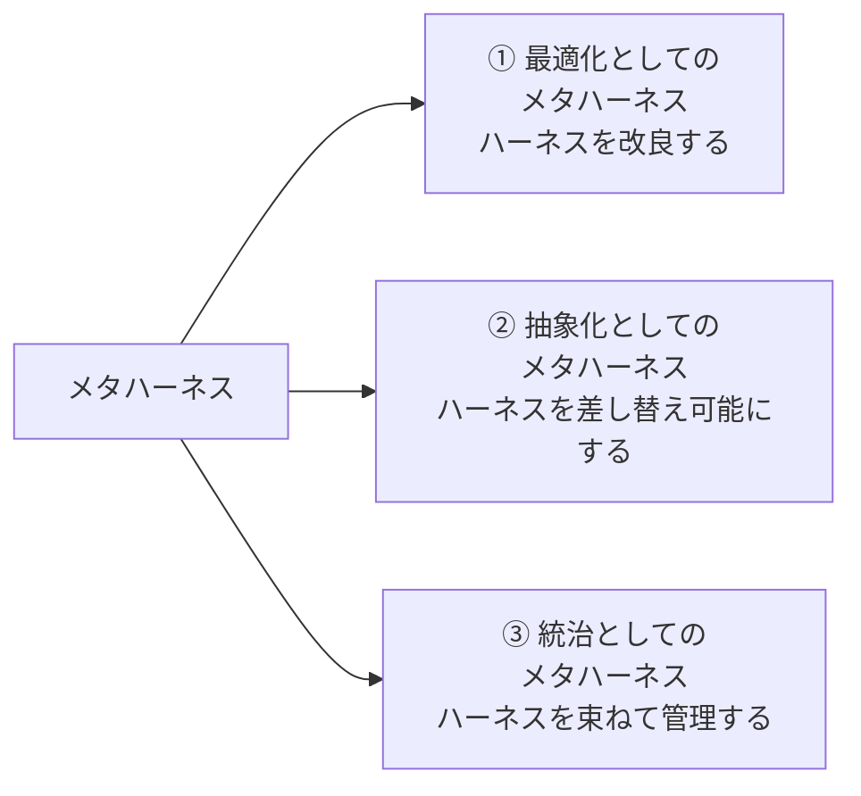
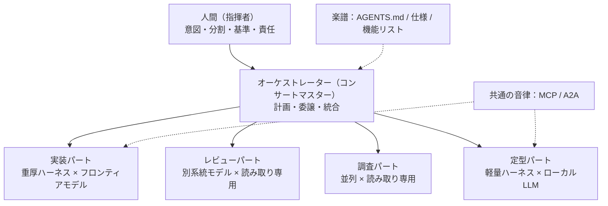

## この記事の結論

- **1つのエージェントにすべてを任せる「万能神」構成は、コンテキスト・自己評価の甘さ・権限・コスト・陳腐化の5つの理由で成立しません**
- 協調動作の土台は2本のプロトコルです。**MCPは「エージェント↔ツール」（縦）、A2Aは「エージェント↔エージェント」（横）**。2026年8月にA2AがAgentic AI Foundation（AAIF）に加わり、両者は同じ中立的な場で管理されるようになりました
- 「とりあえず**Claude Codeだけ**使っておけばいい」も、「**サブエージェント**として重厚なハーネスを大量に回す」も、どちらも適材適所から外れています。**重いハーネスは難所に、軽いハーネスや固定ワークフローは定型作業に**振り分けます
- 「マルチエージェント」と「メタハーネス」は別物です。しかも「メタハーネス」という言葉自体に、**少なくとも3つの意味**が混在しています
- あるべき未来は、万能な何かに全部を任せる世界ではありません。**特性の違うAIたちをオーケストラのように協調させ、人間が指揮をとる世界**です

:::message
**前編**：[AIエージェントの定義を一次情報から組み直す【前編】モデルとハーネス、用語の地層](https://zenn.dev/infra_ojisan/articles/ai-agent-definition-model-harness)
前編では「**エージェント＝モデル＋ハーネス**」と定義し直しました。本記事はその定義を前提に進めます。
:::

## はじめに：「万能神」への誘惑

前編で見てきたように、2026年のエージェントは「モデル＋ハーネス」として理解するのが一番すっきりします。そして優秀なハーネスが手に入ると、次のような発想が生まれます。

- 「Claude Codeが何でもできるなら、**全部Claude Codeに任せればいい**」
- 「オーケストレーターから `claude -p` を**サブエージェントとして大量に呼べば**最強では？」
- 「そのうちモデルが賢くなって、**1つのエージェントが全部やる**ようになる」

本記事の主張は、これらすべてに対して「No」です。その理由と、代わりにどう組むべきかを、一次情報をもとに整理していきます。



## 第1章　なぜ「万能神エージェント」は成立しないのか

### 理由1：コンテキストは有限で、しかも腐る

Lilian Weng氏が2023年に挙げた課題「有限のコンテキスト長」は、3年経った今も解決していません。コンテキストウィンドウが広がっても、**情報を詰め込むほど推論の質が落ちる**「コンテキストの腐敗（context rot）」が起きるからです。

実装の細部、調査のログ、レビュー指摘、運用手順を1つのコンテキストに全部抱えたエージェントは、どれも中途半端になります。Anthropicが2026年1月に公開したガイド「[When to use multi-agent systems (and when not to)](https://claude.com/blog/building-multi-agent-systems-when-and-how-to-use-them)」も、マルチエージェントが有効な第一の理由として「**コンテキストの保護**」を挙げています。

### 理由2：自分の成果物には甘い

Anthropicの「[Harness design for long-running application development](https://www.anthropic.com/engineering/harness-design-long-running-apps)」（2026年3月）は、エージェントに自分の成果物を評価させると**過大評価しがち**だと報告しています。そして次のように結論づけました。

> 作業するエージェントと評価するエージェントを分けることは、強力なレバーになる。
（原文の趣旨："separating the agent doing the work from the agent judging it proves to be a strong lever"）

生成側を自己批判的にするより、**独立した評価者を懐疑的に調整するほうがはるかに簡単**なのです。人間の組織でも、書いた本人が自分のコードをレビューしないのと同じです。

### 理由3：権限を1か所に集めると危ない

万能神エージェントは、必然的に「全ツールの全権限」を持つことになります。プロンプトインジェクションを1回受けただけで、本番DBもGitHubもSlackも触れてしまいます。

Anthropicの「[Scaling Managed Agents](https://www.anthropic.com/engineering/managed-agents)」（2026年4月）は、エージェントを**頭脳（brain：モデルとハーネス）**、**手（hands：サンドボックスとツール）**、**セッション（永続的なイベントログ）**に分け、**認証情報がコードを実行するサンドボックスに届かない**設計にしています。権限は分けて持たせるのが原則です。

### 理由4：コストが合わない

| 構成 | トークン消費の目安 | 出典 |
|---|---|---|
| チャット | 1倍 | — |
| 単一エージェント | 約4倍 | Anthropic 2025-06 |
| マルチエージェント | 約15倍 | Anthropic 2025-06 |
| マルチエージェント（同じタスクを単一エージェントと比較） | 3〜10倍 | Anthropic 2026-01 |

協調させるとトークンは増えます。だからこそ「**全員に最高価格のモデルと最重量のハーネスを持たせる**」のは論外です。grepして置換するだけの作業にフロンティアモデルを使うのは、新卒でもできる作業に役員を張りつけるようなものです。

### 理由5：モデルもハーネスもすぐ古くなる

前編で紹介したとおり、Anthropic自身が「**ハーネスが埋め込んだ仮定は、モデルが進化すると古くなる**」と書いています。モデルの勢力図も数か月単位で入れ替わります。1つの製品にすべてを賭けた構成は、そのままロックインと技術的負債になります。

### 反論：「マルチエージェントを作るな」はどうなった？

公平のために、反対の立場も紹介しておきます。2025年6月、Devinを開発するCognitionは「[Don't Build Multi-Agents](https://cognition.com/blog/dont-build-multi-agents)」で、**コンテキストを共有しない並列エージェントは矛盾した判断をする**と警告しました。有名なのが「Flappy Birdを作らせたら、背景担当はマリオ風の背景を、キャラ担当は画風の合わない鳥を作ってきた」という例です。Anthropicも一貫して「**まずは単一エージェントから始めよ**」と言っています。

では、この論争はどう決着したのでしょうか。2026年4月、同じCognitionのWalden Yan氏が「[Multi-Agents: What's Actually Working](https://cognition.com/blog/multi-agents-working)」を公開し、うまくいっているパターンをこうまとめています。

> 複数のエージェントが知恵を出し合う。ただし**書き込みは単一スレッドのまま**にする。
> 追加のエージェントは「**行動**」ではなく「**知性**」を提供する。

| うまくいっているパターン（Cognition 2026） | 内容 |
|---|---|
| コードレビューループ | まっさらなコンテキストのレビュー担当が、PRあたり約2件のバグを検出。うち58%が重大 |
| スマートフレンド | 主エージェントが、別のフロンティアモデルに「相談」する。異なるモデルの組み合わせでも機能する |
| マネージャー・コーディネーター | マネージャーが作業を分割して子エージェントを起動し、構造化された委譲で調整する（無秩序な群れにしない） |

Anthropicの2026年1月のガイドも、**問題の種類（計画・実装・テスト）で分けるのではなく、コンテキストの境界で分けよ**と述べています。つまり2026年の到達点は「マルチエージェントか、否か」ではありません。

**「書き込み（行動）は一本化し、読み取り・調査・評価（知性）を分散させる。分ける単位はコンテキストの境界」**

これが、万能神でも無秩序な群れでもない、第三の道です。

## 第2章　協調の2本柱：MCPとA2A

協調動作を組むには、エージェントを「部品」として差し替えられる必要があります。そのための標準規格が**MCP**と**A2A**です。

### MCP（Model Context Protocol）：エージェントの「手足」をつなぐ

#### 背景と現在地

| 日付 | 出来事 |
|---|---|
| 2024-11-25 | Anthropicが公開。「AIアプリのUSB-C」をうたい、ツール・データ接続の**N×M問題**（モデルごと・ツールごとに個別実装）を解消する狙い |
| 2025年 | OpenAI、Google、Microsoftなど主要ベンダーが相次いで対応。ChatGPT、Gemini、Cursorなどでも使えるように |
| 2025-11-04 | Anthropic「[Code execution with MCP](https://www.anthropic.com/engineering/code-execution-with-mcp)」。ツール定義がコンテキストを圧迫する問題に対し、MCPサーバーを**コードのAPIとして見せる**ことで最大98.7%削減（15万トークン→2千トークン）した例を紹介 |
| 2025-12-09 | Linux Foundation傘下に**Agentic AI Foundation（AAIF）**が発足。MCPはAnthropicから寄贈され、goose（Block）、AGENTS.md（OpenAI）とともに創設プロジェクトに。この時点で月間SDKダウンロード9,700万超、稼働サーバー1万超 |
| 2026-07-28 | 新仕様を公開。**ステートレス化**（セッションIDとハンドシェイクの廃止）、MRTR（途中で追加入力を求める往復）、HTTPヘッダーによるルーティング、Tasksの拡張機能化、MCP Appsなど。主要SDKで月間約5億ダウンロード規模に |

#### 仕組み

MCPは**ホスト**（Claude Codeなどのアプリ）の中の**クライアント**が、**サーバー**（GitHub、DB、Slackなどをラップしたもの）に接続する構成です。サーバーが提供する主な機能は3つです。

| 機能 | 内容 | 例 |
|---|---|---|
| Tools | エージェントが呼び出せる操作 | `create_issue`、`run_query` |
| Resources | 読み取れるデータ | ファイル、DBスキーマ |
| Prompts | 再利用できるプロンプトの型 | 「PRレビュー用テンプレート」 |

Claude Codeなら、次のように接続します。

```bash
# リモートのMCPサーバー（HTTP）を追加する
claude mcp add --transport http github https://api.githubcopilot.com/mcp/

# 登録済みのMCPサーバーを確認する
claude mcp list
```

プロジェクト単位で共有したい場合は、リポジトリ直下の `.mcp.json` に書きます。

```json
{
  "mcpServers": {
    "github": {
      "type": "http",
      "url": "https://api.githubcopilot.com/mcp/"
    }
  }
}
```

:::message alert
**MCPをつなぎすぎる罠**
MCPサーバーを10個、20個とつなぐと、ツール定義だけでコンテキストが埋まり、前編で触れた「コンテキストの腐敗」を自分で引き起こします。これも「万能神構成がダメな理由」の具体例です。対策は、**役割ごとに必要なMCPだけを持たせる**こと（＝エージェントを分ける）、そしてツール検索や段階的な開示（スキルなど）を使うことです。
:::

### A2A（Agent2Agent Protocol）：エージェント同士をつなぐ

#### 背景と現在地

| 日付 | 出来事 |
|---|---|
| 2025-03 | IBMが別のエージェント間通信規格**ACP（Agent Communication Protocol）**を公開 |
| 2025-04-09 | Googleが**A2A**を発表。50社超が賛同 |
| 2025-06-23 | Linux Foundationに寄贈。AWS、Cisco、Microsoft、Salesforce、SAP、ServiceNowが創設メンバーに |
| 2025-08 | IBMのACPが開発を終了し、**A2Aに合流** |
| 2026-03 | **A2A v1.0**（初の安定版）。署名付きAgent Card、マルチテナント、gRPCを含む複数のプロトコルバインディング |
| 2026-04 | 1周年。対応組織150超。Azure AI Foundry、Amazon Bedrock AgentCore、Google Cloudなど主要クラウドが対応 |
| 2026-08-17 | **AAIFのホストプロジェクトに**。MCP、goose、AGENTS.md、agentgatewayと同じ場で管理されることに |

#### 仕組み

A2Aの前提は「**相手のエージェントは中身の見えない（opaque）存在**」だということです。相手がどのモデルを使い、どんなハーネスで、どんな推論をしているかは知らなくてよい。知る必要があるのは「**何ができて、どう頼めばいいか**」だけです。

| 概念 | 役割 |
|---|---|
| **Agent Card** | エージェントの名刺。名前、能力（スキル）、エンドポイント、認証方式を記したJSON。通常は `/.well-known/agent-card.json` で公開 |
| **Task** | 依頼の単位。状態（受付・作業中・入力待ち・完了・失敗など）を持つ |
| **Message / Part** | やり取りの中身。テキスト、ファイル、構造化データ |
| **Artifact** | 成果物。diff、レポート、画像など |
| **ストリーミング／プッシュ通知** | 長時間タスクの進捗を非同期で受け取る |

Agent Cardの例です（v1.0のスキーマに沿って主要項目だけに絞った簡略版です。実装時は[仕様書](https://a2a-protocol.org/latest/specification/)を確認してください）。

```json
{
  "name": "reviewer-agent",
  "description": "PRの差分を静的解析とテスト実行でレビューし、指摘事項を重大度つきで返す",
  "version": "1.0.0",
  "supportedInterfaces": [
    {
      "url": "https://agents.example.internal/reviewer/a2a/v1",
      "protocolBinding": "JSONRPC",
      "protocolVersion": "1.0"
    }
  ],
  "provider": { "organization": "Example Inc.", "url": "https://example.com" },
  "capabilities": { "streaming": true, "pushNotifications": true },
  "defaultInputModes": ["text/plain", "application/json"],
  "defaultOutputModes": ["application/json"],
  "skills": [
    {
      "id": "code-review",
      "name": "コードレビュー",
      "description": "指定ブランチの差分をレビューし、セキュリティ・性能・テスト観点で指摘する",
      "tags": ["review", "security", "test"],
      "examples": ["feature/login ブランチの差分をレビューして"]
    }
  ]
}
```

タスクの状態は次のように遷移します。**「入力待ち（INPUT_REQUIRED）」があるのがポイント**で、ここに人間の承認を差し込めます。



### 3本目の軸と「ACP」問題

実はもう1つ、押さえておくべきプロトコルがあります。そして、ここでも用語の混乱が起きています。

| 名前 | 正式名称 | 何と何をつなぐか | 現状 |
|---|---|---|---|
| MCP | Model Context Protocol | エージェント ↔ ツール・データ | AAIF |
| A2A | Agent2Agent Protocol | エージェント ↔ エージェント | AAIF（2026-08〜） |
| ACP（IBM） | Agent Communication Protocol | エージェント ↔ エージェント | 2025-08に**A2Aへ合流して終了** |
| ACP（Zed） | **Agent Client Protocol** | **エディタ・UI** ↔ エージェント | 2025-08-27公開。Claude Code、Codex CLI、Gemini CLI、OpenHandsなどが対応。Zed、JetBrains、Neovimなどで利用可 |
| AGENTS.md | — | リポジトリの知識 → エージェント | AAIF |

**同じ「ACP」でも、IBMのものとZedのものはまったくの別物**です。2026年に「ACP」と書かれていたら、ほぼZedのAgent Client Protocolのほうだと考えてよいでしょう。これは後で扱う「メタハーネス」の実装で重要になります。

全体を重ねると、協調動作は次の3方向で整理できます。



## 第3章　協調動作の設計パターン

ここからは、元資料「協調動作（A2A × MCP）を組む際の設計パターン」を、第1章の知見をふまえて全面的に組み直します。

### 5つの設計原則

| # | 原則 | 理由 |
|---|---|---|
| 1 | **横（A2A）と縦（MCP）を分ける** | オーケストレーターは外部ツールの細かい仕様を知らなくてよい。専門エージェントは自分の担当ツールだけを持つ |
| 2 | **境界を越えるのは「指示・参照・成果物」だけ** | ソースコード全体やログ全文を渡さない。渡すのはタスク文、ファイルパスやブランチ名、そして戻りは要約・diff・判定結果 |
| 3 | **書き込みは一本化する（シングルライター）** | 同じファイルやブランチに複数のエージェントが書くと衝突する。並列化するのは読み取り・調査・評価 |
| 4 | **評価者は別コンテキスト、できれば別モデル・別ハーネス** | 自己評価の甘さを避ける。同じ系統のモデルは同じ見落としをしやすい |
| 5 | **完了判定はハーネスで機械的に** | テスト、lint、E2E、フックで判定する。エージェントの「できました」を信じない |

### 基本アーキテクチャ（改訂版）



戻り値は、すべて「要約・diff・判定」に絞ります。オーケストレーターのコンテキストに入るのは、各担当の**結論だけ**です。

### 委譲の流れ：人間の承認をどこに挟むか



### パターン早見表

Anthropic「Building effective agents」のパターンと、2026年時点で実績のあるパターンを対応づけます。

| パターン | 仕組み | 向いている仕事 | 注意点 |
|---|---|---|---|
| オーケストレーター・ワーカー | 司令塔が動的に分割・委譲・統合 | 範囲が事前に読めない開発・調査 | 司令塔のコンテキストに詳細を戻さない |
| 評価者ループ | 生成→独立した評価→差し戻し | コードレビュー、文章、デザイン | 評価基準を具体的に書かないと甘くなる |
| 並列調査（ファンアウト） | 観点ごとに読み取り専用で並走し集約 | 技術選定、障害の仮説検証、競合調査 | トークン消費が大きい。書き込みはさせない |
| スマートフレンド | 主担当が行き詰まったら別モデルに相談 | 難しい設計判断、デバッグ | 相談結果を採用するかは主担当が決める |
| シフト引き継ぎ | セッションごとに状態をファイル・Gitに書き出す | 数時間〜数日の長時間タスク | 機能リストと完了判定を機械化する |
| パイプライン | 固定の順序で担当を回す | 定型の運用・ドキュメント生成 | そもそもエージェントではなく**ワークフロー**で十分なことが多い |

### 適材適所：どのハーネスに何を任せるか

ここが本記事の核心です。「Claude Codeだけ使っておけばいい」でも「全部サブエージェントで回せばいい」でもない、という話を具体的にします。

| 役割 | 求められる特性 | 候補（2026年9月時点） | 選定の考え方 |
|---|---|---|---|
| **窓口・常駐・オーケストレーター** | 長期記憶、複数チャネル、スケジュール実行、計画 | [Hermes Agent](https://github.com/NousResearch/hermes-agent)、[OpenClaw](https://github.com/openclaw/openclaw) | 人と話し続ける層。コーディングの腕より「覚えている・つながっている」ことが大事 |
| **難しい実装・未知のコードベース調査** | 長い自律ループ、コンテキスト管理、フック、権限制御 | Claude Code、Codex CLI | **重厚なハーネスの本領**。境界ははっきりしているが難しいタスクに投入する |
| **サンドボックスでの丸投げ** | 隔離実行、PR作成まで完結 | [OpenHands](https://github.com/OpenHands/software-agent-sdk)（Software Agent SDK／ヘッドレス実行） | 「Issueを解決してPRを出して」をまとめて投げ、完了通知と成果物だけ受け取る |
| **MCPツールを多用する運用作業** | MCP拡張の扱いやすさ、ローカルモデル対応 | [goose](https://github.com/block/goose)（AAIFプロジェクト） | ログ集計、チケット起票、SaaS連携。安価なモデルやローカルLLMとも組み合わせやすい |
| **定型の差分作成・一括置換** | 余計な対話をしない、トークン消費が小さい | [pi](https://github.com/badlogic/pi-mono)などの軽量エージェント、Aider | 手順が決まっている作業に重厚なハーネスは不要。Aiderは2026年9月時点で最終リリースが2025年8月（v0.86.0）なので採用時は要確認 |
| **独立レビュー** | 実装担当と**別のコンテキスト、できれば別のモデル系統** | 実装とは別のハーネス×モデルの組み合わせ | 同じモデル・同じプロンプトでのセルフレビューは見落としが重なる |
| **A2Aサービスとして常駐させる** | Agent Card、A2Aサーバー機能 | [AG2](https://docs.ag2.ai/latest/docs/user-guide/a2a/server/)（`A2aAgentServer`）、[Agent Stack](https://github.com/i-am-bee/agentstack)（LF AI & Data） | 専門エージェントをHTTPサービスとして立て、どのオーケストレーターからも呼べるようにする |
| **既存ツールからサブエージェントを呼ぶ** | Markdown定義の再利用 | [sub-agents-mcp](https://github.com/shinpr/sub-agents-mcp) | `code-reviewer.md` などの定義をMCPツールとして公開し、裏で別プロセスのCLIエージェントを動かして結果だけ返す |

#### 「Claude Codeだけ使っておけばいい」がダメな理由

Claude Codeは優れたハーネスです。Anthropic自身も「Claude Codeは幅広いタスクで使っている優れたハーネスだ」と書いています。しかし、それ1つですべてを賄おうとすると、第1章の問題がそのまま出ます。

- 実装もレビューも同じコンテキストでやる → **自己評価の甘さ**
- 必要なMCPを全部つなぐ → **ツール定義でコンテキストが埋まる**
- すべての作業にフロンティアモデル → **コストが合わない**
- 1製品にワークフローを最適化しすぎる → **ロックインと陳腐化**

#### 「サブエージェントにClaude Codeはもったいない」理由

逆に、オーケストレーターから `claude -p` を小さな作業ごとに大量に呼ぶ構成も、多くの場合は宝の持ち腐れです。

- **司令塔が二重になる**：Claude Codeは内部で自ら計画を立て、必要なら自分のサブエージェントまで起動します。外側のオーケストレーターと内側のClaude Codeの両方が計画を立てると、責任の所在も、トークンの行方も見えにくくなります
- **起動時に余計なものを読み込む**：`claude -p` は、何も指定しなければ対話セッションと同じようにフック、スキル、MCPサーバー、CLAUDE.mdを読み込みます。公式ドキュメントも、スクリプトやSDKからの呼び出しでは `--bare` を推奨しています
- **承認を返せない**：ヘッドレス実行では権限プロンプトに誰も答えられません。許可するツールを事前に絞る設計が必須です
- **強みが活きない**：対話的な操舵、長い自律ループ、コンテキスト圧縮といった強みは、「このファイルのこの関数名を置換して」程度の作業ではほとんど使われません

それでもClaude Codeをワーカーとして使うなら、**難しいが境界の明確なタスク**に限定し、読み込むものと使えるツールを明示的に絞ります。

```bash
# 難所の実装をワーカーとして任せる例（読み込み対象と権限を明示的に絞る）
claude --bare -p "feature/sso ブランチで docs/sso-spec.md の仕様を実装し、npm test を通すこと。完了したら変更点を要約して" \
  --allowedTools "Read,Edit,Bash(npm test *),Bash(git diff *),Bash(git commit *)" \
  --output-format json | jq -r '.result'
```

定型作業には、軽量なハーネスとモデルを使います（コマンドのオプションはバージョンで変わるため、`--help` で確認してください）。

```bash
# 軽量エージェントに定型の修正を任せる例（Aider）
aider --message "README.md のインストール手順を docs/install.md の内容に合わせて更新して" --yes-always README.md

# MCP拡張を持つ汎用エージェントにワンショットで任せる例（goose）
goose run -t "昨日のエラーログを集計して、上位5件をチケット化して"
```

:::message
**判断の目安：「そのタスクで、エージェント自身が次の一手を考える必要がどれだけあるか？」**

- ほとんどない → 固定ワークフロー（エージェントですらなくてよい）
- 少しある → 軽量ハーネス＋安価なモデル（ローカルLLMも候補）
- 大いにある、しかも境界は明確 → 重厚なハーネス（Claude Code、Codex CLIなど）
- 大いにあり、境界も曖昧 → 人間とオーケストレーターが先に分割する
:::

ちなみにローカルLLMを定型作業の担当に据える話は、以前の記事で「goose＋ローカルLLMでミニゲームを作らせる」ところまで試しています。

https://zenn.dev/infra_ojisan/articles/local-llm-old-gaming-pc-llamacpp

## 第4章　マルチエージェントとメタハーネスを混同しない

### 用語の粒度を揃える

「マルチエージェント」という言葉も、指しているものの粒度がばらばらです。まず4つに分けます。

| 用語 | 何か | 典型例 | コンテキスト | プロセス |
|---|---|---|---|---|
| **サブエージェント** | 1つのハーネスの中で、親が子のコンテキストを起動して結果だけ受け取る仕組み | Claude Codeのsubagents | 子は独立、結果だけ親へ | 同一ハーネス内 |
| **エージェントチーム** | 1つの製品の中で、複数のインスタンスがタスクリストとメッセージで協調する仕組み | Claude Codeのagent teams（実験的機能） | それぞれ独立、相互に通信 | 同一製品の複数セッション |
| **マルチエージェント（フレームワーク型）** | 1つのフレームワーク内で、役割やツールの異なるノード同士を協調させる | LangGraph、CrewAI、AG2、OpenAI Agents SDK | 共有ステートを渡すことが多い | 多くは同一プロセス |
| **メタハーネス** | **完成した異種のハーネスを、その外側から束ねて統括する層** | Omnigent、Conductor、Zed（ACP経由） | 完全に分離、境界を越える情報だけ制御 | 別々のネイティブプロセス |

なお「マルチエージェントシステム（MAS）」自体は、LLM以前の1980〜90年代から分散人工知能の分野で研究されてきた、**非常に広い概念**です。LLMのエージェントを複数使う構成は、その一部にすぎません。



### 元資料の整理を検証する

元資料では「マルチエージェントは広義の概念で、メタハーネスは自律エージェントの協調・統括にフォーカスしている」という感覚が示されていました。この理解は**実務的な意味のメタハーネスについては正確**です。比較表を改訂するとこうなります。

| 観点 | マルチエージェント（フレームワーク型） | メタハーネス |
|---|---|---|
| 位置づけ | 協調のパラダイム、およびそれを実装するライブラリ | 個別ハーネスの**上位の制御層** |
| 構成単位 | プロンプトやツールを変えたノード、ステートマシンの1ノード、関数 | **完全な自律ループを持つハーネス**（Claude Code、Codex CLI、OpenHandsなど） |
| 中身への関与 | 各ノードの推論ループを設計する | 各ハーネスの内部には**踏み込まない** |
| コンテキスト | 共有ステートや履歴を渡すことが多い | プロセス・作業ツリー・サンドボックスごとに分離 |
| 主な関心事 | 「役割をどう分けて、どう解決させるか」 | 「異種ハーネスをどう隔離・監視・統治し、権限とコストを守るか」 |
| 協調の手段 | フレームワーク内の関数呼び出し、共有メモリ | A2A、Agent Client Protocol、Git作業ツリー、ファイル |

### 「メタハーネス」には3つの意味がある

ここが翻訳記事ではほぼ確実に混同されている部分です。2026年に入ってから「メタハーネス（meta-harness）」という言葉は、**少なくとも3つの異なる意味**で使われています。

| # | 意味 | 代表的な出典 | 何をするか |
|---|---|---|---|
| 1 | **ハーネスを自動で最適化する外側のループ** | Stanford等「[Meta-Harness: End-to-End Optimization of Model Harnesses](https://yoonholee.com/meta-harness/)」（2026年3月、COLM 2026） | 過去のハーネス候補のコード・実行トレース・スコアをファイルシステムに置き、提案役のエージェント（Claude Code）がそれを読んでハーネス自体を改良する。TerminalBench-2でClaude Opus 4.6で76.4%など |
| 2 | **特定のハーネスに依存しない、インターフェース層** | Anthropic「[Scaling Managed Agents](https://www.anthropic.com/engineering/managed-agents)」（2026年4月） | 「Managed Agentsは、将来Claudeが必要とする**特定の**ハーネスには口を出さないメタハーネスだ」。頭脳・手・セッションの**インターフェース**にだけこだわる |
| 3 | **異種ハーネスを束ねて統治する上位の制御層** | Databricks「[Omnigent](https://www.databricks.com/blog/introducing-omnigent-meta-harness-combine-control-and-share-your-agents)」（2026年6月）など | Claude Code、Codex、Cursor、Hermesなどを差し替え・組み合わせ可能にし、ポリシー・コスト・権限をメタ層で強制。チームでセッションを共有 |



3つに共通するのは「**ハーネスそのものを操作対象にする、一段上の層**」だという点です。ただ、目的はそれぞれ「改良」「抽象化」「統治」とまったく違います。「メタハーネス」と聞いたら、どの意味で使われているのかを必ず確認しましょう。本記事の文脈（協調動作）で使うのは主に③、設計思想としては②も含みます。

### 実務的なメタハーネス（③）が担う機能

| 機能 | 内容 | 実装の例 |
|---|---|---|
| 実行の隔離 | エージェントごとに作業ツリー・サンドボックスを分ける | Git worktree、コンテナ、クラウドサンドボックス |
| 境界つき委譲（Bounded Delegation） | 依頼文と成果物（diff、要約）だけを境界の外に出す | A2A、ファイル、PR |
| ハーネスの差し替え | 同じタスクを別のハーネス・モデルで実行・比較する | Omnigent、Agent Client Protocol |
| ポリシーの一元化 | 権限、コスト上限、禁止操作をプロンプトではなく**メタ層で強制** | ポリシーエンジン、ゲートウェイ |
| 人間の承認（HITL） | 危険な操作、マージ、本番反映の前に人間が判断する | 承認キュー、A2AのINPUT_REQUIRED |
| 可観測性と監査 | 誰が（どのエージェントが）何をしたかを追跡する | イベントログ、トレース |

### 概念の変遷（改訂版）

| 時期 | 出来事 | 意味 |
|---|---|---|
| 2023 | Weng氏「Agent = LLM + 計画 + 記憶 + ツール」、AutoGPT | 単一エージェントの部品表ができた。ただし実用には至らず |
| 2024-11〜12 | MCP公開、Anthropic「Building effective agents」 | 「複雑にするな」とツール接続の標準化 |
| 2025-03〜08 | IBM ACP、Google A2A、A2AのLinux Foundation移管、ACPのA2A合流、Zed Agent Client Protocol | エージェントを**部品化・相互接続**する規格が出そろう |
| 2025-06 | Anthropicのマルチエージェント研究システム vs Cognition「Don't Build Multi-Agents」 | マルチエージェント論争 |
| 2025-12 | AAIF発足（MCP、goose、AGENTS.md） | 協調の土台を中立的な場へ |
| 2026-02〜04 | ハーネスエンジニアリングの成立、A2A v1.0、Meta-Harness論文、Managed Agents | 「ハーネス」が設計の単位になり、その**一段上**が議論され始める |
| 2026-04 | Cognition「Multi-Agents: What's Actually Working」 | 論争の収束：書き込みは一本化、知性は分散 |
| 2026-06 | Databricks Omnigent | 統治としてのメタハーネス製品が登場 |
| 2026-07〜08 | MCPステートレス仕様、A2AのAAIF合流 | プロトコルが同じ場に集約 |

## 第5章　近い未来の姿：人間がオーケストレーションする世界

ここからは筆者の見立てです。一次情報で確認できた事実とは分けて読んでください。

### 見立て1：補修は痩せ、境界と協調の層は太る

前編で見たとおり、モデルの弱点を補うためのハーネス部品（コンテキストリセットや細かい段取り）は、モデルが賢くなるにつれて外れていきます。一方で、**任せる範囲が広がるほど、権限・検証・承認・監査・協調の層は厚くなります**。エージェントの価値の中心は「1つのハーネスの賢さ」から「**複数のハーネスをどう組み合わせ、どう統治するか**」へ移っていくはずです。

### 見立て2：エージェントは「雇う」ものになる

MCP、A2A、AGENTS.md、gooseがAAIFという同じ場に集まったことで、ベンダーをまたいだ協調が前提になりつつあります。Agent Cardで能力を公開し、A2Aで仕事を受ける専門エージェントは、**社外の専門家に仕事を発注する**のに近い感覚で使われるようになるでしょう。

### 見立て3：タスク×ハーネス×モデルの「配置」が設計の中心になる

「どのモデルが最強か」という問いは、あまり意味を持たなくなります。代わりに問われるのは、次のような**配置の最適化**です。

| 観点 | 判断の例 |
|---|---|
| 難しさ | 未知の設計判断はフロンティアモデル×重厚ハーネス、定型はローカルLLM×軽量ハーネス |
| 機密性 | 社外に出せないデータはローカルやプライベート環境のモデルへ |
| 独立性 | レビューは実装と違う系統のモデルへ |
| コスト | 並列調査はトークンが膨らむので、価値の高いタスクに限定 |

### 見立て4：人間は「指揮者」になる

OpenAIのハーネスエンジニアリングの記事は「**Humans steer. Agents execute.**（人間は舵を取り、エージェントが実行する）」と書きました。協調の時代に人間が担うのは、コードを1行ずつ書くことではなく、次の4つです。

1. **意図**：何を、なぜ作るのか
2. **分割**：どこにコンテキストの境界を引くか
3. **基準**：何をもって「できた」とするか（評価者の設計）
4. **責任**：何を承認し、何を止めるか



## むすび：万能神ではなく、オーケストラを

1人の天才にすべてを任せるより、それぞれの楽器の特性を知り尽くした奏者たちが、共通の音律（プロトコル）と楽譜（仕様）のもとで音を重ねるほうが、はるかに豊かな音楽になります。

- バイオリンにティンパニの役はさせない（重厚なハーネスに定型作業をさせない）
- ティンパニ奏者に主旋律を全部は任せない（1つのエージェントに全部を任せない）
- 奏者どうしで互いの音を聴き合う（独立したレビューと評価）
- そして、全体の解釈を決めて音を止める権限を持つのは指揮者（人間）

「とりあえずClaude Codeだけ」でも「全部をサブエージェントに投げる」でもなく、**数あるAIの特性を生かして協調させ、人間がオーケストレーションする**。それが、技術的にも組織的にも無理のない、そして何より美しい、あるべき未来の姿だと考えています。

:::message
 **余談**：第3章の「適材適所表」と「判断の目安」は、そのまま**タスクを最適なハーネス×モデルに振り分けるルーター**の仕様書になります。メタハーネスの市場はまだ始まったばかりで、Omnigentのような汎用品はあっても、「日本語の業務タスクを難しさ・機密性・コストで仕分けて、クラウドのフロンティアモデルとローカルLLMに配置する」ところまで踏み込んだものはほとんど見当たりません。また、社内に眠っている既存のスクリプトやRPAを**Agent Card付きのA2Aサーバーとして公開する「A2A化」**は、レガシー資産をエージェント時代の部品に変える地味ながら需要の大きい仕事になりそうです。
:::

## 参考リンク

### 協調動作・マルチエージェント

- [When to use multi-agent systems (and when not to) | Claude by Anthropic](https://claude.com/blog/building-multi-agent-systems-when-and-how-to-use-them)（2026-01-23）
- [How we built our multi-agent research system | Anthropic](https://www.anthropic.com/engineering/multi-agent-research-system)（2025-06）
- [Don't Build Multi-Agents | Cognition](https://cognition.com/blog/dont-build-multi-agents)（2025-06-12）
- [Multi-Agents: What's Actually Working | Cognition](https://cognition.com/blog/multi-agents-working)（2026-04-22）
- [Harness design for long-running application development | Anthropic](https://www.anthropic.com/engineering/harness-design-long-running-apps)（2026-03-24）
- [Building effective agents | Anthropic](https://www.anthropic.com/engineering/building-effective-agents)（2024-12-19）
- [Orchestrating Agents: Routines and Handoffs | OpenAI Cookbook](https://cookbook.openai.com/examples/orchestrating_agents)
- [Handoffs | OpenAI Agents SDK](https://openai.github.io/openai-agents-python/handoffs/)

### MCP

- [Introducing the Model Context Protocol | Anthropic](https://www.anthropic.com/news/model-context-protocol)（2024-11-25）
- [MCP Specification 2026-07-28](https://modelcontextprotocol.io/specification/2026-07-28)
- [The 2026-07-28 Specification | MCP Blog](https://blog.modelcontextprotocol.io/posts/2026-07-28/)
- [MCP joins the Agentic AI Foundation | MCP Blog](https://blog.modelcontextprotocol.io/posts/2025-12-09-mcp-joins-agentic-ai-foundation/)（2025-12-09）
- [Code execution with MCP | Anthropic](https://www.anthropic.com/engineering/code-execution-with-mcp)（2025-11-04）

### A2A・その他のプロトコル

- [A2A Protocol Specification](https://a2a-protocol.org/latest/specification/)
- [A2A and MCP | A2A Protocol](https://a2a-protocol.org/latest/topics/a2a-and-mcp/)
- [A year of open collaboration: Celebrating the anniversary of A2A | Google Open Source Blog](https://opensource.googleblog.com/2026/04/a-year-of-open-collaboration-celebrating-the-anniversary-of-a2a.html)（2026-04）
- [A2A joins AAIF's open agentic stack | AAIF](https://aaif.io/blog/a2a-joins-aaif)（2026-08-17）
- [ACP Joins Forces with A2A | LF AI & Data](https://lfaidata.foundation/communityblog/2025/08/29/acp-joins-forces-with-a2a-under-the-linux-foundations-lf-ai-data/)（2025-08-29）
- [Agent Client Protocol | Zed](https://zed.dev/acp)

### メタハーネス

- [Meta-Harness: End-to-End Optimization of Model Harnesses](https://yoonholee.com/meta-harness/)（arXiv: [2603.28052](https://arxiv.org/abs/2603.28052)）
- [Scaling Managed Agents: Decoupling the brain from the hands | Anthropic](https://www.anthropic.com/engineering/managed-agents)（2026-04-08）
- [Introducing Omnigent: A Meta-Harness to Combine, Control and Share Your Agents | Databricks](https://www.databricks.com/blog/introducing-omnigent-meta-harness-combine-control-and-share-your-agents)（2026-06-13）

### ツール・ドキュメント

- [Run Claude Code programmatically | Claude Code Docs](https://code.claude.com/docs/en/headless)
- [Create custom subagents | Claude Code Docs](https://code.claude.com/docs/en/sub-agents)
- [Orchestrate teams of Claude Code sessions | Claude Code Docs](https://code.claude.com/docs/en/agent-teams)
- [AG2 - A2A Server Setup](https://docs.ag2.ai/latest/docs/user-guide/a2a/server/)
- [Agent Stack | GitHub](https://github.com/i-am-bee/agentstack)
- [OpenHands Software Agent SDK | GitHub](https://github.com/OpenHands/software-agent-sdk)
- [goose | GitHub](https://github.com/block/goose)
- [sub-agents-mcp | GitHub](https://github.com/shinpr/sub-agents-mcp)
- [Aider Releases | GitHub](https://github.com/Aider-AI/aider/releases)
- [OpenClaw vs Hermes Agent | MarkTechPost](https://www.marktechpost.com/2026/05/10/openclaw-vs-hermes-agent-why-nous-researchs-self-improving-agent-now-leads-openrouters-global-rankings/)（2026-05-10）
