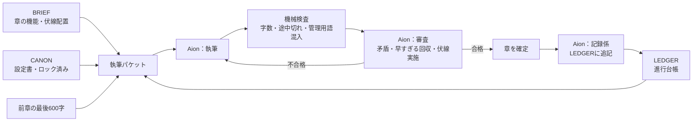

## はじめに

小説やRPGのシナリオ作成に特化した[生成AIモデルAion](https://www.aionlabs.ai/)で最新版の3.5が提供開始され[お財布に優しいminiモデル](https://www.aionlabs.ai/docs/models/#:~:text=AionLabs%3A%20Aion%203%2E5%20Mini)も同時に出たので、早速これを使って生成AIに短編小説を1本書かせてみよう！・・・と思って始めたら、いつの間にか「小説家に依頼する」形ではなく、「制作スタジオを回す」形になっていました。

- プロデューサー：自分
- 脚本原案・全体構成：自分と Claude(Opus5.5)
- ディレクター（進行管理）：Hermes Agent(GLM5.3Flash)※
- 制作（執筆）：Aion 3.5 Mini
- 校正：Claude(Opus5.5)
- 読者：自分と家族

この記事では、このスタジオをどう組んだか、途中で何に詰まってどう直したか、そして完成した作品を**読者とどうつなぐか**という構想をまとめます。作品はまだ制作中です（完成後に追記します）。
※：AGENTS.mdで制御可能で、ほどほどの賢さのモデルが動作すればなんでも良かったのだけど、最近お気に入りのgooseがOpenCodeGoのモデルを使えなくなってしまっていた（後述）のでGUIで見栄えがいいHermesAgentを使いました（モデルはGLM5.3Flash）

## 作りたかったもの

注文はシンプルです。

| 項目 | 内容 |
|---|---|
| ジャンル | SF・クローズドサークル（宇宙船の中だけで話が進む） |
| 長さ | 日本語で約2万字（8章×約2,500字） |
| 核 | ボーイミーツガール。登場人物は少年と少女の2人だけ |
| 事件 | 異常な事態と、残酷な事実 |
| 結末 | ビターエンド。二人にとってはバッド、でも世界は救われる |

空気感の参考は『11人いる！』『冷たい方程式』『たったひとつの冴えたやりかた』（あかん性癖がバレる）。ただし各作品の中核トリックは流用しない、という条件をつけました。

## 役割分担：Claude は「細部を書かない」

最初に決めたのは、**Claude には物語の中身を一切書かせない**ことです。Claude が作るのは構造だけ。細部（事件の正体、真相、人物、伏線の中身）は、小説特化モデルの Aion に創作させます。

Claude が書いた指示書（BRIEF）に入っているのは、次の3つだけです。

1. 各章の「機能」（例：第3章＝閉鎖空間での相互不信。疑いをこの章で解消しない）
2. 伏線の「スロット」と、それをどの章で設置・回収するか
3. 結末の方向性（二人は不可逆の喪失、世界は救われる、悪役は置かない）

伏線スロットはこんな形です。中身は空欄で、機能と章番号だけが決まっています。

| ID | 名前 | 設置 | 補強 | 回収 |
|---|---|---|---|---|
| F1 | 異常の兆候 | 1 | 3 | 5 |
| F2 | 規則の隠れた前提 | 2 | — | 6 |
| F3 | 少女の真実 | 1 | 4 | 6 |
| F4 | 少年の真実 | 3 | — | 7 |
| F5 | 鍵 | 2 | 4 | 7 |
| F6 | 約束 | 4 | — | 8 |
| R1 | 偽の手がかり | 2 | 3 | 5（否定） |
| C1 | 世界の賭け金 | 2 | 8（確認） | 5 |
| M1 | 反復モチーフ | 1 | 4 | 8 |

本文を書く前に、Aion にこの表を埋めさせて「設定書（CANON）」を作らせます。規則（動かせない条件）を先に決めて、そこから残酷な事実と唯一の解決法を逆算する、という順番も指示しています。CANON は審査を通ったらハッシュを取ってロックし、以後は変更できません。

## 長い物語が途中で崩れないための仕組み

小さめのモデルに長編を書かせると、だいたい中盤で崩れます。同じ会話の中で章を重ねると、前半の設定がコンテキストから押し出されるからです。

そこで、**章を書くたびに毎回まっさらなリクエストを送る**ことにしました。渡すのは、スクリプトが決まった順番で組み立てた「パケット」だけです。



ポイントは LEDGER（進行台帳）です。章が確定するたびに、要約・確定した事実・伏線の状態・残り時間などの数値を、決まった書式で追記させます。

```
## CH03
SUMMARY: ...
FACT: ...
SLOT: F4=planted | 描写: ...
CLOCK: ...
LAST: ...
```

直近2章はこの全項目を渡し、それより前は要約・事実・伏線状態だけに圧縮します。映画の撮影現場でいう**スクリプター（記録係）**の役割です。場面同士のつながりを記録して矛盾を防ぐ係が、そのまま物語の破綻防止になっています。

審査は「文章の好み」ではなく「物語が壊れていないか」だけを見ます。設定との矛盾、3人目の人物の登場、回収予定より前に答えを明かしていないか、指定の伏線をちゃんと置いたか、の4点です。

## 進行エンジンと「詰まったら人間」

進行は `novelctl.py` という小さな Python スクリプト（標準ライブラリのみ）が握っています。ディレクター役のエージェントがやることは、基本的に次の1行を繰り返すだけです。

```bash
python3 tools/novelctl.py step
```

状態はすべてディスク上の `progress.json` にあり、エージェントの会話記憶には依存しません。途中で止まっても、`status` を見れば現在地と次の一手が分かります。

そして、AIだけで解決できない事態は `ESCALATE` として止まり、コード別の対応表に従って人間に渡されます。

| コード | 意味 | 人がやること |
|---|---|---|
| `CHAPTER_EXHAUSTED` | 3稿書き直しても合格しない | 修正指示を見て、直すか採用するか決める |
| `CANON_MODIFIED` | ロック後に設定書が変わった | 意図した変更か確認する |
| `CALL_FAILED` | モデル呼び出しの失敗 | キー・モデル名・残高を確認する |
| `FINAL_REVIEW_FAILED` | 最終審査で重大な指摘 | 巻き戻すか、このまま完成とするか決める |

## 実際に詰まったこと

ここからは、動かしてみて実際に起きたことです。

### Goose からの撤退

最初はハーネスに Goose を使う予定でした。ところが、Goose の本体側で使っていたモデルのプロバイダ（OpenCode Go）が `x-opencode-session` ヘッダーを必須にしていて、次のエラーで止まりました。

```
Bad request (400): Request is missing x-opencode-session and cannot be routed efficiently.
```

Goose からプロバイダへカスタムヘッダーを渡せなかったので、Goose はあきらめて Hermes Agent に乗り換えました。

このとき助かったのが、**執筆側のモデル呼び出しをハーネスから切り離していた**ことです。当初は Python から子プロセスの `goose run` 経由で Aion を呼んでいましたが、これを OpenRouter への直接リクエストに差し替えました。変更は `config.json` の1行と、呼び出し用の小さなスクリプト1本です。ディレクターが Goose でも Hermes でも OpenCode でも、制作ラインはそのまま動きます。

### モデルIDの取り違え

設定には `aeon3.5mini` と書いていましたが、OpenRouter 上の正しい ID は `aion-labs/aion-3.5-mini` でした。OpenRouter のモデル一覧 API で確認すると、262K のコンテキスト、推論（reasoning）が必須のモデルだと分かりました。

### 5分で殺されるプロセスと、見えない推論

Hermes から最初の1歩を実行したところ、Hermes の Python 実行環境が300秒で打ち切られ、裏で動いていた呼び出しごと止まりました。やり直しでは環境変数が引き継がれず、APIキーなしで失敗しています。

さらに厄介だったのは、**推論が長いモデルは完了するまで何も見えない**ことです。ストリーミングなしのリクエストだと、OpenRouter のログにも完了まで何も出ません。止まっているのか考えているのか、区別がつきませんでした。

直したのは次の3点です。

- **ストリーミング化**：受信状況をファイルに書き出し、`status` に表示する
- **無通信タイムアウト**：180秒なにも届かない接続だけを「詰まり」とみなして再試行する
- **キーの探索**：複数の環境変数名と `.env` ファイルから探し、ハーネスの環境変数引き継ぎに頼らない

直したあとの `status` はこうなります。

```
CALLING: design  試行3  経過1133秒  推論49357字  本文6766字  最終受信1秒前
```

設定書1本の作成で、3回目の試行までに約19分、その回の推論だけで約5万字を使っていました。見えるようになると「待てる」ようになりました。

## マルチAI・メタハーネスで気づいたこと

結果的に、この構成はマルチAI・メタハーネスになっていました。

- 構成を考える AI（Claude）
- 進行を回す AI（Hermes Agent）
- 書く AI・審査する AI・記録する AI（Aion）
- それらをつなぐ、状態を持った薄いスクリプト

業務を分解して専門家に分けると、**どこで詰まったら人間が入って流せばいいか**がはっきりします。対応表のどの行に当たるかを見て、判断して、`resolve` を打つ。

AIにすべてを丸投げして、結果が返ってくるまでぼーっと待つ、あるいは気分を切り替えて別のことをする。それに比べると、ちゃんと「人間の仕事をしている」感覚があります。考えてみれば、管理職になると対人間で同じことをやっているだけなんですよね。仕事を分けて、任せて、詰まったところで判断して流す。

## 読者とのソーシャルな関係：琴線を見る

ここからが構想の本題です。完成した作品は縦書きの EPUB にして、読者に章ごとの評価をもらいます。

### 縦書きEPUBと章末の評価リンク

`novelctl.py epub` で、確定した章から EPUB3 を組み立てます。`writing-mode: vertical-rl`、右綴じ、2桁の数字や「!?」は縦中横にしています（EPUBCheck で検証済み）。

各章の最後には「この章を評価する」というリンクを置きます。EPUB の中にフォームを埋め込む方法は、多くの端末がスクリプトを動かさないため使えません。代わりに Web の評価ページへ飛ばします。

### 評価ページ：5段階＋ネタバレなしの一言

評価ページでは、章ごとに5段階の星と80字までの一言を残せます。ネタバレを防ぐ仕組みとして、**ほかの人の一言は、自分が評価した章の分だけ表示**されます。まだ読んでいない章の感想は、目に入りません。

### 小説サイトやKindleとの違い

章単位の反応を集める仕組み自体は、すでにあります。カクヨムにはエピソードごとの「応援」と「応援コメント」があります。Kindle には、多くの読者が引いた箇所を示すポピュラーハイライトがあります。ただ、Kindle の読者データを作者が集計して見る公式の手段は、調べた範囲では見当たりませんでした。

この企画が違うのは、**作品の設計図がデータとして手元にある**ことです。

- **設計と反応の比較**：BRIEF には章ごとの「緊張度」を数値で書いてあります。狙った曲線と、読者の平均評価の曲線を重ねて表示できます。ずれている章が、狙いと反応が食い違った場所です。
- **琴線マップ**：読者ごと・章ごとの評価をヒートマップにします。謎解きに反応する人と、二人の関係に反応する人の違いが見えます。
- **仕掛けと反応**：LEDGER には「第5章で異常の兆候を回収」「第4章で約束を設置」と記録が残っています。全章を読み終えた読者には、各章の仕掛けと評価を並べて見せます。どの種類の仕掛けで心が動いたかが分かります。

小説サイトは作品の構造を知りません。構造と反応の両方を持っているから、ここまで見えます。

### ビブリオバトルに作者が登場したら

もう一つやってみたいのが、ビブリオバトルに「作者」が登場することです。この作品の作者はスタジオなので、プロデューサーが伏線の配置表を見せながら「ここで泣かせる設計でした」と語る、メイキング付きの発表になります。そこに読者の琴線マップを重ねて、狙いが当たった章と外れた章を答え合わせする。読むだけで終わらない、双方向の読書です。

### 次の作品へ

読者の反応は1作ごとに蓄積されます。「この伏線配置はこういう読者に刺さる」という知見がたまれば、次の BRIEF を直す材料になります。書く→読まれる→設計を直す、というループが、スタジオのノウハウになっていきます。

## 今後

- 1作目を完成させ、Claude の校正と家族の評価を回す
- 評価ページは今のところ claude.ai のアーティファクトで、家族に共有して使う想定です。一般公開するなら、独自のホスティングに移す必要があります
- 公開する場合は、AIで生成したことを明記する（配信先によっては申告のルールもあります）

## まとめ

- 生成AIに小説を書かせるなら、「小説家に頼む」より「スタジオを回す」ほうがうまくいく
- 破綻を防ぐ鍵は、変更できない設定書、記録係の台帳、毎回まっさらな呼び出し
- 仕事を分けると、人間が入るべき場所が見える。それは管理職の仕事そのもの
- 作品の設計図を持っているからこそ、読者の「琴線」を構造と結びつけて見られる

完成したら、作品と読者の反応を追記します。
