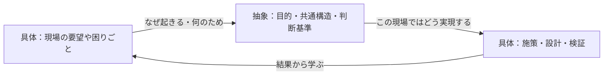
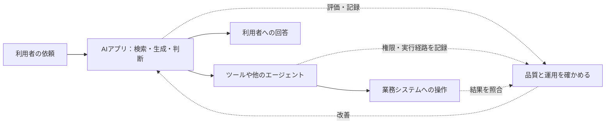

## はじめに

僕は生成AIに対して懐疑的で慎重な立ち位置でした。「だってただのチャットでしょ？」と。とはいえ1年半使い続ける中で「まぁ便利かな」と思うようになったのは去年の夏くらい、去年の冬には「これ（AIのできることをしゃぶり尽くす）を最後の仕事にしよう」と覚悟を決めて原理から学ぶことにしました。いろんな書籍を読み、これは後輩にも読ませたいと思った書籍を紹介します。

アフィリエイトは使用していません。

## 「生成AIは嘘をつく」で止まらないために――『直感 LLM』を読んで

「生成AIは嘘をつく」「危険だ」「難しそう」。そう感じている人に、僕はまず『直感 LLM』を薦めたい。もちろん、そんな方がこの一冊でLLMを理解できるとは思いません。コードや専門用語も出てきます。それでも、僕にとっては、LLMがどうやって回答を作るのかを「なんとなく」つかめた本でした。この「なんとなく」が、使い方を変える第一歩になりました。

**書籍メモ：** Jay Alammar、Maarten Grootendorst 著。日本語版の副題は「ハンズオンで動かして学ぶ大規模言語モデル入門」です。

[発行元：オライリー・ジャパン](https://www.oreilly.co.jp/books/9784814401154/)

### 文章の裏側を、順番に見せてくれる

本書は、入力された文章が小さな単位である**トークン**に分けられ、数値の表現である**埋め込み**になり、モデルが文脈を踏まえて次のトークンを選ぶ流れを、図と実例でたどります。僕が特に腑に落ちたのは、回答が最初から完成しているわけではなく、生成したトークンを加えながら続きを作っていく、という点です。

これはLLMの内部を大づかみにした図です。実際にはTransformerのアテンション機構などが関わります。本書の第2章と第3章を読むと、この図の各箱が少しずつ具体的になります。

### 「もっともらしい」と「正しい」は別です

次の言葉をうまくつなげられることは、事実を確認したことと同じではありません。だから僕は、流暢な回答を見ても「この答えは危ういかもしれない」と立ち止まれるようになりました。知らない固有名詞、数字、出典が急に出てきたら、なおさら確認が必要です。

一方で、入力の仕方によって回答の方向は変わります。本書の第6章は、指示、背景情報、入出力の例、出力形式などをプロンプトに組み込む方法を扱います。僕はここから、「どう聞けば、望む方向の答えに近づけるか」を考えるようになりました。ただし、プロンプトは正解を保証する魔法ではありません。重要な内容には根拠の確認や出力の検証が要ります。

| 最初の聞き方 | 僕ならこう直します | 狙い |
|---|---|---|
| 「この障害の原因は？」 | 「以下のログから、確認できる事実と原因の仮説を分け、追加で調べる項目を挙げてください」 | 推測を事実として扱いにくくする |
| 「説明して」 | 「開発経験半年の人向けに、用語を一行で説明し、短い例を添えてください」 | 読み手に合う説明へ寄せる |
| 「これで合っていますか？」 | 「誤りそうな箇所、根拠が不足する箇所、確認方法を表にしてください」 | 回答を点検する |

表は僕なりの実務例です。問いを明確にするほど役に立つ回答を得やすくなりますが、最後に確かめる役割は人間に残ります。

### 卵のエンジニアには、ここからで十分です

最初から全章のコードを動かさなくても大丈夫です。僕ならまず第2章のトークンと埋め込み、第3章の生成の仕組み、第6章のプロンプト設計を読みます。その後、社内文書を参照する仕組みに興味が出たら第8章のRAGへ進みます。

「生成AIは嘘をつくから使えない」と切り捨てるのも、「それらしく答えたから正しい」と信じるのも、僕には少し惜しく思えます。何が得意で、どこで間違えやすく、どう聞けば助けになるのか。本書は、その判断を自分で始めるための一冊です。

---

## 「どうすればいい？」の前に「何のため？」――『システム開発と「具体と抽象」』を読んで

僕はこの本を、エンジニアだけでなく、管理職にも読んでほしいです。生成AIが実装方法や資料のたたき台を出せる今、「Howを早く出す」だけでは仕事の価値を説明しにくくなりました。そこで人が向き合うべきなのは、**そもそも何が問題なのか**、**何を実現したいのか**という問いだと思います。

**書籍メモ：** 細谷功 著。正式な書名は『システム開発と「具体と抽象」――問題発見と問題解決を往復する「思考のメタ化」を身につける』です。

[発行元：技術評論社](https://gihyo.jp/book/2026/978-4-297-15790-6)

### 抽象化は、ふわっと話すことではありません

本書が繰り返すのは「具体→抽象→具体」の往復です。目の前の要望や失敗事例から共通する構造や目的を取り出す。それを別の条件に合わせて、実行できる案に戻す。僕はこの動きを、原理原則をつかんで応用するための練習だと受け取りました。

たとえば「毎週の集計表を自動化してほしい」と頼まれたとします。すぐにマクロの作り方を調べることもできます。でも一段上がって聞くと、「数字が出るのが遅く、会議で判断できない」が本当の困りごとかもしれません。そうなら、集計の自動化だけでなく、入力の締め切りや見たい指標の見直しも候補になります。これは本の事例を写したものではなく、僕が考えた例です。

| 見る高さ | 問い | 集計表の例 |
| --- | --- | --- |
| 具体 | 何を作るか | 集計マクロを作る |
| 抽象 | なぜ必要か | 意思決定に使う数字が遅れて届く |
| 再び具体 | この条件で何を変えるか | 入力方法、更新頻度、画面を組み合わせて見直す |

### 問題を「解く」前に、問題を「見つける」

本書がシステム開発に引き寄せて説明するのは、川上の**問題発見**と、川下の**問題解決**の違いです。顧客の言葉をそのまま仕様にしても、顧客が達成したかったことから外れる場合があります。第4章で扱う新規テーマの提案や投資対効果の話も、要望に即答する前に背景を見直す例として印象に残りました。

僕の周りでも、「どうすればいいですか」「答えを教えてください」と、すぐHowを求める場面があります。もちろん具体的な手順は必要です。ただ、原理原則や目的をつかまないまま答えだけ借りると、条件が少し変わっただけで行き詰まります。AIに具体化を手伝ってもらうほど、人は問いや判断基準を自分で持つ必要があると感じます。

### 管理職にも薦めたい理由

本書は個人の考え方だけで終わりません。後半では、組織の構造や成熟が、現場の問題発見のしやすさを左右することまで視点を上げます。「提案してほしい」と部下に言いながら、前例と確実な数字だけを求めていないか。僕は管理する側にも、この問いを持ってほしいです。

読み始めたばかりのエンジニアなら、明日からの会話で一つ試せます。依頼を受けたら、作業に入る前に「それは何のためですか」「成功した状態は何ですか」と聞いてみる。答えを聞いたら、今度は具体的な案に戻す。**俯瞰することは現場から離れることではなく、現場で選ぶ手段をよくすること**だと、僕はこの本から学びました。

---

## 動くAIの先に、運用できるAIはあるか――『LLMOps』と『エージェンティックメッシュ』を続けて読んで

AIアプリが一度うまく答えたとして、それは「正しく動くシステム」でしょうか。翌月も同じ品質で使えるでしょうか。別のエージェントや社内システムに仕事を任せたとき、誰が何をしたか追えるでしょうか。僕は、お客さまにAIソリューションを届けるなら、ここまで考えたいです。

その視点をくれるのが、この2冊です。『LLMOps』はLLMアプリを本番で評価し、提供し、守り、改善する流れを広く扱います。『エージェンティックメッシュ』は複数のエージェントが連携する環境を、発見・通信・権限・監視・ガバナンスまで含めて設計します。アプリの入り口と、実行を支える基盤・運用を一緒に考えるための両輪です。

**書籍メモ：** 『LLMOps』はAbi Aryan著。『エージェンティックメッシュ』はEric Broda、Davis Broda著です。

[『LLMOps』の発行元：オライリー・ジャパン](https://www.oreilly.co.jp/books/9784814401604/) ／ [『エージェンティックメッシュ』の発行元：オライリー・ジャパン](https://www.oreilly.co.jp/books/9784814401758/)

### 「回答がよい」と「システムがよい」は違います

『LLMOps』で僕がまず押さえたいのは、評価を一つの点数に押し込めないことです。たとえば社内文書に答えるAIなら、検索で必要な文書を見つけたか、回答は根拠に合うか、決めた形式で返したかを別々に確かめます。さらに本番では、遅延、費用、情報の扱い、変化後の品質も見ます。本書の第7章と第8章は、この「作って終わり」にしない考え方を教えてくれます。

一方、『エージェンティックメッシュ』を読むと、AIがツールを使い、別のエージェントと協働するほど、**最終回答だけ見ても足りない**ことが分かります。どのエージェントが選ばれ、どの権限で何を実行し、どこで人が承認したのか。第7章のレジストリやモニター、第12章の信頼フレームワークは、そうした振る舞いを管理するための設計です。

この図は僕なりに2冊をつないだものです。必ずしも全てのAIアプリが他のエージェントや業務システムを呼ぶわけではありません。呼ぶ場合には、外部で起きた結果まで確かめる必要があります。

| 問い | 『LLMOps』から学ぶ視点 | 『エージェンティックメッシュ』から学ぶ視点 |
| --- | --- | --- |
| 正しく動くとは？ | 用途に合う評価項目を決め、検索・生成・出力を検証する | 計画、権限、ツール利用、実行結果が目的と方針に沿うか確かめる |
| 正しく運用するとは？ | データ、モデル、API、監視、セキュリティを継続して管理する | エージェントの登録から廃止までを管理し、行動を追跡できるようにする |
| 失敗したら？ | どの段階で品質が落ちたか測り、改善する | どのエージェントが何をしたかたどり、影響を止めて見直す |

### 卵のエンジニアが持ち帰るなら

いきなり大規模な基盤を作る必要はありません。小さなAIアプリを一つ想像して、まず「何ができたら成功か」を一文で決めます。次に、典型的な質問と失敗しやすい質問を用意し、回答の根拠や形式を確かめます。ツールを使わせるなら、許可する操作、記録する実行経路、人が確認する地点も決めます。

僕なら『LLMOps』のアプリケーション・評価・ガバナンスの章を先に読み、その後『エージェンティックメッシュ』のワークフローとエージェントの比較、エンタープライズ向けの設計、信頼フレームワークへ進みます。後者が描く大規模なメッシュは、そのまま明日導入する設計図というより、規模が増えたときに何が必要になるかを考える見取り図として読むと入りやすいです。

「正しいAIシステム」とは何か。その答えは用途や許されるリスクによって変わります。だからこそ僕は、回答の品質だけでなく、**途中の判断と行動を説明でき、運用中も確かめ続けられること**を、お客さまに届けるAIの条件にしたいです。この2冊は、その問いをチームで話し始めるために薦めたい組み合わせです。
