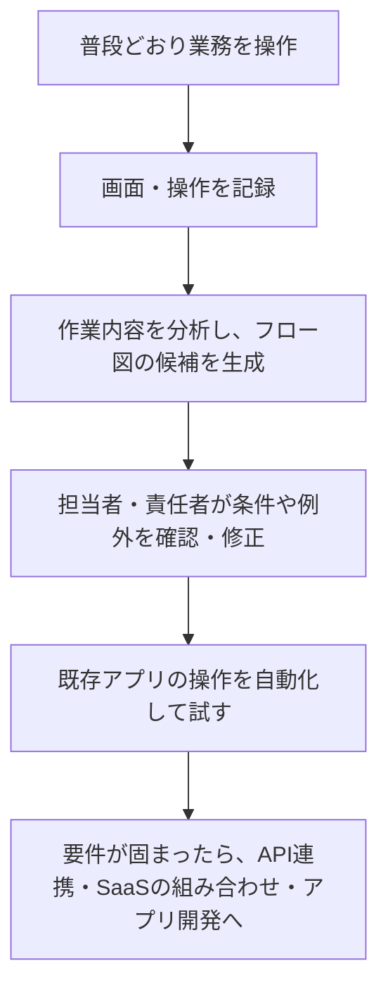

最近、業務の自動化について、こんなことを考えています。

**業務をプロンプトで説明してもらう代わりに、普段の操作を見せてもらえばいいのでは？**

画面や操作をキャプチャして分析し、まずフロー図にする。それを担当者や責任者に確認してもらい、実際の作業を自動化する。必要に応じて、既存のSaaSやアプリケーションをつないだり、アプリを作ったりする。

新しい技術を発明しようという話ではありません。使える仕組みがすでにあるなら使いたいし、AnthropicやOpenAIが実装してくれるなら、自分たちで作る部分が減って助かります。

ただ、考えているうちに、MicrosoftのRecallの炎上を思い出しました。そして既存製品や特許公報を調べてみたら、思っていた以上に近いものがありました。

## 業務を説明するより、やって見せる方が早いことがある

「普段の仕事を言葉で説明してください」と言われても、意外と難しいものです。

どの画面を見て、何を確認して、どんな場合に別の作業へ進むのか。作業に慣れている人ほど、説明するまでもなくやっていることがありそうです。

そこで、普段どおり作業してもらい、その操作を入口にします。

最初から独自アプリへ置き換える必要はありません。Computer Useやブラウザ自動操作などで、既存の作業を再現して確認する段階があってもいい。

記録から分かるのは、まず「何をしたか」です。「なぜそうしたか」や、記録に現れなかった例外まで分かるとは限りません。例えば上司に確認した操作があっても、金額が理由なのか、契約上の例外なのか、その日だけの事情なのかは確認が必要です。

だから、フロー図と実際の動作を見ながら、要件を少しずつ固めたい。ヒアリングの場だけで、業務の全部を言語化してもらおうとは考えていません。

## Recallは炎上した。それでも、今なら受け入れられる場面があるのでは

2024年、MicrosoftのRecallは、画面を定期的に記録して過去に見たものを検索する機能として、大きな批判を受けました。プライバシーやセキュリティへの懸念を受け、Microsoftはオプトインやデータ保護の強化を発表し、提供の進め方も変更しています。[Microsoftの当時の説明](https://blogs.windows.com/japan/2024/06/11/update-on-the-recall-preview-feature-for-copilot-pcs/)

Recallの目的は、以前見たものを探し直すことです。業務のフローを分析して自動化を作るものとは違います。それでも、「画面を記録し、AIが扱える情報にする」という入口は近いと感じます。[現在のRecallの説明](https://support.microsoft.com/en-us/windows/privacy/privacy-and-control-over-your-recall-experience)

Computer Useが認知され、AIに画面操作を任せることが実際の選択肢になってきた今なら、**お客様と対象業務や記録範囲を合意したうえで、操作を記録・分析して自動化につなげることも、受け入れられるのではないか**。これは僕の見立てです。

記録する業務、期間、保存先、解析に渡すデータ、止め方を決めて、その範囲で使う。「AIの操作が一般化したから、何を記録しても構わない」という話ではありません。

## 調べたら、RPAやタスクマイニングにすでにあった

この領域には、タスクマイニングという名前がついていました。利用者の操作を記録し、作業手順や違いを分析して、改善や自動化につなげるものです。

例えばUiPath Task Miningは、複数の操作記録を比較・統合し、業務担当者が編集した結果をフロー図や手順書、UiPath Studio向けのファイルに出力できます。[UiPathの公式説明](https://docs.uipath.com/task-mining/automation-cloud/latest/user-guide/assisted-task-mining-introduction)

Power Automateにも、記録からプロセスマップを作り、対応するアプリの操作について自動化フローの下書きを生成する機能があります。メールやExcelなどの操作に、コネクタを使う提案までしてくれます。[Microsoftの公式チュートリアル](https://learn.microsoft.com/en-us/power-automate/task-mining-tutorial)

なるほど、そりゃありますよね。新規性は期待していませんでしたが、使えるものがあるのはありがたいです。

## 特許の公開出願も見つかった

もう一つ気になっていたのが、特許です。

公開情報を調べると、今回考えている流れに近い出願がありました。

| 出願人 | 公開公報 | 関連する内容 |
| --- | --- | --- |
| ソフトバンクグループ | [特開2026-025579「システム」](https://patents.google.com/patent/JP2026025579A/ja) | 業務操作の記録・解析から、フローとマニュアルの生成、一部の自動化へつなぐ構成 |
| UiPath | [特開2024-096684](https://patents.google.com/patent/JP2024096684A/ja) | タスクマイニングを使用した、ソースとターゲット間のAIによるデータ転送 |

ここで確認したのは、公開された出願です。最新の登録状況や、審査後の請求項までは確認していません。公開出願があることと、特許権が成立していること、さらに自分たちの実装がその範囲に入ることは、それぞれ別です。

特許発明の技術的範囲は、特許請求の範囲に基づいて判断されます。構想が似ているから直ちに抵触するとも、以前からある技術だから自由に実装できるとも、この調査だけでは判断できません。[特許庁の説明](https://www.jpo.go.jp/news/shinchaku/event/seminer/text/document/2023_nyumon/all.pdf)

また、お客様から操作や記録の許可をもらうことと、第三者の特許に関する確認も別の話です。商用実装を詰める際には、既存製品を使う部分と自社で作る部分を整理し、具体的な構成について確認する必要があります。

## 大手が作ってくれると助かる……と思ったら、Anthropicはもう動いていた

「この入口をAnthropicやOpenAIが実装してくれると使いやすいのに」と考えていたら、Anthropicにはすでに **Record a skill** がありました。

作業中の画面、クリック、入力、音声を記録してClaudeに渡すと、再利用できるSkillを提案してくれます。利用者が内容を確認して保存する流れです。公式説明では、Mac版CoworkのPro・Max・Team向けで、Windowsでは利用できません。[Record a skillの公式説明](https://support.claude.com/en/articles/12512198-how-to-create-custom-skills)

Claude in Chromeの従来のサイドパネルにも、利用者が操作を実演してワークフローを教え、繰り返させる機能があります。[Claude in Chromeの公式説明](https://support.claude.com/en/articles/12012173-get-started-with-claude-in-chrome)

Skillの生成と、業務アプリやフロー図の生成は同じではありません。それでも、「説明する代わりに操作を見せて教える」という入口が製品化されているのは、うれしい発見でした。

OpenAIについてもComputer Useの実行基盤は提供されていますが、今回確認した公式資料では、同様の実演記録から再利用可能な手順を生成する一式の機能までは確認できませんでした。今後どう進むかは楽しみにしています。[OpenAIのComputer Use](https://developers.openai.com/api/docs/guides/agents-api/tools/computer-use)

僕としては、記録や操作の仕組みを全部自前で抱えたいわけではありません。使いやすいものが出てくれば取り込みたい。そこで実装の手間が減れば、現場の判断条件や例外を確認し、実際に使える形にする方へ時間を使えます。

「普段どおりやって見せてください」から、自動化を始められる。そんな入口を、必要な場面で使えるようにしていきたいです。

---

公開情報の確認日：2026年10月7日。製品の提供条件や特許の権利状況は変わるため、利用・実装時に改めて確認します。
