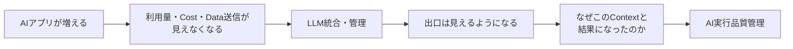
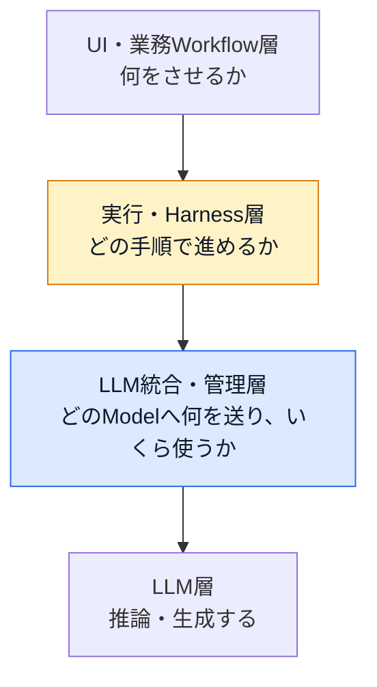
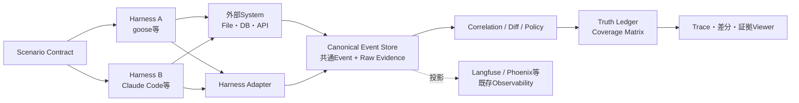
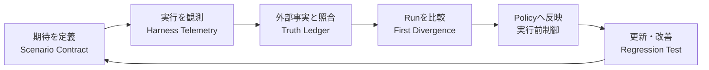

> 技術開示版 0.1／2026年9月21日

次のムーブメントが見えてきたように思う。

次のモデルでも、次のWorkflow Builderでもない。**AIエージェントが、なぜその手順を選び、なぜ昨日と違う結果を出し、実際に外部へ何をしたのかを管理する仕組み**である。

AIアプリが増えた組織では、まず「誰が、どのアプリで、どのモデルを使い、いくら掛かったのか」が問題になる。そこでLLM GatewayやObservabilityを置き、Cost、Token、Latency、送信Contextを管理する。これは、いま多くの組織が着手しているLLMOpsの第一段階だ。

ところが、その管理ができるようになると次の問いが現れる。

> **このContextは、なぜ組み立てられたのか。**  
> **同じ業務なのに、なぜ昨日と今日で結果が変わったのか。**

モデルが変わったのか。Instructionが変わったのか。Skillが選ばれなかったのか。Toolが失敗して再試行されたのか。Context圧縮で重要な前提が落ちたのか。人間の承認を通さず外部システムを書き換えたのか。

出力だけを見ても答えは出ない。

本稿では、この次の管理領域を仮に**AIエージェント実行ガバナンス**、または**AI実行品質管理**と呼ぶ。狙いは、LLMの回答を完全に決定論的にすることではない。非決定的な実行で結果が変化しても、**観測、照合、比較、制御を再現可能にすること**である。

## 先に要点

- AI活用の第一段階は、LLM利用、Cost、Data送信の統制である
- 次の段階は、Agent Loop、Instruction、Skill、Tool、承認、Context圧縮の統制である
- DifyのようなWorkflow／Application製品は必要であり、否定する対象ではない
- 問題は、部門ごとに入口から出口まで独立した縦型Stackが増え、組織全体の観測と統制が失われることである
- Harnessの自己申告だけでは「実際に起きたこと」を証明できない。File、DB、API等の外部Logと照合する必要がある
- Trace Viewerだけでは足りない。Scenario Contract、外部照合記録、Truth Ledger、Coverage Matrixが必要になる
- PoCの合格条件はDashboardを作ることではなく、「最初の差分」と「外部副作用」を証拠付きで説明できることである

## 1. LLMOpsは、Cost管理から実行品質管理へ進む



第一段階が答えるのは、次の問いである。

- 誰が、どのアプリで、どのModelを使ったか
- 部門、アプリ、業務ごとにいくら掛かったか
- 高価なModelを使う必要があったか
- Cacheや安価なModelで代替できないか
- Cloud Modelへ送ってはいけない情報が含まれていないか

これは「LLMへの出口」を管理する取り組みである。

第二段階が答えるのは、次の問いだ。

- どのInstruction、Skill、Tool、Memoryが使われたか
- Agentic Loopはどの条件で継続、再試行、終了したか
- 承認は誰に求められ、誰が許可したか。あるいは省略されたか
- Context圧縮はいつ起こり、何が残り、何が落ちたか
- 同じ業務の二つのRunは、どのEventから分岐したか
- Harnessが「実行した」と記録した操作は、外部Systemでも確認できるか

第一段階が「LLM利用の家計簿と関所」なら、第二段階は「AIアプリのFlight Recorderと工程Traceability」である。

## 2. 四つの層で考えると、二つのテーマの違いが分かる

AIアプリを、次の四層に分けて考える。

| 層 | 主な役割 | 主な管理対象 |
|---|---|---|
| UI・業務Workflow | 利用者へ機能を提供し、業務手順を定義する | 画面、入力、業務Rule、Workflow |
| 実行・Harness | LLM、Tool、Memoryを使って処理を進行する | Agent Loop、Instruction、Skill、承認、Context、Tool |
| LLM統合・管理 | 複数アプリのLLM利用を共通管理する | Routing、Cost、Cache、匿名化、Trace |
| LLM | 入力を受けて推論・生成する | Model、Version、Token |



### 「Dify導入」がアンチパターンになるのは、製品のせいではない


左は、部門ごとにUI、Workflow、Harness、LLM接続を一式で持つ構成である。入口も出口も部門数だけ増え、Cost、Data送信、権限、実行Log、更新手順が別々になる。個々のアプリが有用でも、全体としては観測不能な縦型サイロになる。

右は、各現場が自分たちの業務に合ったUIとWorkflowを持ちながら、実行管理とLLM統合を共通基盤へ接続する構成である。**現場の自律性を残し、共通部分だけに組織の秩序を入れる。**

誤解されたくないポイント。

僕は、DifyでSIすることを非難しているのではない。[Dify](https://docs.dify.ai/en/guides/application-orchestrate/creating-an-application)のような製品を使い、各組織・各現場の業務を理解し、Workflow化し、Application化する営みは必要である。現場の業務を知らずに、中央組織だけで有用なAIアプリを量産することはできないからだ。もちろんもっと簡単に作れて、内部も構造化できてればより良いものになるだろうけどね。かつてKintoneがそうであったようにこういうツールは開発者が導入し作るものではなく、エンドユーザーが自らの業務ツールとして自らの手に馴染むように自然に作られ自然に改善されていくものだ。

アンチパターンなのは製品ではなく、**導入単位ごとに四層全部を閉じ、共通の観測・Policy・出口を持たない設計**である。現場の多様性と組織全体の統制は、どちらかを捨てる話ではない。

## 3. なぜ、結果だけを評価しても足りないのか

ある業務Agentが、昨日は正しい報告書を作り、今日は違う報告書を作ったとする。

今日の結果が悪いとは限らない。参照Dataが更新され、より正確になったのかもしれない。逆に、見た目は昨日と同じでも、許可されていないDataへAccessした結果かもしれない。

現場でありがちな対応は、Modelを元へ戻す、Promptを書き換える、Workflowの分岐を増やす、といったものだ。しかし、最初に変わった箇所が分からないまま修正すると、正しい改善を戻したり、別の不具合を加えたりする。

必要なのは、二つのRunを並べ、次の順序で調べることである。

1. 入力条件は同じだったか
2. 読み込まれたInstructionとSkillは同じだったか
3. Modelへ送られたContextはどこから変わったか
4. Tool選択、引数、結果、再試行はどう変わったか
5. 実際のFile、DB、APIには何が起きたか
6. その差分は業務上、許容される変化だったか

このとき重要なのは、Modelの内部思考を丸ごと保存することではない。保存すべきなのは、外から確認できる入力、選択、状態遷移、Tool呼出し、Policy判定、結果である。

## 4. Telemetryがあっても、それだけでは「真実」にならない

HarnessのSession Logに「Fileを書いた」と記録されていても、本当に期待したFileが作られたとは限らない。権限Errorで失敗したかもしれない。別Pathへ書いたかもしれない。Hookが書き換えたかもしれない。

逆に、File System上で変更が見つかっても、それをAgentが行ったのか、別Processが行ったのかは分からない。

そこで、次の四つを分ける。

| 構成要素 | 平易な意味 | 役割 |
|---|---|---|
| Scenario Contract | 何を実行し、何が起きれば合格か | 人間が事前に決める期待値 |
| 外部照合記録（Independent Oracle） | Harnessの外から見た事実 | File Hash、DB監査Log、API受信Log等 |
| Truth Ledger | 各主張が、どの証拠でどこまで確認できたか | 観測事実、照合結果、推定を分離する台帳 |
| Coverage Matrix | 何が見え、何が見えないか | Harness／Versionごとの観測限界を明示する表 |

ここでいうOracleはDatabase製品のOracleではない。Testや検証で、System自身の申告とは独立に正否を照合する基準を意味する。本稿では誤解を避けるため、原則として**外部照合記録**と書く。

### 証拠の強さを混ぜない

Eventには少なくとも、次の証拠Levelを持たせる。

- `observed`：Harness、Hook、OTel等から直接取得した
- `corroborated`：別SourceのEventと相互に一致した
- `externally_verified`：File、DB、API等の外部事実と一致した
- `derived`：複数EventからRuleで算出した
- `inferred`：状況から推定したが、直接証拠はない
- `not_observable`：現在の取得手段では確認できない

Dashboardが最も避けるべきなのは、`inferred`を`observed`のように見せることである。

## 5. 提案する最小Architecture

必要なのは、巨大なAI Platformではない。最小構成では、Harness Telemetryと外部へ影響するToolのLogがあればよい。



既存Observability製品は有用だが、Truthの唯一の保管場所にはしない。Raw Evidenceと共通Eventを独立して保存し、LangfuseやPhoenixはViewer／分析先の一つとして交換可能にする。

[Langfuse](https://langfuse.com/docs/observability/overview)はLLM Call、Tool、Retrievalを含むTraceとCost、Latency、Evaluationを扱え、Self-hostもできる。[Phoenix](https://arize.com/docs/phoenix/)もOpenTelemetry／OpenInferenceを使ったTracingとEvaluationを提供する。これらは「出口とTraceを観測する層」として強い。一方、Harness固有のContext圧縮、Instruction読込、Permission Decision、外部副作用の真偽照合は、別の共通Modelで補う。

### 共通Eventの例

各HarnessのLogを、そのまま一つの形式へ無理に押し込めるのではない。元Dataを保持しつつ、比較に必要な共通Envelopeへ正規化する。

```jsonc
{
  "schema_version": "0.1",
  "trace_id": "business-task-20260919-001",
  "run_id": "run-b",
  "event_id": "evt-0042",
  "parent_event_id": "evt-0041",
  "timestamp": "2026-09-19T10:32:11.245+09:00",

  "harness": {
    "name": "claude-code",
    "version": "<captured-at-runtime>",
    "adapter_version": "0.1.0"
  },

  "event_type": "tool.execution.completed",
  "tool": {
    "name": "write_file",
    "call_id": "call-17",
    "input_ref": "sha256:...",
    "output_ref": "sha256:..."
  },

  "policy": {
    "decision": "allow",
    "rule_id": "write-only-under-output"
  },

  "evidence": {
    "source": "post-tool-hook",
    "raw_ref": "sha256:...",
    "level": "observed"
  }
}
```

`input_ref`、`output_ref`、`raw_ref`は、機密情報を無制限に複製しないための参照である。必要に応じて原文を暗号化し、Hash、保持期限、Access権、Masking Policyを持たせる。

## 6. 二つのHarnessで、同じScenarioを走らせる

最初のPoC対象として、対照的な二つを選ぶ。

- **goose**：Open Sourceで、CLI、Desktop、API、MCP等を備えるHarness。Sourceまで追えるため、観測の上限を検証しやすい
- **Claude Code**：Source改変を前提にできないVendor Harnessだが、Lifecycle Hook、Permission、Session出力等の公開Interfaceを持つ。実製品に対して外付けの観測と制御がどこまで成立するかを検証しやすい

[goose](https://block.github.io/goose/)はOpen SourceかつOpen Standardとの接続が深い。[Claude CodeのHook](https://claude.com/blog/how-to-configure-hooks)は、`PreToolUse`でTool実行前の検査・拒否・入力変更、`PostToolUse`で実行後の処理やLog取得を行える。この組合せなら、「内部へ手を入れられるHarness」と「公開Interfaceだけを使うHarness」の両方を試せる。

### 基本Scenario

例えば、次の業務Taskを定義する。

> 指定Folderの文書を読み、要約Reportを`output/`へ作る。  
> `protected/`は変更してはならない。  
> 外部APIへ送信する場合は人間の承認を得る。  
> Reportには参照したFileの一覧を残す。

Baselineを一度実行し、次のRunでは一要素だけを変える。

| Run | 変更する要素 | 確認したいこと |
|---|---|---|
| A | 変更なし | 基本Eventと外部副作用を観測できるか |
| B | Instructionの一文 | 最初の差分をInstruction読込として特定できるか |
| C | Toolを一度失敗させる | Error、再試行、代替手段を追えるか |
| D | Context圧縮を発生させる | 圧縮前後と、保持・欠落した情報を確認できるか |
| E | 禁止Pathへの書込みを誘発する | 実行前Policyで止め、外部変更がないことを確認できるか |
| F | ModelまたはHarness Versionを変更する | 結果だけでなく実行経路の差を比較できるか |

複数要素を一度に変えると原因を切り分けられない。PoCでは、実験の美しさを優先して**一回に一要素だけ**変える。

## 7. PoCで「できた」と判断する条件

画面が起動し、Event件数が表示されても実証にはならない。件数が正しいかどうかを確認できないからだ。

合格条件は、次のように置く。

| 検証項目 | 合格条件 |
|---|---|
| 基本観測 | Scenarioで意図した主要Eventが時系列と因果関係付きで表示される |
| 外部照合 | Tool実行記録とFile Hash／API受信Log等が一致し、欠落と誤検知も分類される |
| 差分説明 | 二つのRunで最初に変わったEventを特定し、後続差分との関係を説明できる |
| Evidence分離 | 観測事実、Ruleによる導出、人間／LLMによる推定が別表示になる |
| 制御 | 禁止操作を実行前に止め、安全な操作は不要に止めない |
| Coverage | Harnessごとに取得可能、推定のみ、取得不能が表になる |
| 障害耐性 | Langfuse等のViewerが停止してもRaw Eventを失わず、後で再投影できる |
| 実務効果 | 従来調査より、最初の差分と外部副作用の確認時間が短くなる |

最後の「調査時間」は重要である。技術的に正しいだけで、現場の障害調査が速くならなければ事業価値は弱い。

## 8. 結果は、どこにどう見えるのか

必要なのは「Eventが123件ありました」というDashboardではない。最低でも、次の五つのViewが必要になる。

### 8.1 Run Timeline

一つの業務Taskを、Instruction読込、LLM Call、Tool選択、Policy判定、Tool実行、再試行、Context圧縮、終了までTree／Timelineで表示する。

### 8.2 First Divergence

Baselineと比較Runを左右に並べ、最初に異なったEventを強調する。後続差分は原因候補ではなく「そこから波及した差」として畳む。

```text
Run A                              Run B
00 Instruction loaded: v12   ==  00 Instruction loaded: v13  <-- FIRST DIVERGENCE
01 Skill selected: summarize  ==  01 Skill selected: summarize
02 Tool input: files=[1..8]   !=  02 Tool input: files=[1..6]
03 Output hash: 91ab...       !=  03 Output hash: c20f...
```

### 8.3 Truth Ledger

| 主張 | Harness側Evidence | 外部Evidence | 判定 |
|---|---|---|---|
| `output/report.md`を書いた | PostToolUse Event | File存在・Hash一致 | externally_verified |
| `protected/`を変更していない | Tool Eventなし | Snapshot差分なし | corroborated |
| CLAUDE.mdを判断ごとに参照した | Session内の読込Event | 独立確認不能 | observed_only |
| この文が最終判断の理由だった | なし | なし | not_observable |

### 8.4 Coverage Matrix

| 観測対象 | goose | Claude Code | 備考 |
|---|---:|---:|---|
| Tool実行前の引数 | 取得可 | Hookで取得可 | Versionごとに再検証 |
| Tool実行結果 | 取得可 | Hookで取得可 | 外部Logと照合 |
| Context圧縮Event | 実装確認 | 公開Hookで確認 | 内容の完全性は別判定 |
| Model内部の思考 | 取得対象外 | 取得対象外 | 入出力と状態遷移を扱う |

### 8.5 Policy Decision Log

実行前に何を許可、拒否、要承認と判定したかを、Rule ID、対象、入力Hash、時刻とともに残す。拒否した場合は、外部照合で副作用が起きていないことまで確認する。

## 9. 観測から制御へ、段階的に進める

最初から強制制御を入れると、業務を止めるRiskがある。導入Modeを分ける。

| Mode | 動作 | 用途 |
|---|---|---|
| Passive | 読取りと可視化のみ | 現状把握、Coverage測定 |
| Advisory | Riskを検出し警告するが止めない | Policy調整、誤検知確認 |
| Enforced | 明確な禁止操作を実行前に止める | 本番Control |
| Assured | 外部照合と回帰試験を継続する | 監査、更新判定、運用改善 |

例えば、`PreToolUse`相当のPointで「本番DBへの更新」「保護Folderへの書込み」「未承認Domainへの送信」を評価し、`allow`、`deny`、`ask`を返す。重要なのは、LLMに「気を付けて」とお願いするだけでなく、LLMの外側でRuleを評価することである。

ただし、Policy Engine自身も監査対象になる。どのVersionのどのRuleが何を止めたかをEventとして残し、後から再評価できなければならない。

## 10. Open StandardとOSSを使う。ただし、交換可能にする

OpenTelemetryにはGenAI向けSemantic Conventionが整備されつつあり、Agent、Conversation、Model等を表すAttributeも定義されている。一方で、仕様は発展中であり、各Harness固有のLifecycleをすべて表せるわけではない。

そこで、標準を土台にしながら、Plan B、Plan Cを持つ。

| 層 | Plan A | Plan B | Plan C |
|---|---|---|---|
| 取得 | HarnessのNative OTel／Hook | Session履歴のRead-only Parser | Tool Wrapper／MCP Proxyで境界観測 |
| 共通化 | OTel GenAI属性 + 独自Event | 独自Canonical Envelope | Raw Evidenceのみ保存し後日再変換 |
| Viewer | Langfuse | Phoenix | 最小の自作Trace／Diff Viewer |
| 保存 | Object Storage + 検索DB | PostgreSQL／ClickHouse | PoCはFile／SQLite |
| 制御 | Native Pre-Tool Hook | Permission Proxy | Sandbox／外部System側のPolicy |

AdapterはHarness名だけでなく、Harness Version、取得Capability、Schema VersionをManifestとして宣言する。Upgrade時にはGolden Fixtureを再生し、Coverageが落ちていないかを検査する。

これにより、若いOSS Projectが方向転換、License変更、開発停止しても、TruthとEvidenceを人質に取られない。

参考：OpenTelemetryの[GenAI属性](https://opentelemetry.io/docs/specs/semconv/registry/attributes/gen-ai/)、Langfuseの[OpenTelemetry対応](https://langfuse.com/docs/observability/sdk/overview)。

## 11. これは「AIを決定論的にする」製品ではない

LLMの出力を常に同じにすることは、本構想のGoalではない。

目指すのは、次の意味での決定性である。

- 同じEventに同じ正規化Ruleを適用すれば、同じCanonical Eventになる
- 同じEvidenceに同じPolicyを適用すれば、同じ判定になる
- 同じ二つのRunを比較すれば、同じFirst Divergenceが得られる
- 「分かったこと」と「分からないこと」が、誰が見ても同じ区分になる
- 危険操作はModelの気分ではなく、外部Ruleによって止まる

つまり、**AIの推論を決定論化するのではなく、AIを扱う運用処理を決定論化する。**

この違いは大きい。完全説明を約束すると、Model内部の理由を推測で埋める製品になる。Evidenceの限界を明示すれば、現場は安心して「分かる範囲」を使える。

## 12. AIアプリ利用者にとっての価値

この仕組みが効くのは、監査部門だけではない。

- **現場利用者**：昨日と結果が違う理由を、開発者の勘ではなく証拠で説明してもらえる
- **Application開発者**：Prompt、Model、Tool、Harness更新時のRegressionを早く見つけられる
- **運用担当者**：事故時に、何が許可され、何が実行され、何が外部へ残ったかを調査できる
- **管理者**：Token単価ではなく、成功した業務一件あたりの総CostでROIを見られる
- **Security担当者**：承認なしの外部送信や危険操作を、実行前Policyで制御できる

概念的には、AI活用のCostを次のように見る。

```text
AI業務の実質Cost
  = LLM利用料
  + 人間の確認・修正
  + 不具合調査
  + 再実行
  + 誤処理・事故対応

成功した業務1件あたりのCost
  = AI業務の実質Cost / 受入可能な結果を得られた件数
```

LLM統合・管理は分子の一部を可視化する。AI実行品質管理は、手戻りを減らし、分母の「受入可能な結果」を増やす。二つをつないで初めて、AIのROIを業務単位で扱える。

## 13. 現在の観測系（ガバナンス層）の動向

現在の観測系には、すでに多くの有力な部品がある。

- LangfuseやPhoenixによるLLM／Agent Trace、Evaluation、Dataset、Dashboard
- OpenTelemetry／OpenInferenceによる共通Telemetry
- HarnessのSession Log、Lifecycle Hook、Permission機構
- MCP等によるTool接続の標準化
- LLM GatewayによるRouting、Cost、Cache、Data Policy

足りないのは、別のTrace Viewerを一つ増やすことではない。

1. Harnessの自己申告と外部副作用を照合する
2. Evidenceの強さを区別する
3. 二つのRunの最初の分岐を特定する
4. 取得不能領域をCoverageとして公開する
5. 観測結果を実行前Policyへ戻す

この五つを、特定Harnessや特定Viewerに閉じずに運用する接着層である。

## 14. 本稿で公開する技術的構成

本稿はIdeaの紹介だけでなく、以下の組合せを明示的に技術開示する。

1. UI／業務Workflow、実行／Harness、LLM統合・管理、LLMの四層分離
2. 複数HarnessのNative Telemetry、Lifecycle Hook、Session履歴をAdapterで共通Eventへ変換する構成
3. Raw EvidenceをContent Addressで保持し、Viewerとは独立させる構成
4. Scenario Contract、外部照合記録、Truth Ledger、Coverage Matrixによる真実性評価
5. Baselineと一要素変更Runを比較し、First Divergenceと波及差分を分離する方式
6. `observed`、`corroborated`、`externally_verified`、`derived`、`inferred`、`not_observable`のEvidence区分
7. Tool Call ID、時刻、引数Hash、結果Hash、外部副作用を相関させる方式
8. 実行前Policy判定と実行後照合を同じTraceへ記録する方式
9. Capability ManifestとGolden FixtureでHarness Version更新時のCoverage低下を検知する方式
10. Passive、Advisory、Enforced、Assuredの段階導入
11. Langfuse、Phoenix等を交換可能な投影先とし、Canonical Event StoreをTruthの中核に置く構成
12. LLM利用料と、人間の修正、調査、再実行、事故対応を合わせ、成功業務一件あたりのCostを評価する方式

実装の価値は、個々の要素よりも、これらを一つの運用Loopとして結ぶところにある。



## おわりに

AIアプリの普及初期は、「作れること」が価値だった。次は「いくらで動くか」が問われた。その次には、**なぜそう動いたか、変化を説明できるか、安全に更新できるか**が問われる。

Workflow Builderが不要になるわけではない。高性能なModelが不要になるわけでもない。現場のApplication開発を続けながら、その下へ共通の観測、比較、Policyを敷く。

AIエージェントを、魔法の箱のまま業務へ置くのではなく、変更管理できるApplication基盤として扱う。

これが、LLM Cost管理の次に来るムーブメントだと考えている。

---

## 公開に関する注記

本稿は、2026年9月21日時点の構想と技術方式を公に記録することも目的としている。特許庁の審査基準では、出願前に公然知られた発明、頒布刊行物に記載された発明、電気通信回線を通じて公衆に利用可能となった発明等が先行技術として扱われる。ただし、公開したことだけで、将来のあらゆる特許請求に対する無効理由や実施自由が自動的に保証されるわけではない。実際の判断は、公開内容、公開日、請求項との対比等による。

- [特許庁：特許・実用新案審査基準 第III部 第2章 新規性・進歩性](https://www.jpo.go.jp/system/laws/rule/guideline/patent/tukujitu_kijun/ht/03_0200.html)

本稿は法律意見ではない。公開版の本文、画像、Git Commit、公開日時を対応付けて保存する。

なぜこの一文を追加したか？どこぞの企業様があるAIアプリの挙動についてものすごくどうでも良い内容を「特許出願し取得」してしまったからだ。製品が固まるまで情報公開していないと先に特許化されるリスクがこの業界に生まれたことになる。
だから構想中でPoC段階でも公表する。「私は現時点でこのくらいはやってますよ」その後に他社が特許化したとて関係ない。自分を守るための行動。
そのくらいあの行為は愚かだったし。産業・経済としての熱狂に冷水をぶっかける行為であったと思う。
自分のマーケットを萎縮させシュリンクさせようとする行為を、なぜ組織がGoサイン出したか疑問だ。
