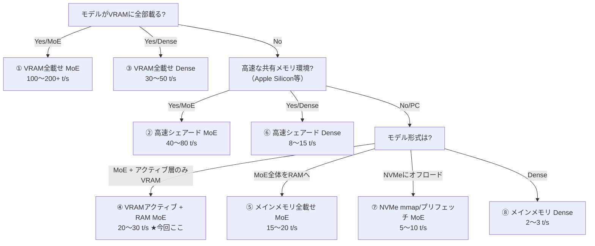

## この記事の結論

5年以上前のミドルクラスゲーミングPC（Core i5-10400 + RTX2060 Super 8GB + DDR4 64GB）でも、**MoE（Mixture of Experts）モデルをllama.cppでVRAM/メインメモリに賢く振り分ければ、チャットで20 t/s前後の実用速度が出せる**という話です。

新しいGPUを買わなくても、手持ちの「そこそこの環境」をチューニングでどこまで戦えるようにできるか、というやりくり戦略の記録です。

## 今回使ったハードウェア

| パーツ | スペック | 備考 |
|---|---|---|
| CPU | Core i5-10400 | 6コア12スレッド |
| GPU | RTX 2060 Super | VRAM 8GB |
| メインメモリ | DDR4 64GB（32GB×2） | 去年購入時点で2万円強（おそらく底値） |

GPUはRTX20世代、いわゆる「ちょっと前のミドルレンジ」です。ここが今回のチューニングの肝になります。

## なぜ素直に「お手軽ツール」を使わないのか

結論から言うと、2026年現在ローカルLLMを手軽に動かすなら [FreeToken](https://github.com/FlashML-org/FreeToken) が圧倒的に強い選択肢です。RTX 30/40/50シリーズをネイティブサポートし、MoEモデルに特化した帯域適応型のCPU-GPU協調実行でセットアップの手間なく高速に動きます。

ただし自分のRTX2060 SuperはTuring世代（RTX20系）で、FreeTokenの公式サポート対象外です。というわけで、地道にllama.cppをチューニングする道を選びました。

ツール選定の大まかな整理はこんな感じです。

- **ollama**：ツールコール（Function Calling）まわりの挙動が今回の用途（コーディングエージェント連携）には力不足だったため見送り
- **vLLM**：パフォーマンス重視ならこちら。ただしVRAMがリッチな環境向けで、非力なVRAMをメインメモリで補う用途にはあまり向かない
- **llama.cpp**：ノウハウが最も蓄積されており、VRAMが乏しい環境でのCPU/GPU混在オフロードの自由度が高い
- **FreeToken**：GUIでお手軽・最速。ただし対応GPUが限られる（今回は対象外）

> 結局一番パフォーマンスが最適化されてお手軽なのがFreeTokenなのは、ちょっと悔しいですね。

## オフロード戦略の全体像

ローカルLLMをどこに載せるか（VRAM／共有メモリ／メインメモリ／NVMe）によって、体感速度は大きく変わります。以下は個人的な整理で、t/sはメモリ帯域から算出した理論値の目安です。

| # | パターン | 速度帯（理論値） |
|---|---|---|
| ① | VRAM全載せ MoE | 圧倒的最速：100〜200+ t/s |
| ② | 高速シェアードメモリ MoE（Mac等） | 超高速：40〜80 t/s |
| ③ | VRAM全載せ Dense | 高速：30〜50 t/s |
| ④ | VRAMアクティブ + RAM MoE（今回はコレ） | 高速〜実用：20〜30 t/s |
| ⑤ | メインメモリ全載せ MoE（PC DDR4/DDR5） | 実用：15〜20 t/s |
| ⑥ | 高速シェアードメモリ Dense（Mac等） | 標準：8〜15 t/s |
| ⑦ | NVMe mmap/プリフェッチ MoE | 技術次第で5〜10 t/s（帯域次第で跳ねる可能性あり） |
| ⑧ | メインメモリ Dense（PC DDR4） | 激重・実用困難：2〜3 t/s |

②のMac(Apple Silicon)の高速シェアードメモリ構成については、以前の記事でまとめています。

https://zenn.dev/infra_ojisan/articles/m4-mac-localllm

この表から言えることはシンプルで、以下の3点に集約されます。

1. **MoEモデルを使う**（Denseモデルは同クラスの速度が出にくい）
2. **少しでも帯域の速いメモリを使う**（共有メモリでも遅ければ意味がない）
3. **Denseモデルを使うなら投機的デコード（MTP等）はほぼ必須**

今回のデスクトップ環境（VRAM 8GB + DDR4 64GB）は上記の④「VRAMアクティブ + RAM MoE」に該当します。判断の流れを図にすると以下のようになります。



## モデル候補

35B前後・アクティブパラメータ3B級のMoEモデルは、このクラスのVRAM/メインメモリ構成にちょうどよいサイズ感です。リリースが新しい順に並べるとこの通り。

| モデル | 所感 |
|---|---|
| [Ornith-1.5-35B-A3B](https://huggingface.co/ornith-ai/Ornith-1.5-35B-A3B) | 日本語でたまに（おそらく文頭の絵文字まわりで）文字化けするのが致命的 |
| [Nemotron-3.5-Lightning](https://developer.nvidia.com/blog/nvidia-nemotron-3-5-lightning-delivers-fast-accurate-specialized-task-execution-for-long-running-agents/)（30B-A3B） | アクティブパラメータのみオフロードする手法がまだ確立されておらず情報も少ないが、抜群に高速でチャレンジャー向け |
| **Qwen3.6-35B-A3B**（今回採用） | Qwen3.5-35B-A3Bの最適化版で、安定した日本語能力が魅力 |
| Gemma4-26B-A4B | さすがに半年以上前のモデルだと見劣りする |
| Qwen3.5-35B-A3B | 上記Gemma4と同様やや古いが、用途特化のファインチューニングモデルが多いのであえて選ぶのはあり |

なお、Qwen3.7/3.8系にはこのクラス（A3B級の小型MoE）に相当するモデルは存在しません。リッチな環境の方向けにはDenseモデルのQwen3.8-27B、そして現状のローカルLLM最強格として Qwen3.8-Flash-Next（メイン125B + N-gram 51B + MTP 4B、アクティブパラメータは6B）があります。VRAM8GBでもアクティブパラメータ分はギリギリオフロード可能ですが、モデル本体が4bit量子化でも100GB超あり、N-gram埋め込み表もVRAMに載せたい構造上、KVキャッシュを含めるとVRAMは64GBほど欲しくなります。DGX SparkやMac Studioクラスでも、mmapでNVMeに逃がす工夫が必要になるレベルなので、今回は素直にQwen3.6-35B-A3Bを選びました。

## セットアップ手順

ここからは実際にWindows環境でllama.cppを構築した手順です。コマンドを手打ちする代わりに、Windows版のClaude（Sonnetクラスのモデルなら何でも可）にプロンプトで指示を出し、作業自体をエージェントに任せています。

### ① llama.cppのインストール

GitHub Releasesから該当ファイルを探してダウンロードするのは面倒なので、Claudeに丸投げします。

> https://github.com/ggml-org/llama.cpp/releases からWindows用のllama.cppをダウンロードしてください。
> `llama-<バージョン>-bin-win-cuda-cu12.4-x64.zip`（実行ファイル本体。CUDA 12.x系）
> `cudart-llama-bin-win-cu12.4-x64.zip`（CUDAランタイムDLL群）
> より新しいバージョンがあればそれをダウンロードしてください。
> 両方のZIPを同一のフォルダ（`.\llm\llama.cpp` など）に展開します。`llama-cli.exe`、`llama-server.exe` と同じディレクトリに `cudart64_12.dll` や `cublas64_12.dll` などのDLLが並ぶ状態にしてください。
> 成功の確認：PowerShellで該当フォルダへ移動し、`.\llama-cli.exe -h` を実行してヘルプが出力されること。

結果はこの通り。

> セットアップが完了しました。
>
> 結果:
> - 展開先: `C:\Users\User\llm\llama.cpp`
> - 取得したリリース: b10919（GitHub Releasesの最新版。ファイル名の命名規則が `win-cuda-cu12.4-x64` から `win-cuda-12.4-x64` に変わっていましたが、内容はご指定のCUDA 12.4 x64版のバイナリ本体＋CUDAランタイムDLLです）
>   - `llama-b10919-bin-win-cuda-12.4-x64.zip`
>   - `cudart-llama-bin-win-cuda-12.4-x64.zip`
> - `llama-cli.exe`, `llama-server.exe` と同じフォルダに `cudart64_12.dll`, `cublas64_12.dll`, `cublasLt64_12.dll` などのDLLが展開済み
> - 動作確認: `.\llama-cli.exe -h` を実行 → ヘルプが正常に出力され、終了コード0（成功）
>
> これでGPU（CUDA 12.x）を使ったllama.cppの実行環境が整いました。モデルファイル（.gguf）を用意すれば `llama-cli.exe -m <モデルパス> -ngl 99` のような形で試せます。

### ② 動作確認とモデル用フォルダの作成

```powershell
# ディレクトリ移動して確認
cd C:\Users\User\llm\llama.cpp
.\llama-cli.exe -h

# フルパス指定で実行
C:\Users\User\llm\llama.cpp\llama-cli.exe -h

# モデル用のフォルダ作成
New-Item -ItemType Directory -Force -Path C:\Users\User\llm\models
cd C:\Users\User\llm\models
```

### ③ モデルのダウンロード

今回はQwen3.6-35B-A3BのUnslothによるMTP版4bit量子化モデル（[unsloth/Qwen3.6-35B-A3B-MTP-GGUF](https://huggingface.co/unsloth/Qwen3.6-35B-A3B-MTP-GGUF)）をダウンロードします。Hugging Faceのモデルページから「Download with CLI」でコマンドをコピーして実行……しようとしたら `hf` コマンドが入っていませんでした。めんどくさいのでこれもClaudeに任せます。

> hfコマンドが使えないので `C:\Users\User\llm\models>` に https://huggingface.co/unsloth/Qwen3.6-35B-A3B-MTP-GGUF のQ4_K_M版（`Qwen3.6-35B-A3B-UD-Q4_K_M.gguf`）をダウンロードしてください。

人間はここまで怠惰になれるものなのか、と自分でも思いますが、何をやっているかさえ理解していれば、コマンドや実行方法はどんどん変わるので都度覚えるだけ無駄です。20GB前後になる大きいファイルなので、Claudeはバックグラウンドでダウンロードを進めてくれます。

> 20GB前後になる大きいファイルなので、バックグラウンドでダウンロード中です。完了したらお知らせします。

気にせず他の作業をしつつ、たまに進捗を確認します。

> ❯ まだダウンロード中でいいんですよね？
>
> はい、まだダウンロード中です。現在3.48GB取得済みです（Q4_K_M量子化の35Bモデルなので最終的に20GB前後になる見込みです）。バックグラウンドで進行中なので、完了したらこちらから完了報告します。特に何もしなくて大丈夫です。

### ④ MTPが効いているか確認する

MTP（Multi-Token Prediction）対応モデルは、本体ファイルとMTP追加ヘッドファイルが分離配布されていることがあります（例：Ornith系や、Qwen3.8の強化学習版の一部）。今回使うUnslothのMTP版GGUFは単一ファイルにまとまっているので、まずMTPがちゃんと効いているか確認します。

```powershell
.\llama-cli.exe `
  -m ..\models\Qwen3.6-35B-A3B-UD-Q4_K_M.gguf `
  -p "こんにちは" `
  --spec-draft-n-max 2 `
  -ngl 99 `
  --n-cpu-moe 48 `
  -c 4096
```

```text
# 応答
こんにちは！🌸 何かお手伝いできることはありますか？ ご質問やサポートが必要なことが
あれば、いつでもお気軽にご連絡ください。😊
[ Prompt: 13.5 t/s | Generation: 16.2 t/s ]
```

起動ログに `llm_load_tensors: loading MTP tensors` や `speculative init` といった表示が出れば、その1ファイルだけで自動的にMTP投機推論が有効化されています。

そもそもアクティブパラメータオフロード自体がかなり投機的な処理なので、投機的デコードがどれだけ効くかは用途次第です。

- 開発（コーディングエージェント）用途のように、同じシステムプロンプト（AGENT.mdなど）が毎回投入されコンテキストの再利用が多い場合は効果が出やすいはず（個人的にはそういう用途はクラウドモデルを使うので未検証）。加えてコーディングエージェント利用時は投げっぱなしで完了通知（承認待ち）が来るまで放置していることが多いため、ミリ秒単位のレスポンス差は誤差の範囲
- チャットのようにその日の気分で話題が変わる用途だと投機の恩恵は薄く、外れたときのペナルティ分だけレスポンス悪化を体感しやすい

最後に、Tok/sの実測値も控えておきましょう。ここからアクティブパラメータオフロードを実際に試します。

```powershell
.\llama-cli.exe `
  -m ..\models\Qwen3.6-35B-A3B-UD-Q4_K_M.gguf `
  --spec-draft-n-max 2 `
  -p "こんにちは" `
  -ngl 99 `
  --n-cpu-moe 48 `
  -ngld 99 `
  -c 4096 `
  -b 256 `
  -ub 256 `
  -ctk q4_0 `
  -ctv q4_0 `
  -t 10
```

```text
[ Prompt: 14.9 t/s | Generation: 12.5 t/s ]
```

サンプルの質疑応答と速度は以下の通りです。

| 質問内容 | Prompt t/s | Generation t/s |
|---|---|---|
| 現在実行中のモデル名と得意なタスクを教えて下さい。 | 23.3 | 19.5 |
| Pythonプログラムのコーディングや日常のWordやPowerPointの作成はできるでしょうか？ | 39.3 | 21.3 |

確実にアクティブパラメータがVRAMに乗って高速化されているのがわかります。

### ⑤ パラメータのチューニング

```powershell
.\llama-cli.exe `
  -m ..\models\Qwen3.6-35B-A3B-UD-Q4_K_M.gguf `
  --spec-draft-n-max 2 `
  -ngl 99 `
  --n-cpu-moe 45 `
  -fa on `
  --load-mode none `
  -c 4096 `
  -b 256 `
  -ub 256 `
  -ctk q4_0 `
  -ctv q4_0 `
  -t 8 `
  -p "こんにちは"
```

```text
# 実行結果（やや効果あり）
こんにちは！👋 何かお手伝いできることや、質問があればお気軽にお知らせください。お元気ですか？😊
[ Prompt: 24.6 t/s | Generation: 21.7 t/s ]
```

| 質問内容 | Prompt t/s | Generation t/s |
|---|---|---|
| 現在実行中のモデル名と得意なタスクを教えて下さい。 | 81.5 | 21.5 |
| Pythonプログラムのコーディングや日常のWordやPowerPointの作成はできるでしょうか？ | 27.9 | 20.9 |

VRAMにうまく乗ったときは激速、乗らなくても十分実用的な速度が出ています。

各パラメータの意味は以下の通りです。

| パラメータ | 意味 |
|---|---|
| `--spec-draft-n-max 2` | MTPで先行生成（投機）するトークン数。MTP非対応モデルでは不要 |
| `-ngl 99` | メインモデルのレイヤーをGPUにオフロードする層数。「99」は事実上「可能な限り全層をGPUへ」という指定だが、VRAMが不足する分は自動的にCPU（メインメモリ）側に残る |
| `--n-cpu-moe 48`（45） | MoEのスパースなエキスパート部分のうち、指定した層数分をCPU＋メインメモリ側の処理に割り当てる。VRAM 8GBに収まらない重いエキスパート群をメインメモリに逃がし、アクティブなアテンション層などをGPUに残すための**最重要チューニングポイント** |
| `-ngld 99` | 投機デコードに使うドラフト機構（MTPヘッド）のレイヤーをGPUにオフロードする層数。「99」でドラフト部分を最優先でVRAMに配置しようとする。MTP非対応モデルでは不要 |
| `-c 4096` | コンテキスト長（プロンプト＋応答の合計最大トークン数）。値を大きくするほどKVキャッシュの消費メモリが増える。コーディングエージェント用途では最低15000程度は欲しい（8000を切るといきなりエラーが返ることがある） |
| `-b 256` | プロンプト評価時のバッチサイズ。デフォルト（512）より小さくすることでVRAMのピーク消費を抑える |
| `-ub 256` | 物理的な計算処理単位（マイクロバッチサイズ）。`-b` 同様にVRAMの作業領域（スクラッチバッファ）を節約する |
| `-ctk q4_0` / `-ctv q4_0` | アテンションのKey/Valueキャッシュの量子化形式を4bitに指定。FP16と比べてKVキャッシュのメモリフットプリントを約1/4に削減 |
| `-t 10`（8） | CPU側演算に使うスレッド数。CPUの物理コア数に合わせて割り当てる |
| `-fa on` | Flash Attentionを有効化（`on` / `off` / `auto`） |
| `--load-mode none` | モデルの読み込み方式の指定。`none` はmmapなどの特別な読み込みモードを使わない指定で、CPU/GPUに層を振り分けるオフロード構成時にページアウトの影響を避けたい場合に使う |

### ⑥ サーバーとして起動

チューニングして納得のパフォーマンスになったら、サーバーとして起動します（とりあえずコンテキストは12000にしていますが、後述の通りこれでも足りませんでした）。

```powershell
.\llama-server.exe `
  -m ..\models\Qwen3.6-35B-A3B-UD-Q4_K_M.gguf `
  --spec-draft-n-max 2 `
  --host 0.0.0.0 `
  --port 8080 `
  -ngl 99 `
  --n-cpu-moe 48 `
  -ngld 99 `
  -c 12288 `
  -b 128 `
  -ub 128 `
  -ctk q4_0 `
  -ctv q4_0 `
  -t 10
```

ローカルサーバーへの接続先は以下の通りです。

- `http://localhost:8080/v1`

## 結果

チャットでは実測でおよそ **12〜24 t/s（生成）**、プロンプト処理は条件が良いと80 t/s超まで伸びるという結果になりました。有料のクラウドモデルには及びませんが、ちょっとした運用スクリプトを書かせる程度なら十分実用に足る速度です。

## おまけ：gooseでミニゲームを作らせてみた

セットアップした環境の"仕上げ"として、コーディングエージェント [goose](https://github.com/block/goose)（CLI）をこのローカルLLM（Qwen3.6-35B-A3B、MTP有効、`-c 24576`）に繋いで、スマホ対応のテトリスを作らせてみました。

<!-- 画像: goose起動〜プロンプト投入時のシェル画面（左：llama.cppサーバのログ、右：gooseの実行ログ）。実際のファイルに差し替えてください -->


プロンプトはこちら。

> webで遊べるスマホ対応版のテトリス作って。UI的には画面の両端にタップかクリックできるボタンで画面左が左移動ボタンと左回転ボタン、画面右が左移動ボタンと右回転ボタン。キーボード操作の場合は"f"で左移動、"g"で左回転、"j"で右移動"h"で右回転としてください。積み上がったらゲームオーバー。スコアとランキングを表示して「最初からやる」「やめる」の選択。

手順書の倍のコンテキスト長（`-c 24576`）にしても足りず、途中でコンテキスト圧縮が必要になりました。

```text
Ran into this error: Server error: Context size has been exceeded.

Please retry if you think this is a transient or recoverable error.
  ⏱ 13m 49s
  ━━━━━━━━━━━━━╌╌╌╌╌╌╌ 66% 16k/25k
> コンテクストを圧縮して再開してください
```

圧縮して再開させたところ、無事に完走しました。完了ログの抜粋はこちら。

<!-- 画像: gooseのタスク完了ログとコンテキスト使用量（97% 24k/25k）。実際のファイルに差し替えてください -->


### 操作方法

| 操作 | タッチ/クリック | キーボード |
|---|---|---|
| 左移動 | 左側 ↩ ボタン（長押し連続移動） | `f` |
| 左回転 | 左側 ↺ ボタン | `g` |
| 右回転 | 右側 ↻ ボタン | `h` |
| 右移動 | 右側 ↪ ボタン（長押し連続移動） | `j` |

### 実装された機能

- スマホ対応：画面両端にタップボタン配置
- キーボード対応：f/g/h/jキーで操作
- ゴーストピース：落下先の半透明プレビュー
- スコアシステム：ラインクリア点数×レベル
- ランキング：localStorageにトップ10を保存
- レベルアップ：10ラインクリアでレベル上昇（落下速度アップ）
- ポーズ機能：ESC/Pキーまたはポーズ画面
- ゲームオーバー：積み上がったら終了 → スコア表示 + ランキング表示
- 選択機能：「最初からやる」or「やめる」の2択

成果物と実際のプレイ画面はこちらです。

<!-- 画像: テトリスのスタート画面。実際のファイルに差し替えてください -->


<!-- 画像: テトリスのプレイ中画面。実際のファイルに差し替えてください -->


合計30分弱でここまで作れたので、この程度のミニゲームなら有料のクラウドモデルを使わなくても十分いけそうです。さらっとした運用スクリプトを書かせるだけなら、そもそもここまでのコンテキスト長は要りません。

あと、率直に言うとgooseはこの環境にはオーバースペックでした。llama.cppのログを見る限り、アクティブなエキスパートが2つ以上同時に立ち上がってしまいVRAMから溢れ、パフォーマンスが落ちていました（10 t/s程度）。[pi](https://github.com/badlogic/pi-mono) のようなよりシンプルなコーディングエージェントなら、もう少しパフォーマンスが上がるかもしれません（並列性が落ちて結果的にトントンになる可能性はありますが）。

## まとめ

- MoEモデル＋llama.cppの `--n-cpu-moe` によるオフロードチューニングで、5年落ちのRTX2060 Super機でも実用速度（12〜24 t/s）が出せる
- お手軽さではFreeToken（RTX30以降対応）に軍配が上がるが、非対応GPUでも工夫次第で戦える
- コーディングエージェント用途はコンテキスト長の消費が大きく、この規模のVRAM/RAM構成では大型エージェント（goose等）よりも軽量なエージェントの方が相性が良さそう

:::message
💡 **余談**：今回作った「①〜⑧のオフロード戦略チャート」は、手持ちのPCスペックを入力すると最適なモデルクラス・チューニング方針をレコメンドする簡易診断ツール（Web or CLI）にできそうです。ローカルLLM界隈は「結局自分の環境で何をどう使えばいいのか」が一番のハードルなので、この手のフィット診断はニッチだけど刺さる需要がありそうだと感じました。
:::

## 参考リンク

- [unsloth/Qwen3.6-35B-A3B-MTP-GGUF](https://huggingface.co/unsloth/Qwen3.6-35B-A3B-MTP-GGUF)
- [Qwen3.6 - How to Run Locally | Unsloth Documentation](https://unsloth.ai/docs/models/qwen3.6)
- [llama.cpp server documentation](https://github.com/ggml-org/llama.cpp/tree/master/tools/server)
- [llama-cli(1) — Debian Manpages](https://manpages.debian.org/unstable/llama.cpp-tools/llama-cli.1.en.html)
- [GitHub - FlashML-org/FreeToken](https://github.com/FlashML-org/FreeToken)
- [ornith-ai/Ornith-1.5-35B-A3B](https://huggingface.co/ornith-ai/Ornith-1.5-35B-A3B)
- [NVIDIA Nemotron 3.5 Lightning](https://developer.nvidia.com/blog/nvidia-nemotron-3-5-lightning-delivers-fast-accurate-specialized-task-execution-for-long-running-agents/)
