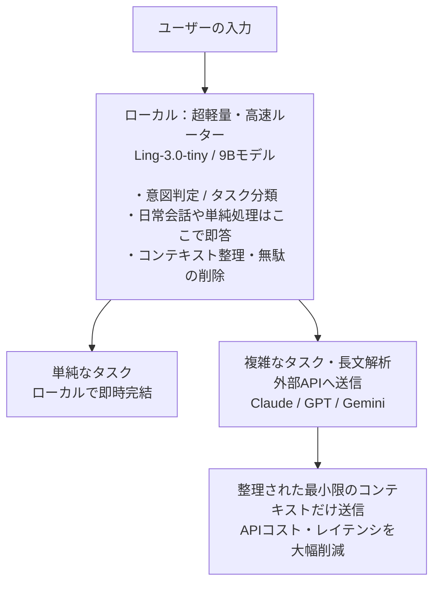

## はじめに

MacでローカルLLMを動かして日常業務やエージェント用途に活用できないか、色々と検証を重ねてきました。検証ログや走り書きのメモが散乱していたので、試行錯誤の軌跡と現時点での結論・ベストプラクティスを整理して残しておきます。

### 検証環境

- **マシン**：M4 MacBook Air 15インチ（2025年モデル）
- **メモリ**：24GB（ユニファイドメモリ）

## 1. 野望編：MoEモデルをSSD退避（mmap）で無理やり動かそうとした

最初の構想は、**「せっかくなら賢い大きめのモデルを動かしたい」**というものでした。

そこで目をつけたのが **MoE（Mixture of Experts）モデル**です。例えば `Qwen3.6-35B-A3B` のようなモデルは、総パラメータ数は35Bと巨大ですが、推論時にアクティブになるのは一部（約3B）です。

24GB（あるいは16GB）の限られたメモリ環境でも、`llama.cpp` の `--n-cpu-moe` や `mmap` を使えば、アクティブな層だけをVRAM/RAMに載せ、残りの膨大なエキスパート重みをSSDに退避（オンデマンドでストリーミング）させながら動かせるのではないかと考えました。

### MoEエキスパートをCPU/SSD側に逃がして動かす試み

```sh
./build/bin/llama-cli \
  -m Qwen3.6-35B-A3B-UD-Q4_K_M.gguf \
  -p "こんにちは" \
  -ngl 0 \
  --n-cpu-moe 40 \
  -c 2048 \
  -ctk q8_0 \
  -ctv q8_0
```

### 結果と課題

- **動くことは動く**：クラッシュ（OOM）せずに巨大なモデルが起動すること自体は感動的でした。
- **しかし、遅い**：SSDからの読み出しオーバーヘッドが大きく、生成速度は数トークン/秒（2〜6 t/s程度）。
- バックグラウンドの完全バッチジョブなら許容できますが、普段使いや対話で使うにはもっさり感が否めません。

## 2. 迷走編：Apple SiliconネイティブなMLXなら普通のサイズでいけるのでは？

SSDストリーミングの遅さに直面し、次に考えたのが**「そもそもApple Siliconに最適化されたMLX（mlx-lm）を使って、普通のサイズ（8B〜14B前後）を動かした方が速くて扱いやすいのでは？」**というアプローチでした。

```sh
uv tool install mlx-lm
```

### OpenAI互換サーバーの立ち上げ

```sh
mlx_lm.server \
  --model mlx-community/gemma-4-12b-coder-fable5-composer2.5-4bit \
  --port 8080 \
  --max-tokens 12500 \
  --kv-bits 4 \
  --kv-group-size 64
```

MLXはMetalの統合メモリを動的に確保してくれて、`--kv-bits` でKVキャッシュの圧縮も効くため非常にスマートです。

### ここで突き当たった現実

1. **エージェント運用でのコンテキスト不足**：コーディングエージェントや自律型エージェントにタスクを投げると、会話ログやコードの読み込みで一瞬でコンテキスト（15k〜32k）が膨らみます。24GBメモリだとモデル本体＋大きなコンテキストのKVキャッシュでメモリがカツカツになり、速度低下やスワップが発生します。
2. **MLX特有の制約と不安定さ**：実際に使ってみると、以下の課題に直面しました。
   - 使えるモデルが限られる点。
   - 最新モデルでMLX対応モデルが公開されていても、実行時に「Model type not supported」と怒られて動かないことがある点。
   - GGUF形式（llama.cpp）の方が量子化ビットの選択肢（Q4_K_Mや低量子化など）も豊富で動作が安定している点。
3. **「オンプレミス絶対死守」の縛りはない**：冷静に考えると、「社外秘データを一切外に出せない完全オンプレミス環境でなければならない」という強い制約があるわけではありませんでした。重い処理や長文脈の処理まで全部ローカルで無理に背負い込む必要はあるのか？という疑問が湧いてきました。

## 3. 着地編：普段使いなら「気持ちよく動く9B前後のモデル」を普通に動かすのが一番

紆余曲折を経てたどり着いた結論は、**「普段使いでストレスなく気持ちよく使えて、日本語の破綻が少ない軽量モデルを『普通に』動かすのが一番快適」**ということでした。

現在行き着いた `llama.cpp` の実行構成は以下の通りです。メモリロック（`--load-mode mlock`）をかけつつ、コンテキスト長は16kを確保し、KVキャッシュを `q4_0` で量子化してメモリ消費を抑えます。

```sh
sudo purge
```

```sh
./build/bin/llama-cli \
  -m ./<model_filename>.gguf \
  -p "こんにちは、今動作しているモデル名と特徴をおしえてください" \
  --load-mode mlock \
  -c 16384 \
  -ctk q4_0 \
  -ctv q4_0 \
  -t 6 \
  -tb 6
```

### 実際に検証して良かったモデルたち

| 用途 | モデル | 速度 | 所感 |
| --- | --- | --- | --- |
| 普段使い・実用枠 | OxCoder-9B（Q4_K_M） | Prompt 61.7 t/s<br>Generation 15.7 t/s | コーディング支援や論理的な受け答えがしっかりしており、速度も約16 t/sと非常に実用的。 |
| 普段使い・実用枠 | Qwen3.5-9B-Uncensored-HauhauCS-Aggressive（Q4_K_M） | Prompt 61.5 t/s<br>Generation 15.2 t/s | 日本語の自然さ、知識の幅、スピードのバランスが優秀。普段の雑多な質問や要約に最適。 |
| チャット特化枠 | Ling-3.0-tiny（Q4_K_M） | Prompt 96.1 t/s<br>**Generation 68.3 t/s** | 圧倒的爆速。レスポンスが一瞬で返ってくるためチャット体験としては極上。論理パズルや複雑なタスクは苦手ですが、ライトな対話用途なら割り切って使えます。 |

:::message
Ling-3.0-tinyに「ハノイの塔（3枚）」の解法を聞いたら解けませんでした。速度を最優先するライトな対話用途向け、と割り切って使うのがよさそうです。
:::

## 4. 目指すゴール（理想）：ローカルルーター＋外部APIのハイブリッド構成

ここまでの検証を経て見えてきた「理想のアーキテクチャ」がこちらです。



### ポイント

1. **大半の処理はローカルで高速に捌く**：定型的な処理、簡単なテキスト整形、雑談などはローカルの軽量モデルで即座にレスポンスを返します。
2. **複雑なタスクだけを外部APIに振る**：長大なコンテキストが必要なエージェント作業や高度な推論だけを有料APIに逃がします。
3. **ルーターがコンテキストを最適化する**：ローカルモデルが外部に投げるプロンプトやコンテキストの前処理・要約を行い、無駄なトークンを削ぎ落としてからAPIに渡すことで、API料金と処理時間を最小化します。

## まとめ

M4 MacBook Air（24GB）というマシンスペックの中で、「巨大モデルを無理やり動かす」ロマンからスタートし、最終的には「軽量モデルのキビキビしたレスポンスを活かす」という実用的な着地点に落ち着きました。

今後はこの軽量ローカルモデルをルーター役として仕立て上げ、外部APIとの賢いハイブリッド運用を作っていきたいと思います。
